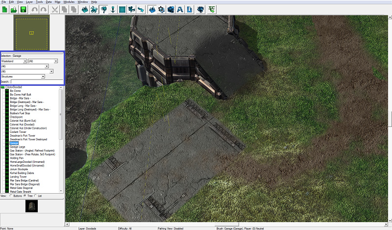
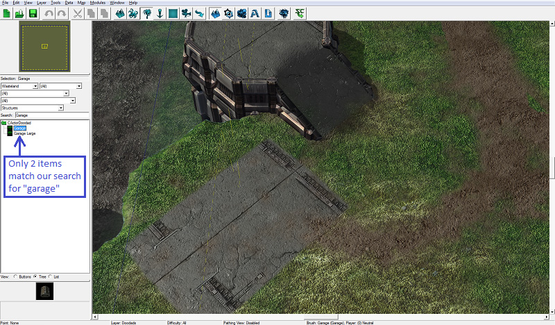
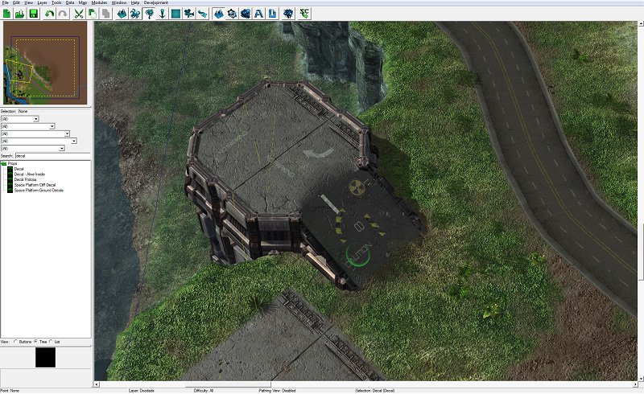
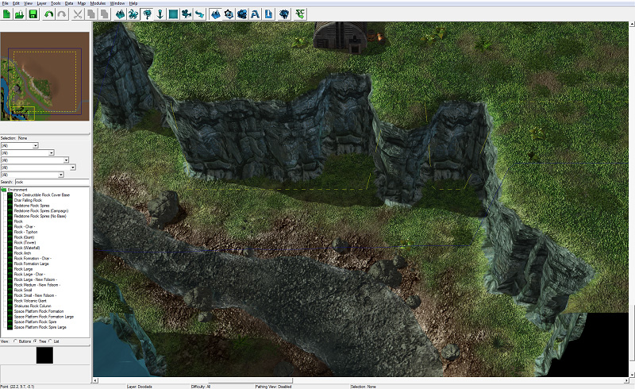
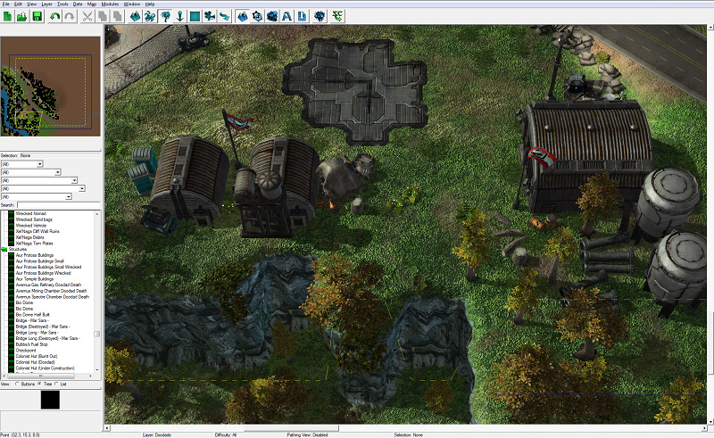
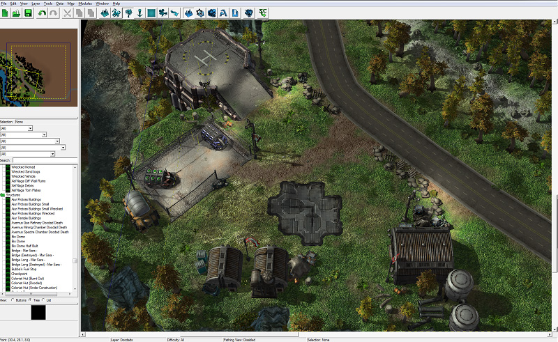

# Terrain Module - Part 2

## Drop in Some Doodads

Time to add some props! Right now, our heroes' military base doesn't look like much. We're going to start building up the place by adding some hangars, crates, and fences. We will also add some decals to the helipad to make it look like an actual helipad.

In the StarCraft II Editor, props are called "doodads." So far, we've been working entirely in the terrain layer of the Terrain Module. To place doodads, though, we need to switch over to the doodads layer. On the top row of buttons, find the button that looks like a tree, or press [D].

## Doodad Controls and Filtering/Searching for Specific Doodads

There are hundreds of doodads available, and finding the ones you want can be difficult. Fortunately, there are filters that you can set, and a search field if you want to get really specific.

The first doodad we're going to add to our map is a Garage. Let's use some filters to help us find it.

Locate the doodad filters. All of the doodad search filters are located on the left side of the screen, right on top of the doodads list.

From the first dropdown, select Wasteland.

From the last dropdown, select Structures.

Just by selecting those two filters we've cut down a list of hundreds to a list of 50 or so. If you want to search even more specifically, you can use the Search field to type the name, or part of the name, of the doodad you'd like to use.

Be aware that if you have filters set to look for specific types of doodads, you may not be able to find the doodad you're looking for. For example, if you have one of the filters set to look specifically for Environment doodads, the Garage doodad is not an Environment doodad, so it will not show up in the list.

Find and select the Garage doodad in the doodads list.

Place the garage on the map somewhere at the bottom of the base.

The garage is facing south, which is not desirable because it is facing the cliff edge, rather than the middle of the base. To rotate the garage, press [Space Bar] or [Escape] to enter selection mode, like we did earlier when placing road points. Then select the garage that we placed on the map. Hold down the [Control] button and the click and hold the left mouse button on the ground outside of the doodad, and drag the mouse until the garage is facing north.

Next, we're going to place some Decal doodads on the helipad.

Find and select the Decal doodad.

Place a couple of Decal doodads on the map near the garage.

There can be multiple variations of the same doodad, which you may notice with the decals we just placed. If you want to cycle through different variations of a doodad, enter selection mode and select the doodad you want to change. Then press the [<] or [>] key to cycle through variations.

Continue to place doodads until you have completed your helipad decorations.

For the last example, we're going to place some rock doodads at the bottom of the canyon at the edge of the water.

Find and select the Rock doodad.

Attempting to place the rocks at the bottom of the canyon, you will notice that their placement images are red and they are unable to be placed. Doodads, like units, have certain placement restrictions. Placing doodads at the lowest level of terrain is one of those restrictions. Fortunately, we can bypass restrictions like this when we need to.

Holding down the [Shift] key when placing doodads will make them "ignore placement," which allows them to be placed anywhere, regardless of placement restrictions. By doing this, you can place the rocks at the bottom of the canyon.

Continue placing doodads around the base and the bottom of the canyon until you are happy with the layout. Here's what we've come up with:

## Doodad properties

There are a number of options that modify doodads on a map. Double-clicking on a placed doodad will bring up the Object Properties menu, which shows the various options available, including position, height, rotation, and scale.
