# Ability Creation Primer 1: Simple Firebolt with Data Collections

!!! info
    Following tutorial is aimed at complete beginners and assumes little to no competency at the editor.

In this tutorial we will go through all steps of making a simple projectile attack ability - where we launch a missile at target enemy and it deals damage on impact. Same as most default projectile based weapons in SC2.

## End result

## Introduction

!!! warning
    Before proceeding ensure your editor settings match with following setup:

**Data Editor settings**

*I am using following editor display settings.*

**Document dependencies**

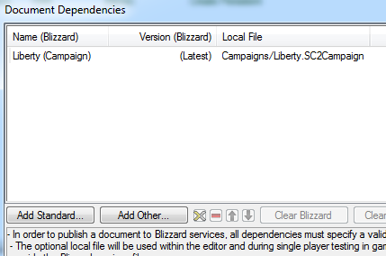
*And using WoL (Wings of Liberty) Campaign dependency.*

## Step 0: Preparation/Data Collections
As a novice at editor, rather than creating things from scratch, we will be copying/duplicating existing stuff up until we become confident in experimenting on our own.
To help us properly duplciate and organize things we will be using new feature introduced in 5.0 – data collections!

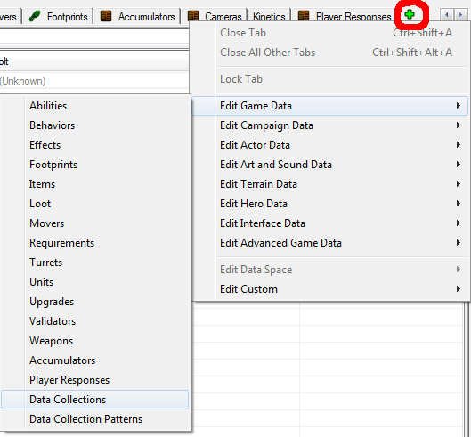

Open up data editor, click little `+` sign, go to `Edit Game Data` -> `Data Collections`.

Let's create a data collection called "**Fire Mage – Firebolt**", then click on suggest so that editor automatically names ID for us.

### Data collections - what is it about

There is a bit of nuance when it comes to working with data collections. One of ideas behind them is to give us ability to group newly created data into collections as we make that data. Think of it as automatically putting stuff we create into a special folder for ease of organization and access.

To recognize newly created data as part of data collection - that data's ID must have data collection's name as a prefix. Ok, how do we do it?

First, we need to know what an "ID" is. All data fields in editor have both a name and an ID. Names have no restrictions to them, they serve to make editor readable, while ID values are things that are used in the back-end code. There are rules to them such as they can't have spaces and they must be unique. 

Usually when we crate a new element, we give it a name and then suggest ID for it. In the example above "Fire Mage – Firebolt" suggested ID was "FireMageFirebolt".

So logically, when creating a new data, knowing that we want to make use of data collection, we would name our data in the following manner - "**Data Collection Name @ Data Element Name**" (or for our example "**Fire Mage – Firebolt @ DataElement**"), then click suggest and be done with it. However when editor sees collection's prefix in element's ID and recognizes it as part of data collection - it will also add it's own prefix to the element. So we will be left with the following monstrosity:

  "Fire Mage – Firebolt @ Fire Mage – Firebolt @ DataElement"

|Fire Mage – Firebolt @|Fire Mage – Firebolt @|DataElement|
| ------------- | ------------- |------------- |
|Automatic prefix generated by editor for data collections|Prefix we added when naming element for it to be included in data collection|Data element name|

Well... since the editor adds it's own prefix, then the one we added isn't necessary. Do we just open each element again and delete our prefix?

This is the only inconvenience with data collections. When we name things, after autosuggesting element's ID we will have to manually erase our prefix.

Or alternatively we can just copypaste data collection's ID directly into element's ID as we make it. Use whichever method you prefer.

---

Also while we're at it, lets open the rest of the tabs we'll get to use:

- `Edit Game Data` -> `Abilities`
- `Edit Game Data` -> `Effects`
- `Edit Game Data` -> `Units`
- `Edit Actor Data` -> `Actors`
- `Edit Art and Sound Data` -> `Buttons`

## Step 1: Missile

If we're going to fire a projectile – then we need to first make a projectile. Or rather duplicate existing one and change it's model to look the part. I'm chosing to duplicate Karass's weapon's projectile. Head to units data tab, find "Weapon – Karass" unit, right-click, duplicate-unit. Mark it's unit and actor, those two always go hand in hand, and since we'll be modifying visual – also mark model for duplication.
 

Now the most important part begins – naming things clearly, so that they don't become a headache later on. Rename unit to "projectile", add data collection's prefix (FireMageFirebolt@) to the unit's ID, rename actor to "Missile", add data collection's prefix to actor's ID, rename model to "Model",  add data collection's prefix to model's ID. I'm reiterating the fact that every time we'll make a new data element – we'll be adding data collection's ID to it. It might take getting used to. 

*Unit*

*Actor*

*Model*

---

!!! warning
    The naming pattern is very important - this is the result you should see after you get to this point.

    

If we click on that model we'll be able to view model data. In there double-click on "**Model**" field, click "**Browse**". Let's pick `FrenzyMissile.m3` as our missile model. This is all that we needed to change here.

## Step 2: Ability

To make our simple firebolt ability we'll need following data:

1. **Ability** - data entry that has general information about our spell (such as range, cost, miscellaneous properties like cast time, information about what can be a target of ability, autocast properties and such.)  
1. **Button** - data entry that contains icon, tooltip, spell name visible to player and relevant informaction that we see on unit's command card.  
1. **Effects** - data entries from which ability logic is constructed.  
1. **Actors** - data entries that create visuals and sounds and generally command much of what is displayed on screen.  

### Preparing Ability & Button

Lets go step by step. First – in the ability data tab make new ability of "**Effect - Target**" type. Because data collections handle naming, we can just call this entry as "Ability". There isn't much we can do with it yet.

Next let's make a button! In buttons data tab create a button, set it's hotkey to Q and image to icon to whatever you think fits best. I think *ui_tipicon_campaign_zerus03-yagdrafireball* makes a good icon for this ability.

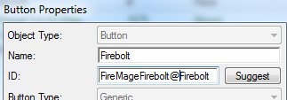

Once the button is made, let's add it to ability's command list. Go back to ability, go to "**Commands+**" field, double-click it, and set it as the default button for "**Execute**" command.

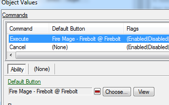

---

### Adding ability to unit

Even though right now our ability doesn't do anything, it still can be added to a unit. So let's do that, this way we can check how it works during different phases of development. We can use Karass (the high templar hero from WoL) as our caster.

Go to unit's "**Abilities+**" field and add our abilty by pressing little green `+` button

After that go to unit's "**Command Card+**" field 
1.  Click on button slot where you want to place button.
1.  Click little green `+` button to add a button 
1.  Choose the button we'd made earlier
1.  In "**Command Type**" choose "Ability Command"
1.  In "**Ability**" choose our ability. Abilites that unit possesses are usually found at the top of the list so you don't need to search for them.

|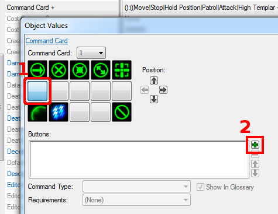|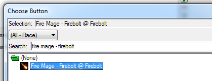|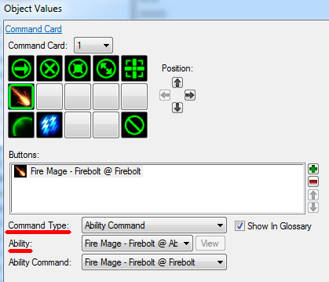|
| ------------- | ------------- |------------- |

---

## Step 2-1: Effects

Alright – time to construct the logic that will drive the ability.

This ability does 2 things
1.  Launches a missile from caster to target.
1.  On impact deals damage to target.

First thing – we need to launch a missile. Go to effects data tab and create a new "**Launch Missile**" effect.

This effect does exactly what it says, launches missile using settings that we give it.

For now all we can do is set which missile should be launched. Find field "**Ammo Unit**" and set it to the projectile we duplicated in step 1.

|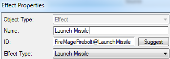||
| ------------- | ------------- |

For missile to deal damage on impact, we will also need a damage effect, so let's get to it.

Create new "**Damage**" effect.

Set "**Amount**" field to 20 and set "**Death**" field to "**Fire**". That way, if this effect kills an enemy – it will make the killed unit play a fire death animation (if they have one).

Additionally find field "**Response Flags+**" and check both "**Acquire**" and "**Flee**". This will cause enemies react to this damage effect, otherwise they would just stand there and take beating like big dummies.
 

||||
| ------------- | ------------- |------------- |

To make the launched missile do damage on impact, put our damage effect into "**Impact Effect**" field in the launch missile effect.

 

Now that we have made both the effects that we need, we can add our launch missile effect to the ability. So go to ability data, find "**Effect+**" field and put there our launch missile effect.
We also need to specify the ability's range in the ("**Range+**" field). Let's set it to 10.

 

---

## Step 2-2: Actors

If we were to test our ability right now, it would do the game logic – missile flies out of caster to target and inflicts 20 damage on impact. But it would fly out of caster's feet, land at enemy's feet, and there would be no sounds, explosions or anything to it.

We will make use of actors to wrap our logic in nice visuals.

|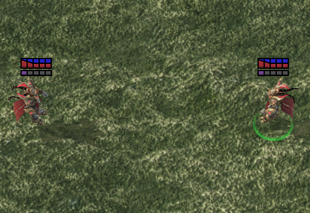*game logic*|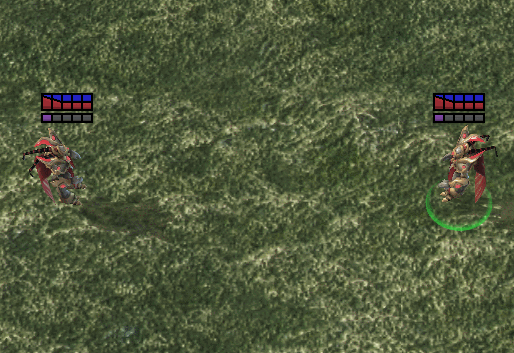*game logic + actors*|
| ------------- | ------------- |

#### Range Actor (minor polish, unnecessary but nice to have)
First, since we just set ability's range, let's add a range actor. It's the actor that is responsible for creating range indicators when we either target with the ability or move our cursor over the ability's button on the unit.

We can either duplicate or create one from scratch. There isn't much to range actors, so let's just create one.

We'll want to create "Range" actor and set it's parent to "Range Abil". If we do that then editor will give us token field (bottom of the screen) where we can put our ability, and editor with a little bit of help will be able adjust actor's data to work for said ability.

|||
| ------------- | ------------- |

After filling in token ability find "**Events+**" field, right click on it, hover over "**Reset To Parent Value**" and chose "**Range Abil**". Doing so will reset actor's events, but it will also adjust them for the ability we specified in token ability field.

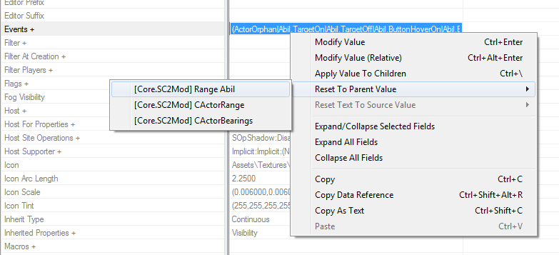

#### Attack Actor

Now lets make our projectile behave just like majority of other projectiles in SC2 behave – shoot from unit's weapon to target's body. For this we'll need an Action actor. 

!!! info
    Action actor controls all things related to visuals/sounds that happen during a regular attack. At a simple level, it's what we use to make sure that attack launches and impacts properly, and takes into consideration to display attack hitting shields while unit has shields, instead of landing straight on unit.

Lets duplicate Karass Attack, it already has a nice sound that sounds like a spell launch. As always, when duplicating, we'll mark stuff that we want to change (except for stuff we have already made, like missile).

After duplication is done notice token fields at the bottom. Replace "Impact Effect" and "Launch Effect" with our effects.

|||
| ------------- | ------------- |

!!! info
    When filling tokens in this instance, the actor's "**Events+**" field will adjust to them automatically (unlike back when we filled them in range actor), so there is no need to reset "**Events+**" field.

In attack actor find field "**Missile**" and replace it with our projectile.

We're now done with actor's fields, so let's change the model we duplicated. Go to model's data and change "**Model**" field to some sort of explosion.
`MiraHorner_Wraith_Coop_Missile_Impact.m3` fits well.

Now our missile should behave and sound as expected. But what about the unit which uses the ability?

#### Animation/Actor Events
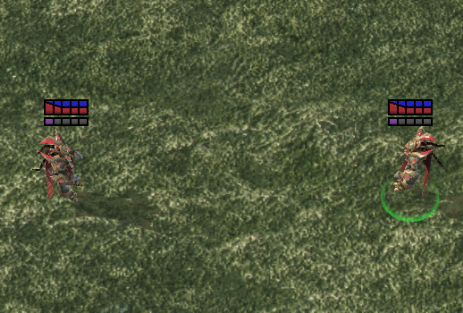

If we Test Document,  we'll see that even though weapon fires out of caster's hands and impacts target's body like all other projectiles – Karass is just standing still while spell occurs. We need to give Karass's actor an instruction – if Karass casts our spell – play certain animation.

Usually we would go into unit's actor's "**Events+**" field and add new events to the huge list of default events that unit has. But there is another, more organized way. We create "**Event Macro**" actor, add our events to it and then add that macro to the list of macros that unit's actor uses. That way we don't have to browse through other events and we always know where to look/edit actor messages for this particular ability.

Create an actor of type "**Event Macro**".

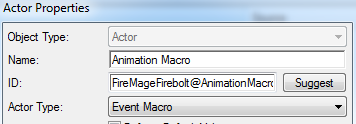

Open up it's "**Events+**" field and add following:

for event

|||
| ------------- | ------------- |
|**Msg Type:**|**Ability**|
|**Source Name:**| choose our ability|
|**Sub Name:**| **Source Cast Start**|

for message
|||
| ------------- | ------------- |
|**Msg. Type:**| **Animation Play**|
|**Name:**| Any name you want, if you haven't worked with this field yet you'll have to manually add animation names. These can be whatever, so name them in a way that will be helpful to you. I'm usually naming my animation for Q spell as "SpellQ"|
|**Animation Properties:**|  **Spell**, **A**|

|||
| ------------- | ------------- |

Then set  "**Time Type**" to "**Time Scale**" and "**Time Variant**" to "1.0".

This will make animation play at the same speed you'd see it play in model viewer (you can find about that at the end of tutorial).

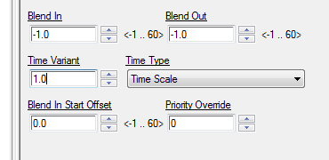

Next head to unit's actor, find field called "**Macros+**" and add our macro to that list.

---

## Step 2-3: Other stuff

### Button Tooltip

Let's give our button a proper tooltip. Head back to the button we made in button data tab. We'll add a general description of "`Strikes target with a firebolt, dealing 20 damage.`".

But hold on! We can directly refer to various data fields in tooltips, so let's fetch damage value directly from damage effect.

Notice that we have various buttons under the text window. Press "**Chose Field...**". For "**Type**" choose "**Effects**", find our damage effect, select damage value and press OK. Now our reference is displayed at the bottom next to "**Data Reference**" pulldown. We can insert it anywhere in the text by pressing "**Insert:**" button.

|||
| ------------- | ------------- |

---

#### Finishing touches

Everything should be now working. But if we look closely we can see that the animation doesn't quite sync with the ability - missile flies out too early. Let's simply delay first effect's execution by going to ability and setting "**Cast Start Time**" to 0.5. (Or we could also solve it by making animation skip forward, but that's info for another day).

#### Wrapping up

Our data effort is done. Let's head back to data collections tab, select our data collection, then click "**Data Collection**" -> "**Auto Fill Data Collection**". With this we can overview all the elements we've made, and if needed, copy all of the elements. Changing data collection's name will also rename all of it's elements.

|||
| ------------- | ------------- |

!!! warning
    When renaming data collection, references in texts won't be updated, so if we rename our data collection we'll have to manually update all text references, like that one where we referred to damage effect in the button's tooltip.

||
| ------------- | 
|*Firebolt complete!*|

# Bonus 1: Making a Cooler Firebolt (skill level – basic)

Now that we have our basic launch-impact ability, let's make it more interesting. Instead of one, we're gonna make our ability launch 15 missiles in a row.

But first, we need to decide on something. Do we keep on changing our ability, or do we make a new skill?

Perhaps we'll want to use original ability in the future, or keep it as a template for other simple projectile skills.

Therefore let's make our cooler firebolt a new skill.

First step to a cooler firebolt is repeating the steps we've done for simple firebolt, so lets copy our previous work.

## Step 1: Data collection duplication.

In data collections tab right click on our firebolt data collection and select "Duplicate Data Collection..."

 

Editor will open a window showing all elements to be duplicated + suggest new ID for data collection (For now its just "FireMageFirebolt2")

 

Click OK, now we have 2 identical data collections. But our new duplicate has "2" at the end of it's ID (which we normally can't see. We need to either double-click at the element to see it's ID, or toggle raw data view  by pressing Ctrl+D, or "**View**"->"**View Raw Data**".)

 

Let's change the name for our new data collection, so how about "Fire Mage – Invoke" (and as always autosuggest a new ID so that it fits our name).

Once that is done we need to manually do a few things:
1. change button's name to "Invoke" (since duplication only affects collection's name and not text that serves as element's name);
1. fix damage reference in Invoke's button tooltip;
1. add duplicated animation macro actor to karass unit actor;
1. add Invoke ability to Karass;
1. add Invoke ability to Karass's command card.

After all this is done – we can Test Document and observe that our Karass is able to cast two identical abilties.

!!! info
    Although data collection duplication window looks similiar to normal duplication window – you can't uncheck individual elements for duplication. If we want to duplicate only part of the collection – we'll need to manually remove unneeded elements by going into "**Data Record**" field in data collection and removing them there. After duplication they can be re-added back with usual autofilling.
    
---

## Step 2: Additional Effect.

### Create Persistent

To execute our "**Launch Missile**" effect multiple times we're going to make use of "**Create Persistent**" effect (it's a go-to effect when you want to repeat something, for example: the repeating damage every tick in a High Templar's Psi-Storm).

Create a "**Create Persistent**" effect and name it "**Start Persistent**".

 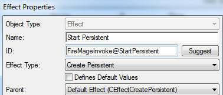

Set "**Location**" to "**Target Unit**".

"**Period Count**" to 15.

"**Period Durations**" to 0.125.

"**Period Effects**" to "Fire Mage – Invoke @ Launch Missile".

 

In "**Flags+**" check "**Channeled**" and "**Channeling**". This will make it so that caster has to dedicate themselves to the attack, so that moving or canceling ability in any way will stop the persistent effect. 

 

>NOTE
>
>The skill will work fine without those two flags. If you want to be able to launch ability and run away asap – feel free to not use them.

 ### Ability

Next go to ability and change it's effect to our new persistent effect.

With this, we can Test Document and see that the ability is indeed working.

---

## Step 3: Polishing/Misc

#### Button

Lets pick a more expressive button image for our new skill – "*btn-ability-tychus-odin-barrage.dds*" should do.

After that, reflect changes we've made to ability in button's tooltip.

"`Strikes target with <d ref="Effect,FireMageInvoke@StartPersistent,PeriodCount"/> firebolts, each dealing <d ref="Effect,FireMageInvoke@Damage,Amount"/> damage.`"

#### Actors

In animation macro – change Animation Properties to just "**Spell**".

### Fancier Launch Missile

In our launch missile effect, go to "**Movers+**" field and add "Hurricane Missile". This will override missile's default mover when launching missile through this effect.

 
 
## Step 4: Launch the map, place some enemies and blast them with firebolts.
||
| ------------- | 
|*Cooler firebolt complete!*|

* [Data Primer 1 - Simple Firebolt.SC2Map](Assets/DataPrimer1-SimpleFirebolt.SC2Map)

---

# Bonus 2: Finding Model Animations and Attachment Points

Back when we were setting animation properties for our abilities, how do we know what to specify, why was "Spell, A" – a throwing motion while just "Spell" –  making Karass bring his hands together?

To know what we can use here we need to view model in the **Cutscene Editor**.

Let's head back to our units data tab. Click on Karass. In the linked elements we can see this unit's main actor. Click on it. Find "**Model**" field. This is the name of Model data element. We can navigate to it through linked elements just like we navigated to this actor. 

||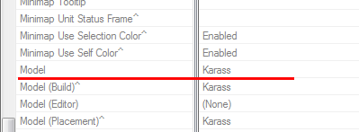|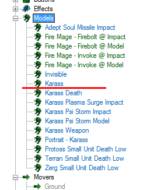|
| ------------- | ------------- | ------------- | 

This time it was pretty obvious what we were looking for, but I thought I'd show how it's all connected just in case.

Once in model data – click on model field. Then click on "**View in Cutscene Editor**".

We will see something like this.

|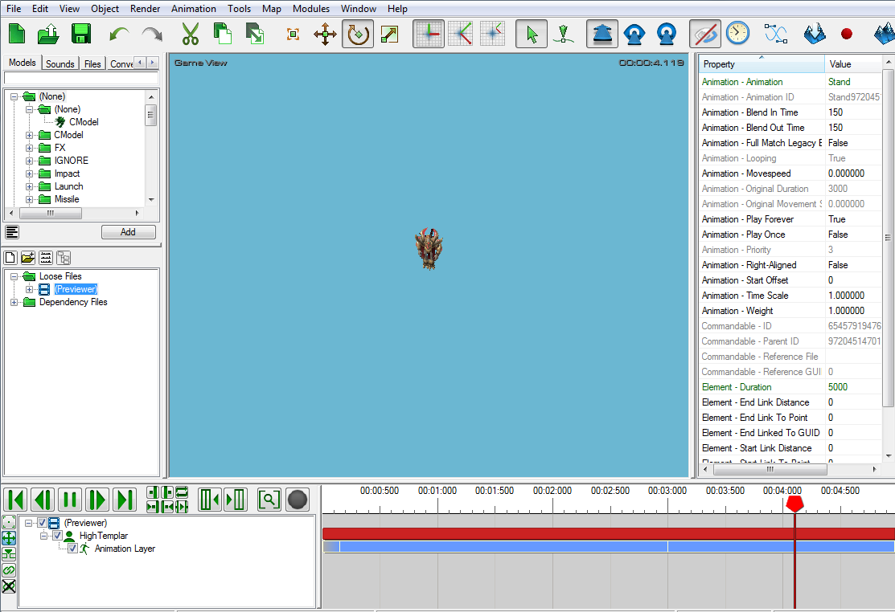|
| ------------- |

### Finding Model Animations

Right click on the blue line on bottom right, chose "**Change Animation**". Now we can see and preview model's animations.

||
| ------------- |
---

### Finding Model Attachment Points

- "**Render**" -> "**Show Geometry**" -> "**Attachment Points**" (or just press "A" button to toggle this)
- "**Object**" -> "**Model Data**" (or just press "Shift+D")

Selecting attachment point in model data window will make it pulse in cutscene editor.

|||
| ------------- | ------------- |

---

With this, we have taken the first step towards making cool stuff in data.

Investigate how default abilities are made, name things in a fashion that makes sense to you and others who might view the code.

Experiment and try things out! Also check out other tutorials on this website to learn more. Things are only going to get better from here on out.
