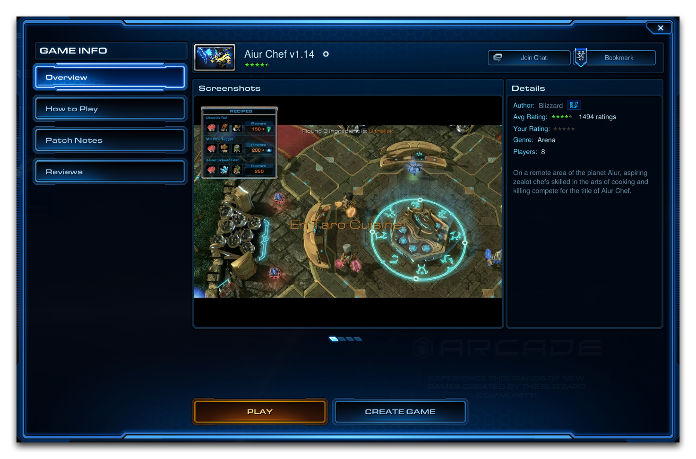
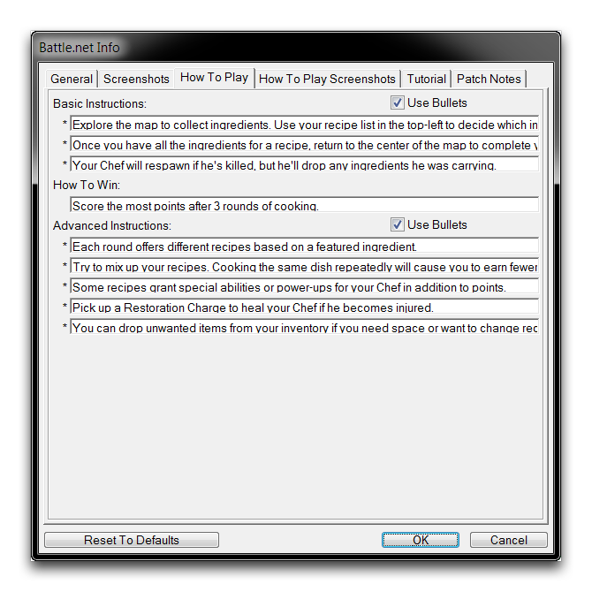
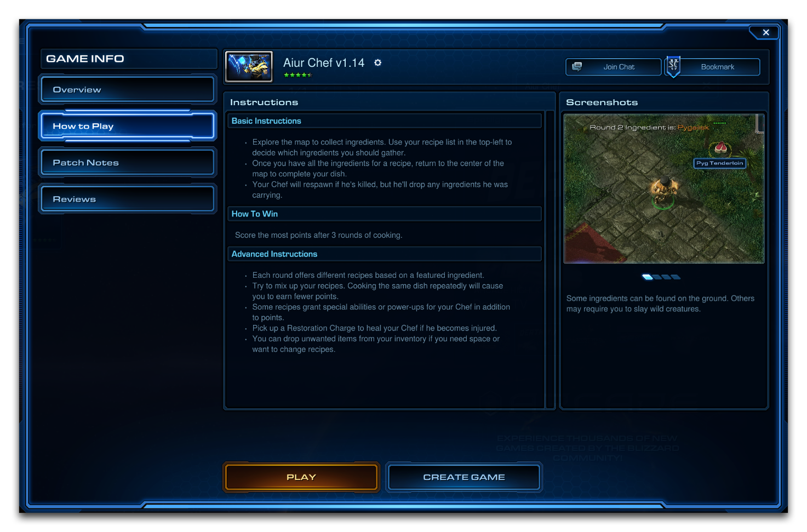
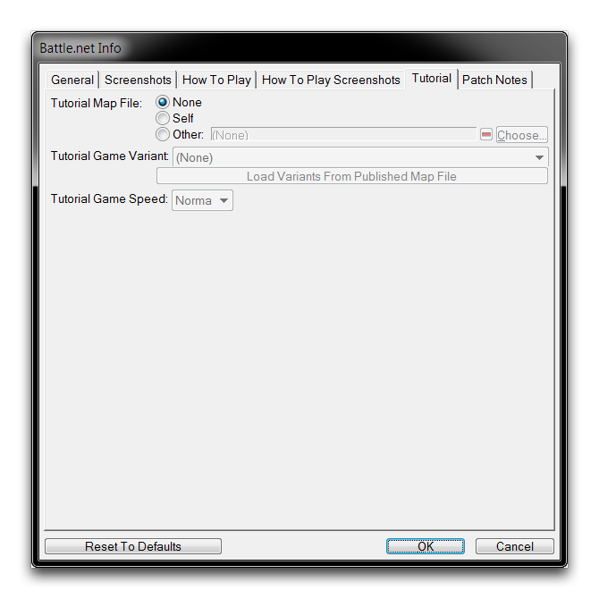
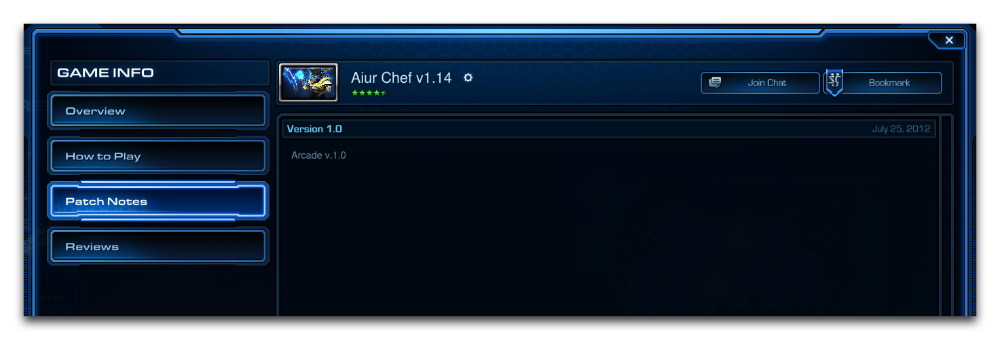

# Battle.Net Info

Battle.net Info is the hub for customizing how a map is presented on the Arcade.

## General

*General Tab*

A project's Icon and a linked Website are set under the General tab. The Website will be appended to the bottom of a game's Details and can offer a hyperlink to a community website. A project's Icon is used frequently throughout the Arcade as the main representation of a project. This includes the Browse screen, the Open Games listing, and many other locations. In the following image, you can see the icon next to the game's title on the Overview screen.

*Arcade Overview Screen*

## Screenshots

The Screenshots tab allows you to select five promotional screenshots to be published to the project's Overview screen.

*Screenshots Tab*

Screenshots are uploaded either from the map's current data with the Archive Browser or from the local computer. Each shot must have a resolution of 800x600 px. Should your screenshots exceed the default resolution, you will be prompted to crop the source image to the required size. Checking the Available In Game option will add the screenshot to the game's data separately (at the expense of publishing size). Once added, your screenshots are used to populate the 'Screenshots' rotation on the 'Overview' screen, as shown below.

*Screenshots from Overview Screen*

## How To Play

You can add a brief manual detailing how to play your game under the How To Play tab. Players in the Arcade will see these details at the 'How To Play' screen. Players will often check this screen while the map loads or while idling in a lobby. This gives you a chance to impart some strategic or gameplay information prior to the loading screen. You can see how to build your How To Play section in the image below.

*How to Play Tab*

Filling out the Basic Instructions, How To Win, and Advanced Instructions fields will fill their corresponding sections of the 'How To Play' screen. If you check the Use Bullets option, your instructions will keep the same bulleted appearance you see at the How To Play tab when they're on the Arcade. You can see how these descriptions look in the Arcade in the following image.

. 

Arcade How to Play Screen

## How To Play Screenshots

The How To Play Screenshots tab functions in the same way as the Screenshots tab and is used to add up to five screenshots to the 'How To Play' section of the project's Arcade page.

*How to Play Screenshots Tab*

The screenshots should be sized to 800x600 px, you can add a caption to each to help add context. Once added, the screenshots are used to populate a section on the rightmost side of the 'How to Play' screen, pictured below.

*How to Play Screenshots in Arcade How to Play Screen*

## Tutorial

The Tutorial tab can be used to set an instructional tutorial map for your project. Once set, players can access this map individually through the 'Play Tutorial' button found on the 'Overview' screen. A tutorial map can be used to give players a safe, risk-free space to learn essential skills required by the main map. Players will be presented with the option to play a tutorial map as shown in the image below.

*Play Tutorial Button on Overview Screen*

The Tutorial tab itself is shown below.

*Tutorial Tab*

The tutorial map is linked via the Tutorial Map File. There are three options to choose from. Selecting Self will provide the tutorial as a Tutorial Game Variant of the current map. Selecting Other allows you to define another map file, either saved locally or on Battle.net, to serve as the tutorial. Alternatively, you can select None, which will remove the 'Play Tutorial' button from the 'Overview' screen.

The Tutorial Game Speed option allows you to set the game speed of the tutorial map independently of the main map.

## Patch Notes

The Patch Notes tab allows you to add patch notes for each version of your project. These are displayed publicly on the 'Patch Notes' screen of the Arcade. Users can use this page to keep up with any important updates and balance changes, as well as seeing if the map is still being maintained.

*Patch Notes Tab*

Each 'Patch Notes' entry contains a Version, Date, and a set of Notes. Patches are always displayed according to their Version number, with the latest patch at the top. Each set of Notes can be a maximum of 100 lines long, while individual lines cannot exceed 140 characters. You can set the Version and Date manually and there is no requirement to match the values generated by the Arcade's publishing system.

*Arcade Patch Notes Screen*
