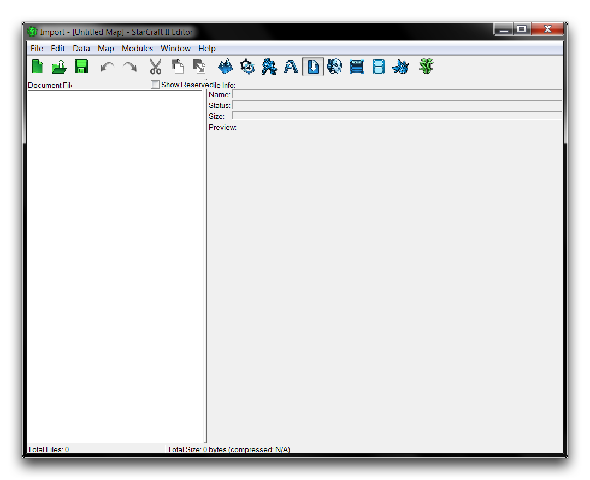
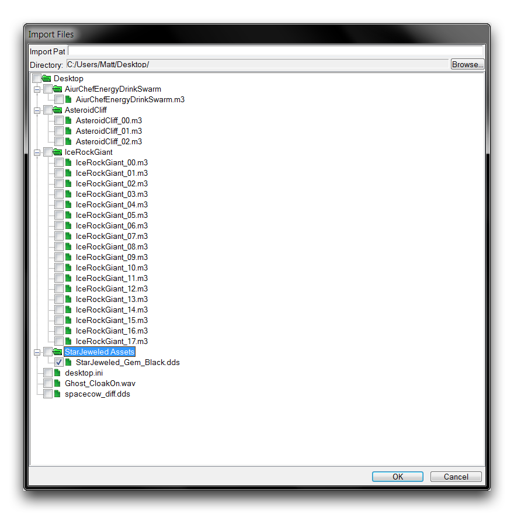
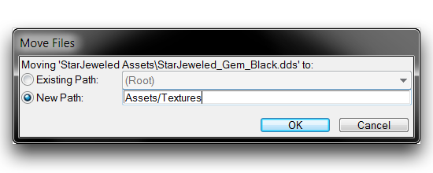

THE IMPORTER
============

The Importer allows you to incorporate custom assets from outside the
standard StarCraft libraries into your projects.

NAVIGATING THE IMPORTER
=======================

Open the Importer by navigating to Module -\> Importer. This will
present you with the following view.

The Importer

On the left, you'll see a subview tagged 'Document Files.' This is where
all imported files are listed in their respective directories. On the
right, you'll see a subview tagged 'File Info.' This is an information
window showing details on the current file. The importer in an active
file will look something like the image below.

Importer in an Active Project

As you can see, the files maintain their file structure within the
Importer, even after they have been imported to the project. While its
name suggests that the Importer is a tool solely for introducing new
files your project, it also acts as a sort of 'Import Module' from which
you can view any assets from outside the engine and see their current
file structure.

IMPORTING A FILE
----------------

Import a file by right-clicking in the 'Document File' area and
navigating to Import Files. This will launch the 'Import Files' window
shown below.

Importing Files

This window will be automatically populated with all of the files in the
selected directory. Each file marked with a check will be imported to
the Importer once you click the 'OK' button. You may activate or
deactivate all files in a specific folder by checking or unchecking the
top of the hierarchy of folders.

Checking the topmost folder, in this case 'Desktop,' will prepare every
directory file for import. Once you've made a selection, you can set the
file structure in the Importer using the 'Import Path' field. The image
above shows an asset borrowed from the Blizzard custom map StarJeweled.
It will be imported to the path 'Assets/Textures.' This will place the
texture 'StarJeweled\_Gem\_Black.dds' in a pre-existing location in the
StarCraft asset structure.

IMPORTED FILE DIRECTORIES
-------------------------

Returning to the Importer, you'll see that the filename is colored
green. This indicates that the file has been imported, but is unsaved.
There are several color-coded states in the importer, broken down in the
table below.

| Color | State                                          |
| :---- | :--------------------------------------------- |
| Green | File has been imported but is unsaved.         |
| Red   | File has been removed but is unsaved.          |
| Blue  | File has been moved or renamed but is unsaved. |
| Black | File is saved.                                 |

  Black     File is saved.
  ------------------------------------------------------------

At this point, you should save to cement the file in its position in the
project's file structure, as shown below.

Imported File Structure

Next, confirm that the file is in the correct directory. Remember that
the file was set to be pathed to the 'Assets/Textures' folder, but it
seems to have retained its 'StarJeweled Assets' folder from its original
location. You can remedy this using the Importer's file-moving
functionality.

MOVING FILES
------------

You can move a file by right-clicking on it and navigating to Move
Files. Once you've done that, the 'Move Files' window will appear. This
window offers the options to move the asset either to an 'Existing Path'
or to a 'New Path.' Select 'New Path' and enter 'Assets/Textures' to
move the file to the directory into which it should have been placed
originally.

Altering a File Path

Checking the Importer after saving the file should show you the result
pictured below.

Imported File with Corrected Directory

Now the file appears to be in the proper location. For a final check,
you can open the Archive Browser by navigating to Window -\> Console.
Type browse into the console. Use the browser's search function with the
asset's name to confirm its place in the file structure. The result of
this operation is shown below.

Archive Browser Confirming Proper File Structure
