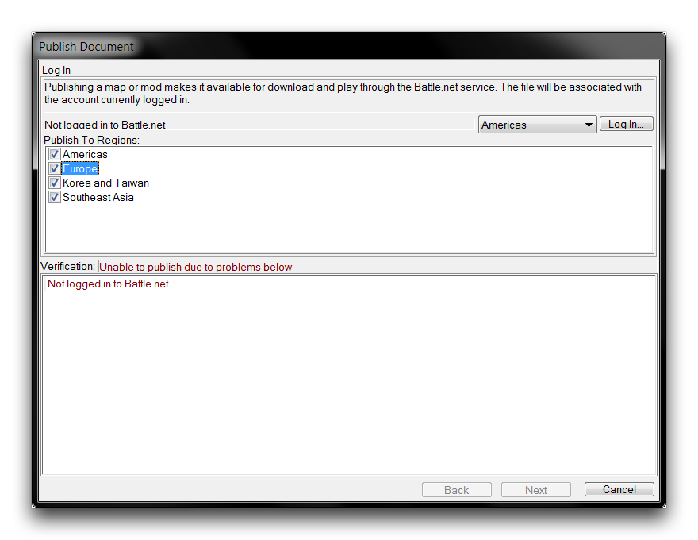
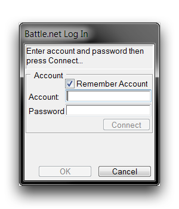
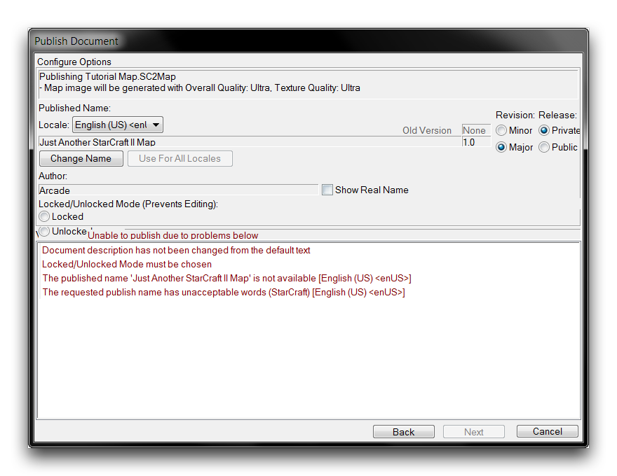
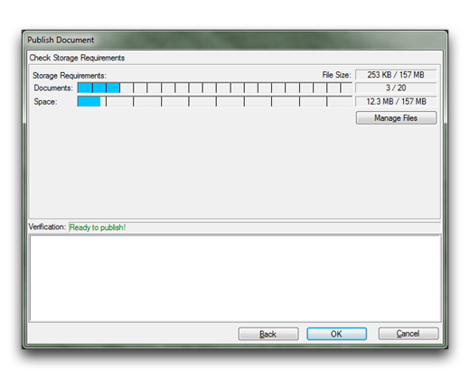

# Publishing

While projects made with the Editor can be played locally on a single-player basis, most creators intend to share their work online. Fortunately, Battle.net, Blizzard's hosting platform for games, has been extended to support developers working in the StarCraft engine. Gone are the days when projects had to be shared through game hosting, as was the case in WarCraft III and Brood War. Now, players can find and download games without any intervention from developers. This free-standing system also offers additional protection, version control, and localization support for its users.

However, network-based project sharing requires a little more upfront preparation from game developers. This preparation comes in the form of new publishing systems in the Editor. You can find them by navigating to File -\> Publish, which launches the 'Publish Document' window, pictured below.

*Publish Document Window*

The first screen you'll be presented with is the 'Log In' view, note the 'Verification' field, which mentions the publishing status. As you can see, the user cannot progress as they are 'Not Logged in to Battle.net.' In order to publish, you'll need a Battle.net account with a full version of StarCraft II attached to it. The Editor itself is provided with the StarCraft II: Starter Edition, but free users cannot publish online. That functionality can be acquired with any version of a StarCraft II account, including the standalone games.

If you click the the 'Log In' button, you'll be prompted to enter your account name and password.

*Battle.net Log In Window*

Enter your account email and password here, then select 'Connect.' If you have an authenticator associated with your account, another window will prompt you for your authenticator code. If you intend to publish often, you may want to make use of the 'Remember Account' toggle, which could save you a lot of time.

Once you've logged in and returned to the main screen, the 'Verification' should show a more encouraging 'Ready to Publish' message. You should also find that the 'Next' button is now usable. Before moving on, note the controls for 'Publish to Regions.' These are convenience options that allow your project to be published to multiple regions at once without requiring you to log in again.

## Publishing Requirements

Selecting 'Next' from the 'Log In' window will send you to the main publishing view, 'Configure Options.' Before a game can be hosted on Battle.net, it must meet a number of requirements. This screen gives you several options for prepping a project for upload, but the most important are the publishing requirements in the bottommost subview. If your project fails to meet any of these requirements, the 'Verification' field will read 'Unable to publish due to problems below,' as shown in the following image.

*Publishing Options Window*

The publishing requirements are usually small logistical issues requiring clarification before upload. Below you will find a table detailing some of the most common issues and their resolutions. Some of the options mentioned in these resolutions will be described in more detail in the following section.

| Requirement                                                      | Description & Resolution                                                                                                                                                                                                                                                |
| ---------------------------------------------------------------- | ----------------------------------------------------------------------------------------------------------------------------------------------------------------------------------------------------------------------------------------------------------------------- |
| Document description has not been changed from the default text. | Projects must have their default description changed.                                                                                                                                                                                                                   |
|                                                                  | Return to the editor, navigate to Map -\> Map Info, and change the text in the 'Description' field.                                                                                                                                                                     |
| Locked/Unlocke d Mode must be chosen.                            | A published map must be set to be either Locked or Unlocked.                                                                                                                                                                                                            |
|                                                                  | Set the map to either Locked or Unlocked from the 'Locked/Unlocked Mode' field in the 'Configure Options' window of the publishing system.                                                                                                                              |
| The published name 'X' is note available \[Locale\].             | The publishing name 'X' is already taken in the noted region Locale.                                                                                                                                                                                                    |
|                                                                  | Select a new publishing name for all regions, or return to the 'Publish to Locales' options, then manually localize for the problematic area with a separate name. Be warned that this method will result in the project requiring multiple publishing trips hereafter. |
| The requested publish name has unacceptable words.               | There are reserved words within the project's publishing name.                                                                                                                                                                                                          |
|                                                                  | Alter the publishing name.                                                                                                                                                                                                                                              |

Once all publishing requirements have been met, the 'Verification' field will show 'Ready to Publish\!'

## Publishing Options

'Configure Options' consists of a number of options designed to prepare a map for publication, as well as resolving requirement issues before upload. See below for a detailed breakdown.

| Field                | Details                                                                                                                                                                                                                                                     |
| -------------------- | ----------------------------------------------------------------------------------------------------------------------------------------------------------------------------------------------------------------------------------------------------------- |
| Published Name       | The publishing name for the project. This is the name used online, by default it is set to the project name set in 'Map Info.' You can change this using the Change Name button.                                                                            |
| Locale               | Selects the localization version for publishing.                                                                                                                                                                                                            |
| Revision             | Increments the automatically generated 'Version' field. Major releases increment the value by 1.0, while Minor versions increment by 0.1. Revision is tied to the publishing name. Every time the name changes, the value is reset back to the default 0.0. |
| Release              | Sets the game's accessibility. Private requires the uploader to host, and requires manual invites for each player. Public allows anyone to host.                                                                                                            |
| Author               | Uses your Battle.net ID to list authorship. If Use Real Name is selected, the name of your Blizzard Account will be appended.                                                                                                                               |
| Locked/Unlocked Mode | The lock status refers to the availability of source project. Unlocked maps can be downloaded within the Editor by any developer. Setting Locked removes the source from public availability.                                                               |

Take care when considering the Locked and Unlocked statuses. The former will properly protect your map from every developer, including yourself. If you lose your files with this status selected, your project will remain online with no way to recover it. Setting your project to Unlocked remedies this, and also allows you to share your project with other developers, assisting in the growth of collaborative knowledge.

## File Management

After each project option is configured and all requirements have been met, you can click 'Next' to arrive at the 'Storage Requirements' view. This gives you a breakdown of the space your file takes up, as well as size limits on your project.

*Storage Requirements View*

Every Battle.net account is allotted the following storage provisions: 20 concurrently uploaded files, 157 MB of total uploads, and a maximum individual upload size of 20 MB for maps and 100 MB for mods. These limits are not shared between regions. If you are approaching any of these limits, you can select 'Manage Files' to make changes to your current uploads. You will be brought to the 'Manage Published Files' window shown below.

*Published Files Manager*

This screen shows all projects currently uploaded to your account, listing their Locked status, Release, Version, and Size. Highlighting a project will reveal its full details. Any published project can be deleted from Battle.net. If you need to free up space, you can do so using the 'Remove From Account' button. Once you have finished, close the window and publish by clicking 'OK' in the 'Check Storage Requirements' view. You will be presented with a pop-up containing the EULA and TOU agreements.

*Compliance Check*

Once you have confirmed your compliance with the agreements, click 'Yes' to publish.
