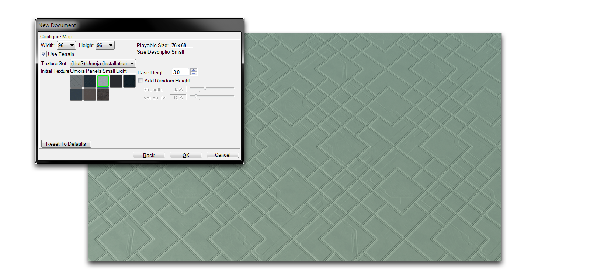
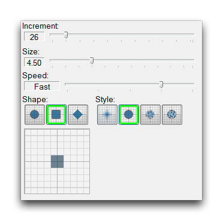
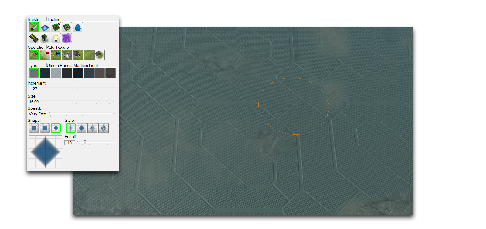
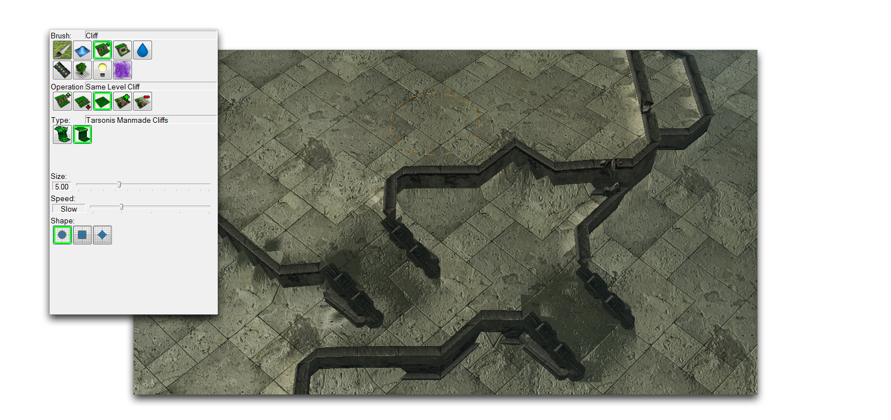
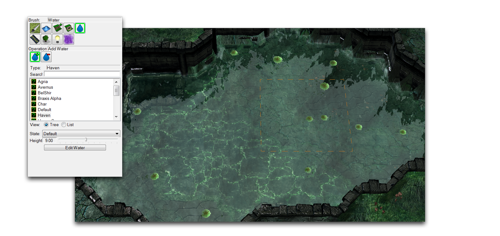
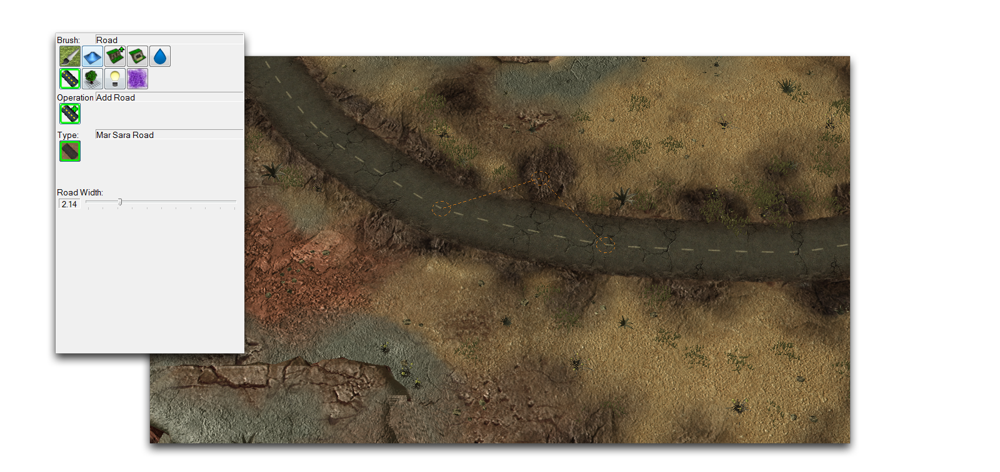
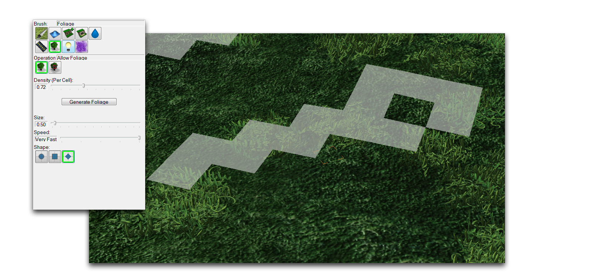

# Terrain Layer

The Terrain Layer deals with the fundamental elements of terrain design, including ground texture, elevation, cliffs, and water. You can access it from the Terrain Bar, by clicking the icon shown below.

*Terrain Layer Icon*

## Terrain Palette

Every map begins at the creation screen, here you'll make basic decisions about the look of your map, determining its texture, height, and size. Once the Editor has generated the map, it will open in the Terrain Editor, giving you a fresh slate of terrain, a blank canvas.

*Map Creation*

The terrain development process usually begins at the Terrain Layer. Continuing the painting theme, the tools in this layer are called brushes. They can be found in the Terrain Palette, shown below.

*Terrain Palette*

## Brush Options

Selecting any brush will display various modifiers within the palette. Every brush has options allowing you to control the ways in which you 'paint' your terrain. Below you'll see an example of these options, followed by a breakdown of all the options available to you.

*Brush Options*

| Pro per ty  | Effect                                                                                                                                                                                                                                                                   |
| ----------- | ------------------------------------------------------------------------------------------------------------------------------------------------------------------------------------------------------------------------------------------------------------------------ |
| Inc rem ent | Adjusts the magnitude at which the current action is performed.                                                                                                                                                                                                          |
| Siz e       | Changes the dimensions at which the current action is performed.                                                                                                                                                                                                         |
| Spe ed      | Adjusts the speed at which the current action is performed.                                                                                                                                                                                                              |
| Sha pe      | Selects the shape of the area in which the current action is performed.                                                                                                                                                                                                  |
| Sty le      | Applies an effect to the action being performed. These include various opacity, shape, and randomness options.                                                                                                                                                           |
|             | The Paintbrush style is the default standard with no additional effects.                                                                                                                                                                                                 |
|             | The Airbrush style applies a degree of opacity around the edges of the application area, controlled by the Variability slider.                                                                                                                                           |
|             | The Noise style adds a random component to the application, while the Fractal style applies the brush recursively. These final two styles, and their modification with the properties Variability and Resolution, are best described by the preview found in the Editor. |

Beyond these general options, each of the nine brushes available in the Terrain Layer has a number of unique options. You can read a breakdown of the brushes and their options in the following sections.

## The Brushes

This tool allows you to paint textures onto the surface of the map. Painting is done with a mixing system that allows the dynamic layering of a palette of eight textures per map.

*Texture Brush and its Use*

| Property        | Effect                                                                                                                    |
| --------------- | ------------------------------------------------------------------------------------------------------------------------- |
| Add Texture     | Applies the currently selected texture to the map using the selected brush options.                                       |
| Remove Texture  | Removes the currently selected texture to the map using the selected brush options.                                       |
| Uniform Texture | Applies the current texture at a locked Alpha value, resulting in no variation in opacity.                                |
| Replace Texture | Replaces the first texture selection with the second, does not alter any other textures.                                  |
| Smudge Texture  | Pushes the first texture the user clicks onto other textures for as long as the button is held.                           |
| Blur Texture    | Softens the border between adjoining textures.                                                                            |
| Fill Texture    | Fills an entire area with the selected texture. The area is selected based on the altitude at which the brush is clicked. |

This tool allows you to alter the topology of your terrain. All height features made with this brush will remain pathable by unit movement, regardless of how outlandish they may appear. You can make pathing distinctions with the cliff and pathing tools.

*Height Brush and its Use*

| Property  | Effect                                                                                   |
| --------- | ---------------------------------------------------------------------------------------- |
| Raise     | Increases the target area's height based on the brush options and Amplitude.             |
| Lower     | Decreases the target area's height based on the brush options and Amplitude.             |
| Uniform   | Alters the height within the brush's target area to be approximately equal.              |
| Noise     | Applies a random variation in height to the target area.                                 |
| Amplitude | Sets a magnitude for height alterations, similar to the standard brush option Increment. |

This tool changes the cliff levels of the target selection. There are four distinct levels of terrain, which have special gameplay rules and interactions. Ground-based units move between these layers using ramps. You can also use this tool to place those ramps.

*Cliff Brush and its Use*

| Property         | Effect                                                                                                                                              |
| ---------------- | --------------------------------------------------------------------------------------------------------------------------------------------------- |
| Raise Cliff      | Raises all terrain in the current target area up one cliff level. If the area is already at the highest level, it will not be altered.              |
| Lower Cliff      | Lowers all terrain in the current target area down one cliff level. If the area is already at the lowest level, it will not be altered.             |
| Same Level Cliff | Clicking with this brush selects the cliff level of the target area, holding the button will apply this level of cliff anywhere the brush is moved. |
| Add Ramp         | Creates a ramp between terrain levels at the target, if possible.                                                                                   |
| Remove Ramp      | Removes any ramps in the target area.                                                                                                               |
| Type             | Toggles between possible visual styles of ramps in the current terrain type.                                                                        |

This tool allows you to select from an array of dynamic set-piece objects available in the Editor. These terrain objects require special placement and cooperation with doodads or units to produce desired effects.

*Terrain Object Brush and its Use*

| Property            | Effect                                                                                               |
| ------------------- | ---------------------------------------------------------------------------------------------------- |
| Add Terrain Object  | Places the currently selected terrain object at the target area.                                     |
| Show Terrain Cells  | Displays any terrain cells in the target area that have had their visibility changed.                |
| Hide Terrain Cells  | Alters the visibility of any terrain cells in the target area.                                       |
| Terrain Object List | A list of all the available terrain objects, sorted by the cliff level they are properly applied to. |

This brush will apply regions to the map where water will be rendered. In this context, 'water' actually refers to a variety of dynamic fluids and may appear as lava or acid in certain terrain types. The regions are locked to a constant size applied in square units by this brush.

*Water Brush and its Use*

| Property           | Effect                                                                                                                                                                                                 |
| ------------------ | ------------------------------------------------------------------------------------------------------------------------------------------------------------------------------------------------------ |
| Add Water          | Applies a water region to the target area.                                                                                                                                                             |
| Remove Water       | Removes any water regions within the target area.                                                                                                                                                      |
| Water Type Listing | Offers a selection of various types of water which may be applied. Note that these are not linked to terrain types and may be applied in any quantity.                                                 |
| State              | Toggles between any alternate settings in the current water type.                                                                                                                                      |
| Height             | The height at which the water in the region being applied will render. Water is applied at a set height per region. This setting can affect the look of certain areas, from shallows to being flooded. |

This tool renders roads, which are treated as a special type of visual element. Roads are rendered automatically along a path laid down by this tool in points. This system is designed to quickly generate realistic looking roads without having to lay down individual doodad segments.

*Road Brush and its Use*

| Property   | Effect                                                                                                                                                                                                 |
| ---------- | ------------------------------------------------------------------------------------------------------------------------------------------------------------------------------------------------------ |
| Add Road   | Creates a road segment by placing individual points. Clicking outside of currently placed points will add a new segment. Clicking within currently placed points allows you to alter the road segment. |
| Type       | Selects from the road textures available in the current terrain type.                                                                                                                                  |
| Road Width | Alters the width of the road segment being currently placed.                                                                                                                                           |

## Foliage Brush

This tool allows you to paint regions so that the Editor can automatically generate foliage depending on their current texture. Foliage is a kind of automatically generated visual element, similar to a doodad, which cannot be directly altered in the Editor.

*Foliage Brush and its Use*

| Property         | Effect                                                                                                                                                                  |
| ---------------- | ----------------------------------------------------------------------------------------------------------------------------------------------------------------------- |
| Allow Foliage    | Sets the target area to permit foliage generation. When the brush is active, these areas will display in a grey overlay.                                                |
| Disallow Foliage | Sets the target area to not generate foliage.                                                                                                                           |
| Density Per Cell | Determines the amount of foliage to be generated when using the Generate Foliage option.                                                                                |
| Generate Foliage | Creates foliage elements within the marked areas of the map. Will also clear foliage from the last generation run, updating the areas whose foliage status has changed. |

This tool gives you access to a palette of four lighting regions to paint onto your map. It also allows you to mix these regions together. When the game is launched, each individual region will have a corresponding set of lighting options applied within its bounds. Any areas with a mix of lighting regions will have the lighting options mixed as well. This allows you to build dynamic, realistic lighting environments. While the brush is active, the four lighting regions are displayed using colored overlays of red, green, blue, and yellow.

*Lighting Brush and its Use*

| Property         | Effect                                                                                                                                                      |
| ---------------- | ----------------------------------------------------------------------------------------------------------------------------------------------------------- |
| Add Lighting     | Applies the currently selected region to the map using the selected brush options.                                                                          |
| Remove Lighting  | Removes the currently selected texture from the map using the selected brush options.                                                                       |
| Uniform Lighting | The first click of the brush samples the composition of the selection region. Continued use of the brush will then apply that composition to other regions. |
| Blur Lighting    | Creates a softer mixture between adjoining light regions.                                                                                                   |
| Fill Lighting    | Fills an entire area with the selected light region. The area is selected based on the altitude at which the brush was clicked.                             |

The creep tool allows you to create creep on the map without the need for creep-generating Zerg units. It also allows you to designate special rules to certain areas for disallowing or permitting creep.

*Creep Brush and its Use*

| Property       | Effect                                                       |
| -------------- | ------------------------------------------------------------ |
| Add Creep      | Applies creep to the target area.                            |
| Remove Creep   | Removes creep from the target area.                          |
| Disallow Creep | Flags the selected area to disallow the generation of creep. |
| Allow Creep    | Flags the selected area to allow the generation of creep.    |
