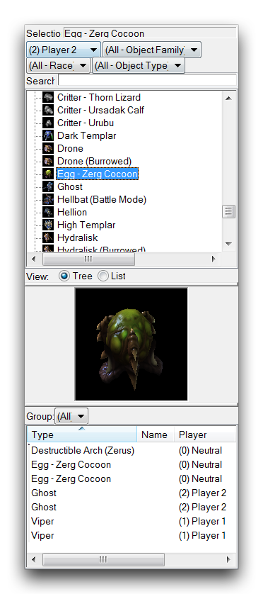
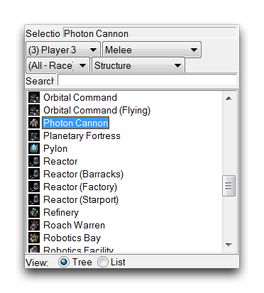
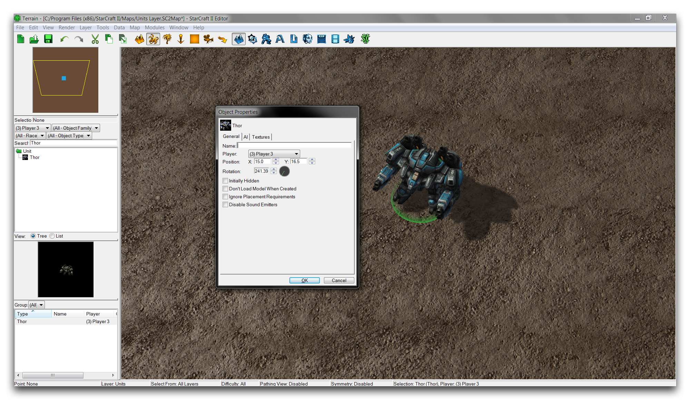
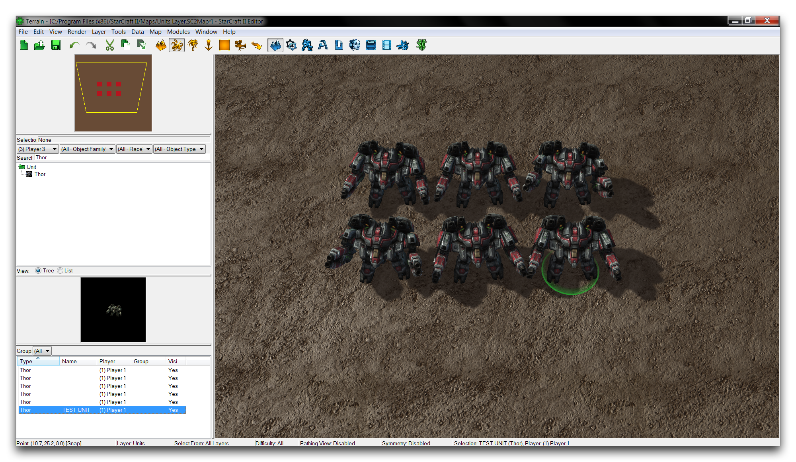

# Units Layer

The Units Layer is where you can place units on the map and configure them in various ways. While units may enter a game via triggers or other sources, placing them directly in the Editor can be useful for designing the look and feel of your game. You can access this layer from the Terrain Bar, by clicking the icon shown below.

*Units Layer Icons*

## Unit Palette

'Unit' is a very flexible term, usually referring to gameplay pieces such as marines, zealots, and the like. These examples are in fact units, but in the context of the Editor the term refers more broadly to a data type. In this case, a unit is an entity that can be placed in the Editor and used in the game. This includes traditional StarCraft units, but it also includes visual props, destructible terrain, resources, buildings, signs, and critters.

As previously mentioned, the Units Layer is a great tool for setting up the working parts of your game while completely avoiding any coding. This can be great for absolute beginners, but it also offers users of any experience level the ability to put together a quick mock-up. Every unit you place in the Terrain Editor will be seen in game unless you later modify or disable them using triggers. You can find, select, and place units using the options present in the Units Palette, shown below.

*Units Palette*

The main feature of the Units Palette is a listing of all units available for placement in the map. This list is populated from the map's current structure of data, including its dependencies and any data native to the current map. The list also gives you access to three layers of filters, allowing you to find by player, object family, race, and object type. You can see it in use in the image below.

*Finding Melee Structures*

The palette also boasts some supplemental features. The Existing Object list keeps a record of every unit you've placed on the map. It provides details about each unit's type, its owner, whether or not it belongs to any current groups, and its visibility status. This can be very useful for locating units in a crowded map or estimating the overall unit count during performance troubleshooting. Finally, there is also a Preview, which shows a rendering of the unit currently selected for placement. You can reorient this view with the standard camera controls. These features are shown in the image below.

*Units Preview and Existing Object List*

## Placing A Unit

To place a unit, look to the unit palette listing and find a subject either manually or using the search bar and filters. Try selecting a Thor by typing into the search bar. Clicking on the unit and navigating to the main viewport will show a transparent preview of the unit ready to be placed.

*Unit Placement Preview*

Click again to place the unit, it should turn solid and will now show up in the Existing Object list.

## Configuring A Placed Unit

When placing units in the Terrain Editor, you also unwrap some of their properties for easy configuration. You can edit the Thor's properties by double clicking on it the main viewport. This will launch the 'Object Properties' window, shown below.

*Unit's Object Properties*

The Object Properties window allow you to make a variety of adjustments to a selected Unit. The options displayed may vary depending on what unit you're working with. Below you'll find a breakdown of the properties this window allows you to edit.

| Property | Description                                                                                      |
| -------- | ------------------------------------------------------------------------------------------------ |
| Name     | Applies a custom label to the specified unit. This label is visible in the Existing Object list. |
| Player   | Sets ownership of the unit.                                                                      |
| Position | Sets the location of the unit in the map via X and Y coordinates.                                |
| Rotation | Adjusts the facing angle of the unit in the Editor.                                              |

As an exercise demonstrating the utility of these features, place a few more Thors on the map using the previous procedure. Edit the object properties of each of these units and make sure they have all their Player values to Player 1. Now select the single original Thor and set is ownership to Player 3. Use its object property Name to give it the label TEST UNIT. If you check the Existing Object list, the labelled unit should be clearly differentiated, as in the image below.

*Labelled Unit*

Go back to the Thor assigned to Player 3 and change its ownership to Player 1. Shuffle the Thors together by moving them around on the Units Layer. You can even set the units so that they are all facing the same direction using their Rotation property, making them all appear identical. Note that a unit at a 270° Rotation will face the camera. You should be left with something that looks like this.

*Unit located with Name Property*

Under ordinary circumstances, these units would be indistinguishable. In this instance, the label you assigned to the Thor is still visible in the Palette Existing Object list, and this will help you to locate your unique Thor after the shuffle. If you had given this unit some special gameplay significance, being referenced in triggers for example, then the ability to find it in the Terrain Module quickly is particularly useful.
