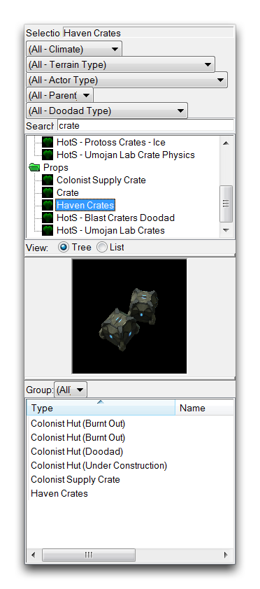
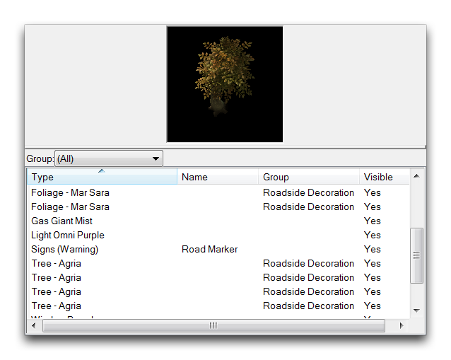

DOODADS LAYER
=============

The Doodads Layer contains decorative environmental objects called
doodads. These are the fundamental map styling element of the Editor,
with thousands available. You can find this layer via the Terrain Bar,
using the icon seen below.

Doodad Layer icon

DOODADS PALETTE
---------------

The Doodads Palette functions as a catalog of doodads, allowing you to
sort, search, and place doodads. There are no restrictions on the use of
Doodads, and the palette gives you access to any doodads available in
the current release. Keep in mind that doodads can accumulate quickly
and overuse of doodads is a common cause of performance dragging. You'll
find this palette in the leftmost portion of the Terrain Editor when the
Doodads Layer is active. The palette itself is shown below.

Palette Preview and Existing Object List

The Doodad Palette boasts five search filters to help you find map
elements. You can apply these filters by navigating to a specific pull
down and selecting a filtering option, as shown below.

Doodad Filtering

The list will be updated to include every doodad with the selected
property. These filters stack, so you can search by multiple properties
at once. The following table contains a breakdown of the filters you can
use.

  ----------------------------------------------------------------------------
  Filter    Description
  --------- ------------------------------------------------------------------
  Climate   A major division of Terrain Types that helps narrow down doodad
            options by a general season, biosphere, or feel.

  Terrain   Filters by the specific setting and texture set that on which
  Type      doodad was originally designed to be placed. Matching the doodads
            and the map's Terrain Type is an excellent starting point for
            selecting complementary pieces.

  Actor     Set to Doodad by default. Typically this filter should remain on
  Type      that setting, but in advanced use this filter allows you to place
            some other types as map decoration, as if they were a doodad.

  Parent    Filters by the parentage of the doodad in the Data Editor. Like
            Actor Type, this is an advanced use category that allows for the
            placement of some non-traditional doodad elements.

  Doodad    Filters by tags of the intended usage for each doodad. Provides
  Type      useful, descriptive categories like Environment, which isolates
            trees and bushes, or Cliff and Ramp, which consists of doodads
            that can be embeded into walls.
  ----------------------------------------------------------------------------

Aside from search filters, the doodad layer offers a few supplementary
features for placing and editing existing doodads. As in the Units
Layer, there is an Existing Object list that tracks all doodads
currently placed in the Editor, and a Preview which supplies a rendering
of the doodad currently selected for placement. Double clicking a doodad
will launch its 'Object Properties' window where you can tag it with a
name, and alter its visual properties in a number of ways. A combination
of these features are shown below.

Doodad Preview and Existing Object List
