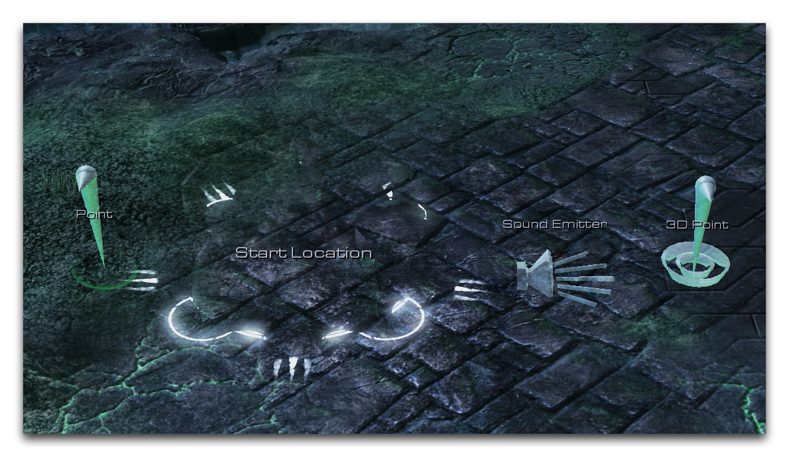
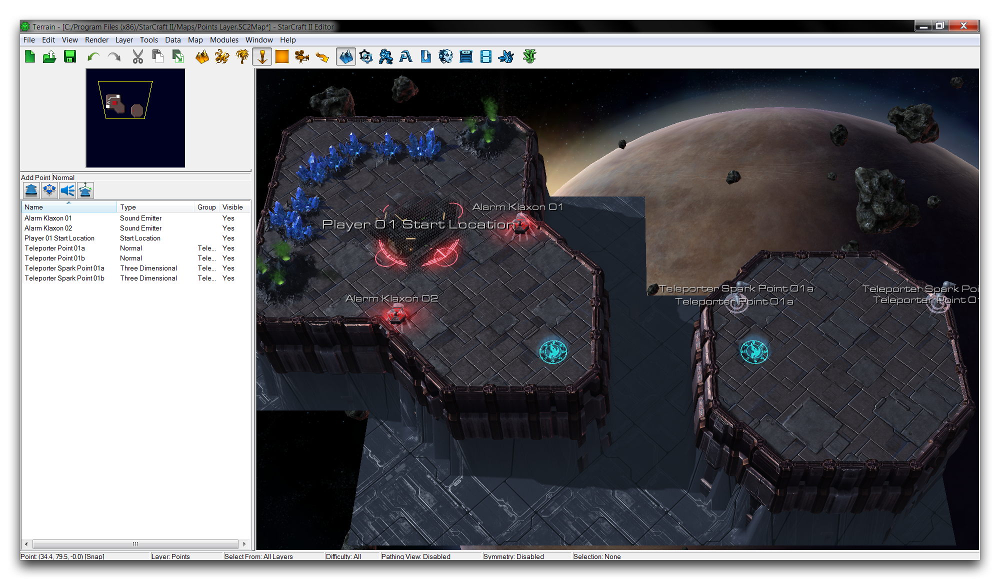
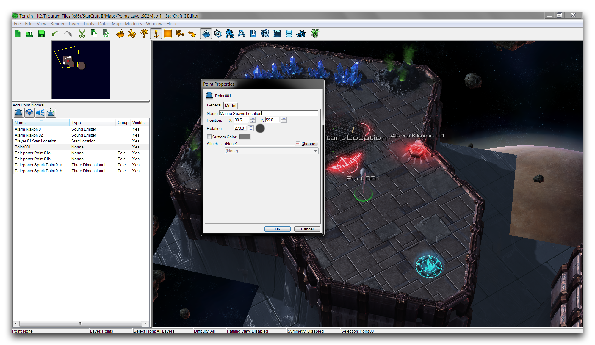
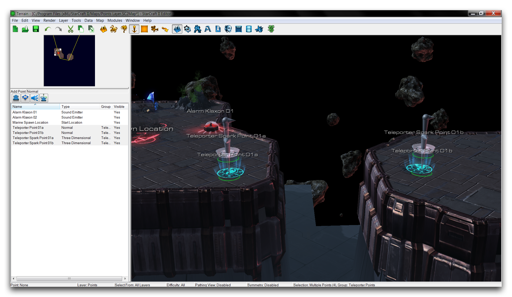
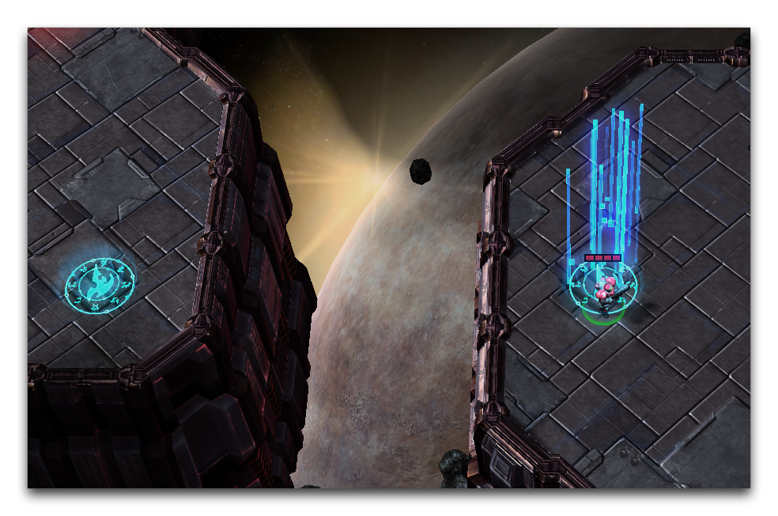

POINTS LAYER
============

The Points Layer uses marking elements called points. Points communicate
locations to other Modules and can be accessed from the Terrain Bar
using the icon pictured below.

Points Layer Icon

POINTS PALETTE
--------------

The Points Palette is where you'll find the tools for creating the
different types of points, as well as a list of every active point in
the map. You can find it on the left-hand side of the Terrain Editor
when the Points Layer is active.

Units Preview and Existing Object List

There are four types of points, Normal Points, Start Locations, Sound
Emitters, and 3D Points. You can place each of them by selecting their
respective tools and clicking on the desired location on the map. This
will mark that location with a point and create a marker at the
location. You can move points after they've been placed by selecting and
dragging the marker. Despite the appearance of their markers, points
don't take up any space and will not be visible outside of the Editor.
You can also hide the markers individually by right-clicking on a point
in the Points Palette and changing their Show in Editor property. Point
markers appear in the Editor as shown in the image below.

Four Types of Point Markers

POINT TYPES
-----------

 they mark a specific coordinate
on the map in the XY plane.

 to players, marking their
initial starting positions. This is a special distinction which receives
several uses throughout the Editor. These points mark the location for
spawning the base and workers in standard melee games. They also set the
default initial camera position for their respective players.

 sounds at their location.
Typically they produce environmental noises within a specific distance
range on the map. This means you can use them as a sort of audio doodad,
creating decorative and atmospheric sound.

 but have an additional Height
value, meaning they are used to mark a coordinate in XYZ or 3D space.

POINT PROPERTIES
----------------

Points have a number of configuration options that you can set from the
'Point Properties' window. You can access this window by double clicking
a point's marker in the Terrain Module. Alternatively, you can double
click a point's name in the list on the Points Palette. Below you will
find an example of a Point Properties window and a breakdown of the
options it gives you.

Point Properties

  ------------------------------------------------------------------------------
  Property   Description
  ---------- -------------------------------------------------------------------
  Name       Labels the point for identification in the Points Palette.

  Position   The location of the point on the map as an XY value.

  Rotation   An angle stored within the point for possible use. The default
             facing of a point is 270 degrees. A point with a custom marker will
             show this facing.

  Color      Tints the point's marker a select color. This option is not
             available for Start Locations.

  Attach To  Selecting a unit with 'Choose' will immediately set the point's
             position to that of the unit. The point will then stay attached to
             the unit as it moves, allowing it to serve as a marker for the
             unit's position. Useful for communicating dynamic locations to
             other Modules.

  Model      Customizes the point's marker model.

  Height     For 3D points only. Sets the Z component of the point's location.

  Sound      For Sound Emitters only. Sets the sound to be played by the
             emitter.
  ------------------------------------------------------------------------------

DEMOING POINTS
--------------

Open the demo map provided with this article. You'll see a small course
nestled on a space platform with several points already placed. The
course should appear as in the image below.

Demo Map Course

The objective here is to make use of some existing trigger code that
will spawn a marine, then allow the beacon on the map to teleport the
marine from one platform to another. Navigate to the Trigger Editor and
note the 'Initialization' trigger. A trigger for creating a marine has
already been set up, but it requires a point for the marine to be
spawned at. This trigger appears as follows.

Trigger Requiring a Spawn Point

Create that point by navigating to the Terrain Editor and clicking on
the Normal Point tool in the Points Palette. Click somewhere near the
start location on the leftmost space platform to create a point. Double
click the new marker to open the 'Point Properties' window and label the
point 'Marine Spawn Location.' You should be looking at something like
the image below.

Labelling a Point

Return to the Trigger Editor and set the 'Point' value of the creation
trigger to Marine Spawn Location. The finished trigger should match the
image below.

Point Hooked up to Trigger

Your marine is now prepared to use the teleportation system, but if you
turn your attention to the map you'll notice that the points controlling
the teleportation have been moved out of position. You'll find it useful
to use 'Object Groups' to help you reposition those points. You can find
them by navigating to Map -\> Object Groups -\> Points.

Grouping these points together will let you manipulate them all at once.
First, you'll have to put them all into one group. Right-click in the
leftmost subview and select Add Group. Name the group 'Teleporter
Points' and then right-click in the rightmost subview and select Add
Points. This will launch the 'Placed Objects' window, where you can add
the points to a group. Select Teleporter Point 01a, Teleporter Point
01b, Teleporter Spark Point 01a, and Teleporter Spark Point 01b, then
click 'Ok.' This procedure is shown in the image below.

Creating the Object Group

Now you should make sure that Use Group Selection is on by navigating to
Tools -\> Use Group Selection. This means that moving any point in a
group will move all of the other points in that group as well. Use this
by selecting one of the grouped teleporter points. Move the leftmost
point to the leftmost beacon on the space platform. Both sets of points
should now line up with the beacons, as shown below.

Aligning the Points to the Teleportation Beacons

Running the map as a test should now spawn a marine at the 'Marine Spawn
Point.' From there, you can move the marine onto the beacon, which will
cause him to teleport to the rightmost platform, then back again.

Teleportation Complete
