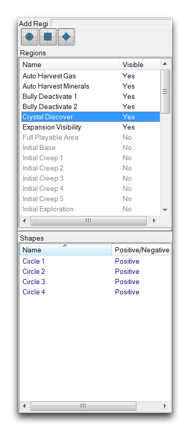
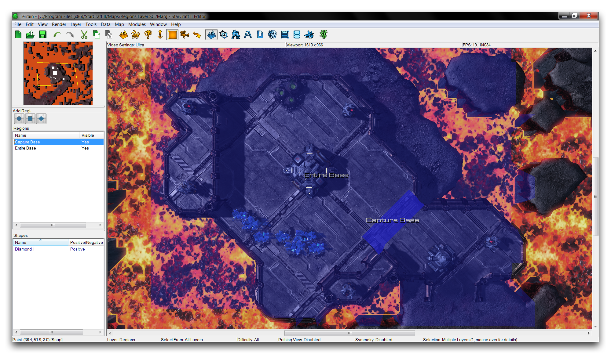
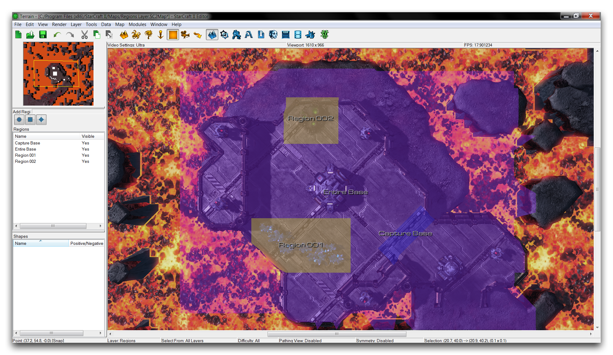
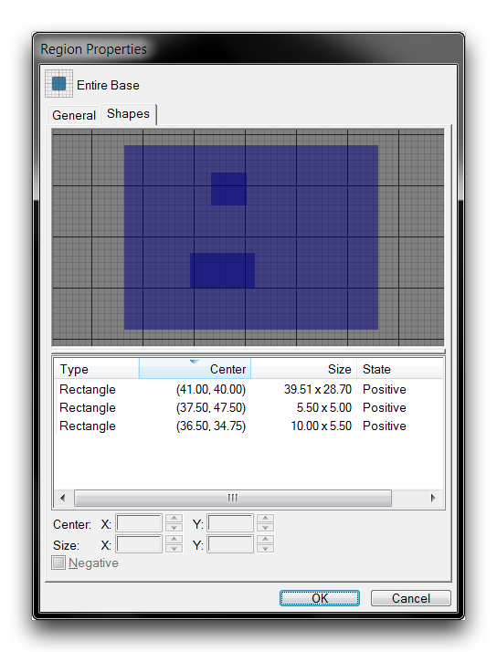
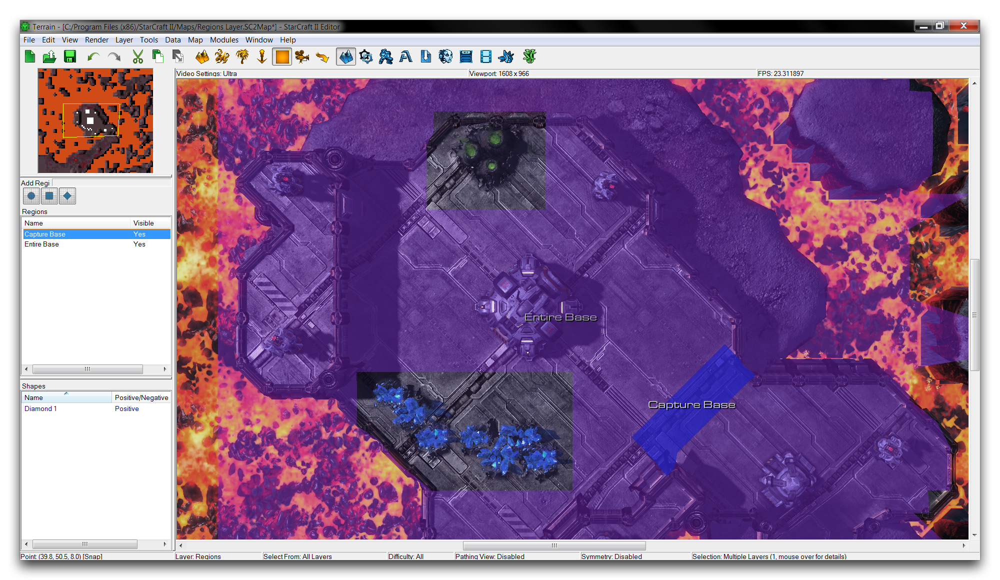

REGIONS LAYER
=============

The Regions Layer allows you to create regions. Regions are marked zones
of the map that communicate areas for use in other Modules. Regions
differ from points in that they mark specific shapes on the map, rather
than single coordinates. Select this layer from the Terrain Bar using
the icon shown below.

Region Layer Icon

REGIONS PALETTE
---------------

The Regions Palette is where you'll find the controls for creating
regions, along with a list of any regions already on the map. This
palette is on the left-hand side of the main viewport when the Regions
Layer of the Terrain Editor is active. It looks like the image below.

Regions Palette

Regions consist of shapes applied to the map using three tools: the
rectangle, the circle, and the diamond. Areas in a region are marked in
the Editor using a colored overlay, but are invisible during normal
play. You can also build composite regions by combining any number of
basic shapes. You can combine shapes either positively, so that their
areas are added together, or negatively, so that an area is subtracted
from an existing region.

You can check the composition of a region by selecting a region and
consulting the bottommost subview of the Regions Palette. This list will
show a tally of all the primitive forms contained within that region and
if they were combined in the Positive or Negative method.

REGION PROPERTIES
-----------------

Composite regions are built using the 'Region Properties' window. You
can find this by double clicking on a pre-existing region either in the
map view or within the Regions Palette. You can see an example of the
Region Properties window in the image below.

Composite Region Building

Here, you can build a composite by beginning with a single, positive
region. You can then add shapes by right-clicking on the shape listing
and selecting Add Circle, Add Rectangle, or Add Diamond. Any of these
shapes can be turned into cutouts by selecting the Negative option.
Positive regions are displayed as a blue overlay, while negative regions
are displayed in red. Back in the map view, the actual shape will be
displayed as a colored overlay, with negative cut-out regions appearing
transparent. In the map view, the example from above would appear as
shown below.

Composite Region in Editor

DEMOING REGIONS
---------------

Open the demo map provided with this article. This map consists of a
small fort on top of a hill, with a pair of player-owned hellions some
distance away.

Demo Map Course

If you check the Trigger Editor in this map, you'll find that there is a
brief action found under 'Player 1 Captures Base,' which will turn
control of the fort's neutral units over to the player once a unit
entering a region. To facilitate this, you'll create a region near the
fort's entrance that can be hooked into this trigger.

Create a region by clicking on one of the three region tools in the
Regions Palette. The Add Region Diamond tool will be most appropriate
here. Select it, then click and drag on the map view to draw the region.
This should give you something that looks like the image below.

Creating a Region

If you don't like the placement of your region, you can resize it by
toggling the cursor into selection mode. Pressing Space on the keyboard
will swap the mouse cursor between a normal pointer for selection mode
and a pointer with a plus sign for region creation. Once you're in
selection mode, clicking on a region will reactive it, allowing you to
move it by clicking and dragging the region to another location. You can
resize the region by holding down Ctrl and clicking on the edge of the
region, dragging it to a new size.

Now, click the region in the Regions Palette to launch its 'Region
Properties' window, then navigate to the 'General' tab. Set the name to
'Capture Base.' The properties window should look like the one shown
below.

Region Properties Contents

You can edit the region in the leftmost view under the 'General' tab, as
above. It's also worth noting that the dimensions and position of the
region are presented under the 'Shapes' tab as Size and Center. You can
confirm your region size here if you had any trouble during the original
placement.

Next, return to the Terrain Module and prepare another region by
selecting the Add Region Rectangle tool. This time, create the region so
that it encompasses the entire hilltop fort. Rename this region 'Entire
Base'. You should be left with something like the image below.

Current Region Layout

If you're having trouble seeing the entire scene, try either zooming out
or setting the camera to a bird's eye view by going to View -\> Entire
Map. From this view, you can zoom in and get the perspective seen in the
example image. Note that you can also highlight a specific region by
selecting it in the map view, as has been done for the 'Capture Base'
region above.

Unfortunately, there are now minerals fields and a vespene geyser inside
the 'Entire Base' region. According to the actions in the Trigger
Module, this would result in the player being given control of these
resources. Resources typically must belong to the Neutral player. You
can use a composite region to build a region that encompasses the base,
but also makes allowance for these elements.

Prepare your composite region by creating two rectangular regions, one
boxing around the mineral line and one around the vespene geyser. You
can change these to Negative regions that will be cut out of the larger
shape, ensuring that resources aren't included in the region. This
procedure should result in the following view.

Cutout Regions Prepared

To make sure everything is easy to read, the new regions and 'Capture
Base' have had custom colors applied to them. You can do this by heading
to Region Properties -\> General -\> Custom Color. You can now create a
composite region by selecting its three constituent regions, then
navigating to the 'Region Properties' window. Select all the regions by
holding shift and clicking on 'Capture Base,' 'Region 001,' and 'Region
002.' Now right-click in the Regions Palette and navigate to Edit -\>
Merge Selection.

Collected Region Properties

This view presents an abstraction of what you can see in the Terrain
Editor. From here, you can create the cutouts by selecting the two
smallest regions and changing their State to Negative. The negative
shapes will be drawn in red, which should give you a result like the one
shown in the Region Properties window below.

Constructed Composite Region

Returning to the map view should now show the region containing the
entire fort, but with two holes around the resources.

Cutout Regions Prepared

Now that the regions make sense, you can move to the Trigger Editor and
back to the 'Player 1 Capture Base' trigger. Select the 'Unit
Enters/Leaves Region' event, and double click on the 'Region' field.
This will launch a 'Regions' window populated with the active regions on
the map. Select the composite region 'Capture Base' and click 'Ok,' as
in the image below.

Selecting Composite Region

Now move to the 'Change Owner' action and set the 'Region' field to
'Capture Base' using the method described earlier.

Now that the project is complete, you can take a moment to review its
function. By moving the hellions at the base of the hill into the
'Capture Base' region, the trigger event will shift everything in the
'Entire Base' region into the player's control. Due to the cutouts in
the composite region, the minerals and gas geyser should remain neutral
entities.

If everything is working, hitting 'Test Document' and leading the
hellions into the fort's entrance should transfer ownership correctly,
as shown below.

Claiming the Fort
