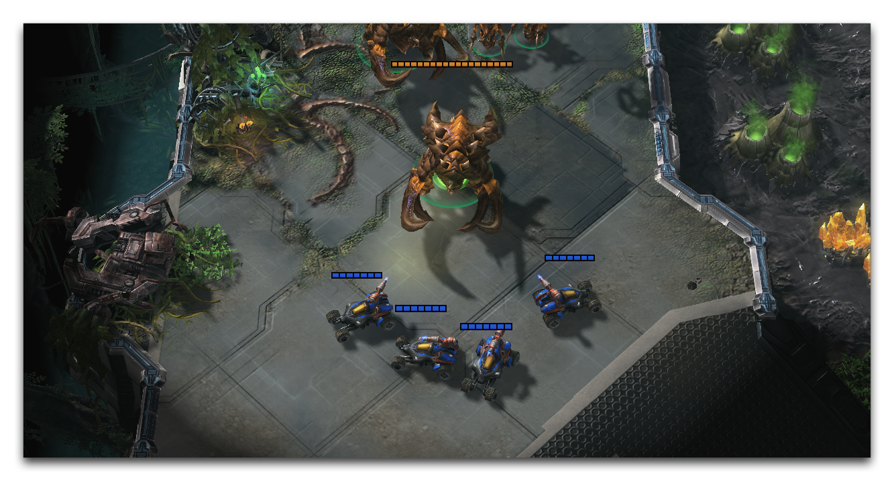

# Cameras Layer

StarCraft is usually seen from the top-down view that characterizes the standard melee game.

*Standard Melee View*

It's easy to overlook the fact that this view is a central point of much of the game's visual design. Despite the engine's cinematic usage throughout the single player campaign, players can often forget that they're looking through a dynamic, fully moveable camera.

Using the Cameras Layer, unique perspectives, effects, and movements can be described using a type of game object called a camera. This layer offers you the ability to hop inside these objects easily, allowing you to see from their viewpoint and configure them for use. You can then use the Trigger Editor and the Cutscene Editor to use cameras in various cinematic or gameplay capacities to offer your players a richer experience. To learn more about cameras, move to the Cameras Layer from the Terrain Bar using the icon pictured below.

*Cameras Layer Icon*

## Camera Objects

Once created, cameras appear as marker objects in the Editor, showing their position and orientation just like an actual camera. Cameras will only appear within the Editor, where they are displayed as a phantom 3D model, as shown below.

*Camera Object*

Despite its illustrative appearance, the camera in the left of this frame is essentially the same as a point that would be found on the Points Layer. The camera is closely related to a '3D Point' in that it is a point in space with an X, Y, and Z value. The big difference between a camera and a 3D point is that the camera also has a vector. This vector is an arrow in 3D space describing a direction.

The combination of the camera's point and vector equate to a location and viewpoint. When you introduce a camera object, the camera transmits information describing 'Where it is' and 'Where it is looking' to the game, setting the view for the player. Looking through the lens of the above camera gives you the view below.

*Camera View*

Remember the 3D model that marks the camera in the Editor view and it's easy understand as a representation of a point and vector. The point is roughly where the center of the lens is, while the vector is represented by the projection coming out of lens.

Maintaining your understanding of the Editor's cameras as physical cameras will make them easier to work with. At some point, you may find yourself managing many cameras as you build game scenes and cinematics. In these situations, it helps to think of yourself as a director, setting scenes and placing particular camera shots.

## Cameras Palette

You'll find cameras and camera creation controls as part of the Cameras Layer under the Cameras Palette, shown below.

*Cameras Palette*

The main list on this palette tracks each camera available in the current map. You can look through any camera by selecting them from this list and clicking View Selected Camera. Here you will also find support for exporting camera configurations to files through the Save View to File option. Cameras are created using the Create Camera button here, which spawns a camera in the Editor at your current viewpoint.

## Camera Properties

Once you've created a camera, you can configure it through its 'Camera Properties.' This is accomplished by right-clicking on a camera in the Cameras Palette and navigating to Camera Properties. You will then be presented with the 'Camera Properties' window, which is shown below, followed by a breakdown of its options.

*Camera Properties*

| Property        | Description                                                                                                                                                               |
| --------------- | ------------------------------------------------------------------------------------------------------------------------------------------------------------------------- |
| Distance        | Determines the space between the camera and its target.                                                                                                                   |
| Roll            | Rotates the angle of the camera in the plane of the page. If the camera were your head, consider Roll as rotating in the direction that would turn your view upside down. |
| Yaw             | Rotates the camera side to side. If the camera were your head, this would be equivalent to looking from left to right or shaking your head in a 'no' motion.              |
| Pitch           | Rotates the camera up and down. If the camera were your head, this would be equivalent to nodding your head in a yes motion.                                              |
| Target X        | The X coordinate of the map that the camera vector is pointing to.                                                                                                        |
| Target Y        | The Y coordinate of the map that the camera vector is pointing to.                                                                                                        |
| Target Z Offset | The differential between the camera and target point. Essentially the Z coordinate or height of the camera. Also known as Height Offset.                                  |
| Depth of Field  | An effect that blurs components of the view to resemble real world vision. This setting sets the start, end, and magnitude of this effect.                                |
| Field of View   | Controls the extent of the game world visible to the camera.                                                                                                              |
| Near Clip       | The distance of the closest clipping plane, closer than which no game elements will be rendered. Essentially the starting distance in 3D space at which rendering begins. |
| Far Clip        | The distance of the furthest clipping plane, beyond which no game elements will be rendered. Essentially the distance in 3D space at which rendering stops.               |
| Shadow Clip     | The minimum distance at which shadows are drawn.                                                                                                                          |
| Custom Color    | Tints the camera model within the Editor.                                                                                                                                 |

## Free Camera Controls

The Editor offers a set of hotkeys for moving its viewpoint in 3D space, known as the free camera controls. By orienting the viewpoint before using the Create Camera tool, you can use these controls as an intuitive way of designing cameras. These controls can be viewed by navigating to File ▶︎ Configure Controls, then searching for the Free Camera labels, as shown below.

*Free Camera Controls*
