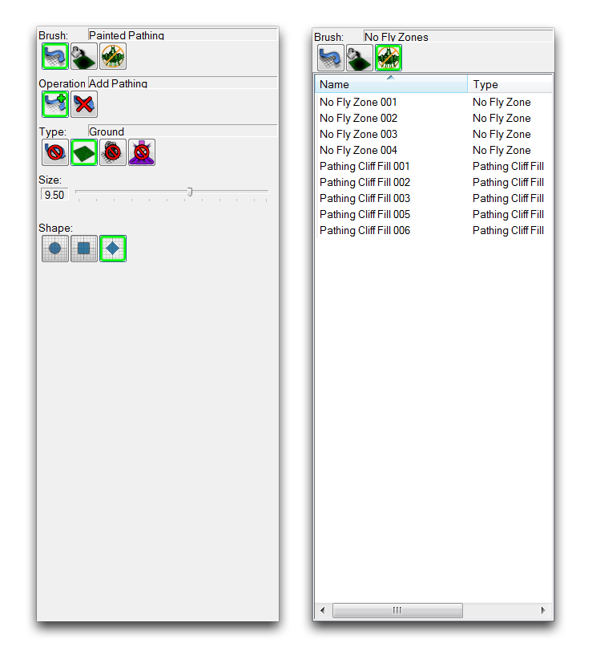
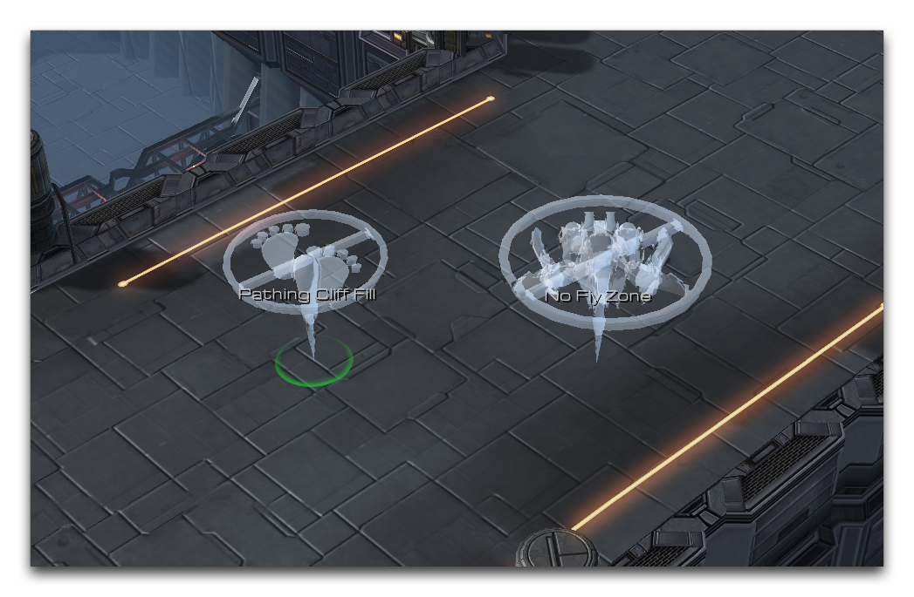

PATHING LAYER
=============

The Pathing Layer is where you control pathing within your map. As a
concept, pathing describes which actions are permissible within an area,
such as moving, building, or flying. Laying down pathing zones
determines the rules governing where these actions can take place. You
can access this layer from the Terrain Bar by clicking on the icon
pictured below.

Pathing Layer Icon

PATHING PALETTE
---------------

No matter how clearly you delineate an environment in the Editor,
players will always probe at its edges and explore beyond the intended
boundaries of the map. As a result, maps require information about where
certain types of basic actions should and shouldn't be allowed,
otherwise gameplay falls apart. You can introduce this information to
the map using rule-enforcing pathing zones.

Creating pathing zones is fairly straightforward. All you'll need is an
understanding of what the specific types of zones prohibit, then all you
need to do is decide on where to apply these rules. You can find the
tools for creating pathing zones in the Pathing Palette. The palette
itself is in the Terrain Editor at the Pathing Layer.

Pathing Palette Views

PATHING TYPES
-------------

 several types of pathing zones
using a brush-like tool. These zones are painted onto the terrain as an
overlay, coloring the map with a different shade for each of the four
different pathing types. When a player launches your game, the pathing
rules will be applied to the marked areas. Below you'll find a breakdown
of the modifiers available for this tool.

  --------------------------------------------------------------------------
  Property    Effect
  ----------- --------------------------------------------------------------
  Add Pathing Applies the selected pathing type to the target area.

  Remove      Removes all pathing from the target area.
  Pathing     

  Size        Changes the size of the area to which pathing is being
              applied.

  Shape       Changes the shape of the area to which pathing is being
              applied.

  No Pathing  This pathing type prevents any units from pathing into this
              area. Colorized red.

  Ground      This pathing type describes the area, as Ground, which has
              special rules set for certain abilities and other data types.
              Colorized green.

  No Building This pathing type prevents any units from building structures
              in the area. Colorized yellow.

  No          This pathing type prevents any units from using a burrow
  Burrowing   ability in the area. Colorized blue.
  --------------------------------------------------------------------------

The following image shows an area making use of painted pathing.

Painted Pathings

Note that the tower structures have been marked with No Pathing zones,
to prevent units being dropped to their decorative high grounds. An area
on the ground has been marked with a No Building zone. Here the designer
has deemed the metal grates of this area to be an unrealistic target for
any building.

 option for creating No Pathing
zones. It will set everything at the destination point's terrain level
to not support pathing as a sort of flood fill.

 Pathing Fill, but apply to
flying units pathing over the area.

You can find both of the last two pathing options under a separate view
of the Pathing Palette. This view provides a list of every active
dynamic pathing object, similar to the lists found in the Points Layer
and Regions Layer. Unlike the colorized regions of Painted Pathing,
dynamic pathing objects are displayed within the Editor using markers,
as you can see in the image below.

Dynamic Pathing Fill and No Fly Zone
