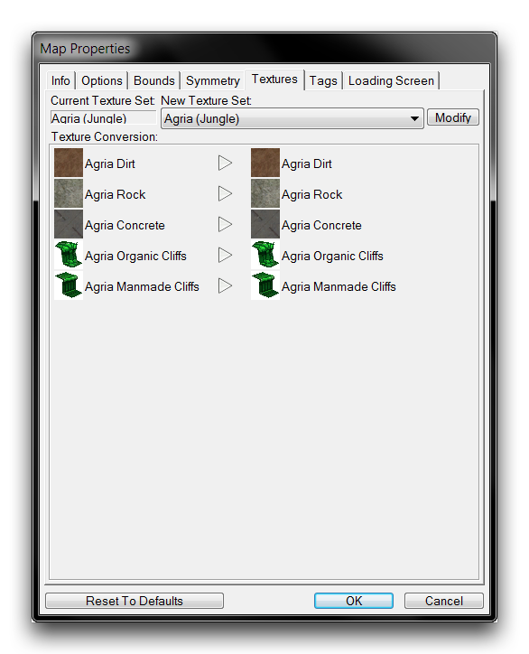
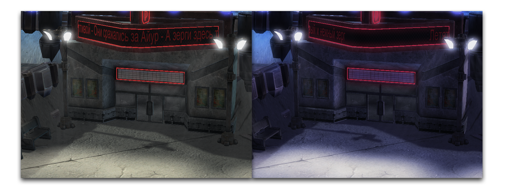
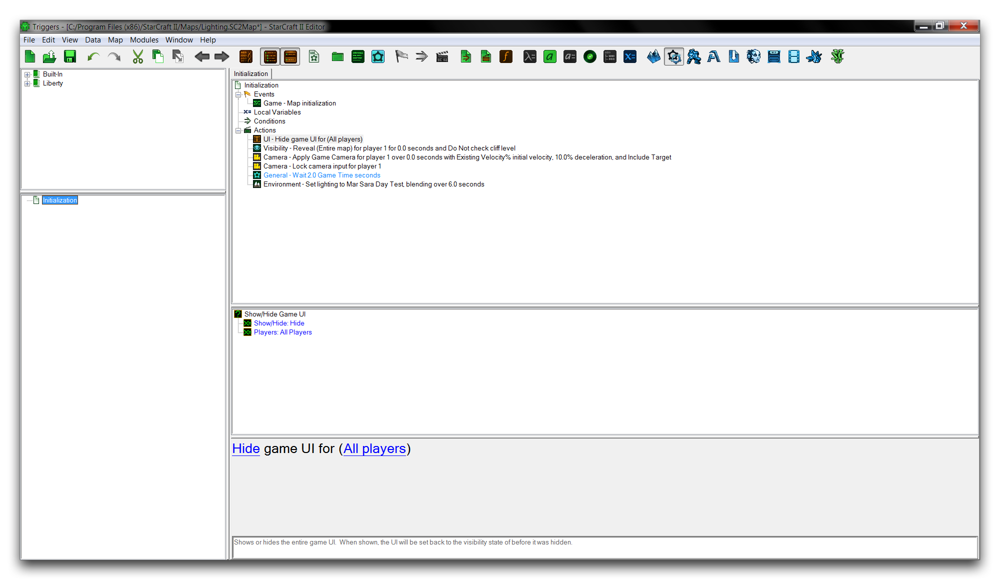

LIGHTING
========

The Editor features a robust lighting system that you can use to create
a wide palette of moods, looks, and feels for your project. The image
below is an example of how the same scene can be realized in different
ways by editing the lighting alone.

Varied Lighting on the Same Scene

LIGHTING DETAILS
----------------

Lighting is actually accomplished in a number of different ways in the
StarCraft engine. You may recall seeing light sources like street lamps
props and mining lights attached to characters. Some spell and ability
effects can even dynamically light a scene in interesting ways, but this
article will focus on global lighting effects within a map.

The lighting in a map is set to one particular style at a time. It can
then be dynamically altered to other styles during gameplay. You'll find
these lighting styles in an extensive data type called Lights, which is
handled directly through the Data Editor. Due to the number of options
available when working with lighting, the Editor also features a special
tool called the Lighting Window. This interface collects all of the
lighting controls and puts them alongside the pre-built lighting styles
within the Editor.

Varied Lighting on the Same Scene

DEMOING LIGHTING
----------------

Open the demo map provided with this article. You'll see that it
contains a scene in which a bar front is lit with a default lighting
setting that looks like natural sunlight. First, you'll learn how to
change the lighting from day to night, then how to use triggers to
slowly reintroduce daytime lighting, simulating a sunrise.

The best place to start is in the Data Editor. Lighting is applied on
the basis of the current Terrain Type. This is the designation in data
for the landscape controlling the textures, style of doodads, and so
forth. The demo map is set to the 'Agria (Jungle)' type. Open the
'Terrain Type Tab' by clicking on the 'New Tab' + button and navigating
to Edit Terrain Data -\> Terrain Types. Now, set the lighting by double
clicking on the 'Lighting' property as shown below.

Lighting Data Property

If you're unsure what Terrain Type your map is using, you can see it by
navigating to Map -\> Map Textures. The field 'Current Texture Set' will
provide the answer, as shown below.

Checking Terrain Type

Clicking on the 'Lighting' field will launch the 'Object Values' window.
Find the 'Mar Sara Night Test' lighting, select it, and click 'Ok.'

Selecting Lighting

Confirm that you've successfully changed the terrain's lighting by
opening the Terrain Module and selecting Render -\> Show Lighting -\>
Game Lighting. The main view should show a much darker, twilit scene.
The difference between the original lighting settings and the new ones
is shown below.

Lighting Changes

Now go to the Trigger Editor and open the 'Initialization' trigger. This
trigger uses some actions that remove the game's UI, reveal the map for
view, and apply a standard camera. Add a new 'Wait' action by
right-clicking under the 'Actions' heading and navigating to New -\> New
Action. Set the 'Time' field of this action to 2.0. Then add the 'Set
Lighting' action, using the same procedure. Set the 'Light' field to
'Mar Sara Day Test' and change the 'Blend Time' to 6.0. This should
leave you with the following.

Prepared Trigger

The map is now complete. If you run a test, after a brief wait, the
current lighting style, 'Mar Sara Night Test' will slowly change,
blending into 'Mara Sara Day Test.' Giving a night-to-day lighting
transition just like a sunrise. Launch the 'Test Map' function to see
the result. It will slowly change the scene's setting, similar to the
sequence shown below.

Lighting Changes Simulating a Sunrise
