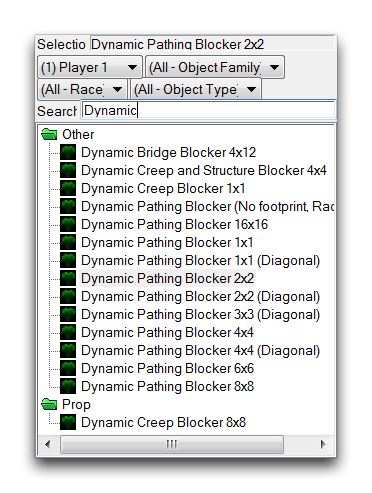
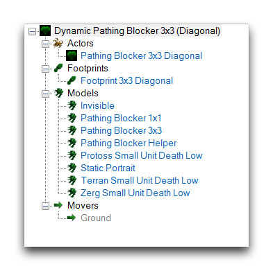
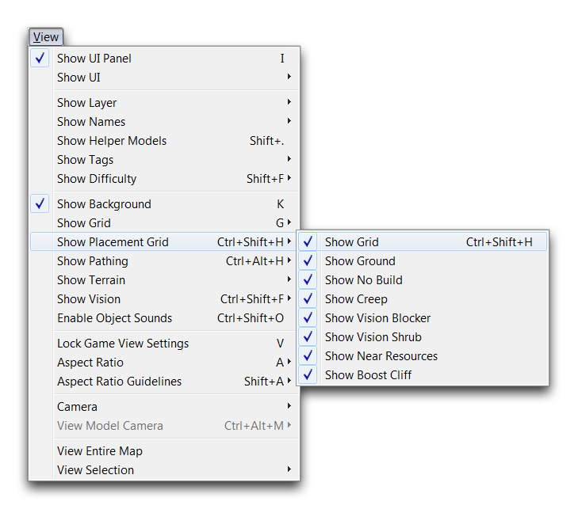
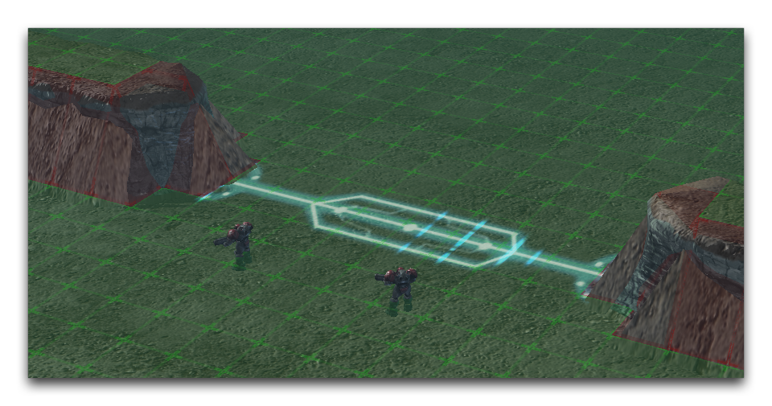
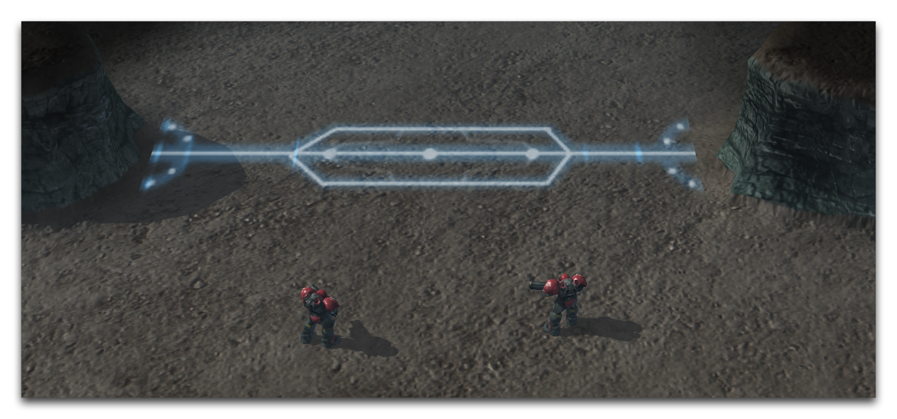

# Dynamic Pathing Blockers

Dynamic Pathing Blockers let you build pathing zones that can be switched on and off during gameplay. This ability is based on the fact that they are actually units, meaning that they can be shown or hidden through trigger actions. Hiding a unit suspends its footprint, removing its pathing accordingly. When the blocker is shown again, its pathing will be restored.

There are a number of uses for pathing on the fly like this. Most notably, you can restrict access to certain portions of the map until a condition or quest-type action is met. Dynamic pathing blockers will also show their footprints in the Terrain Editor, making them easier to work with than any other solutions for creating temporary blockages.

## Creating Dynamic Pathing Blockers

You can find pre-made dynamic pathing blockers in the Units Palette by searching for the term 'Dynamic.'

*Dynamic Pathing Blockers*

The name of each blocker typically notes its footprint size and shape, as well as the type of pathing it blocks. Dynamic pathing blockers are not to be confused with the dynamic pathing fill option in the Pathing Layer. The former is a pathing zone that can be altered during game-time, while the latter fills an area in the Editor with a 'No Pathing' zone.

You can also build dynamic pathing blockers from scratch using the template PATHINGBLOCKER during unit creation, as shown in the image below.

*Dynamic Pathing Blockers*

Once you've created it, you'll need to set the pathing blocker's 'Footprint' field to the desired Footprint object. It also needs to be connected to a unit actor in order to connect it to its standard models. The blueprint for a common blocker is shown below.

*Dynamic Pathing Blocker Data Composition*

## Placing Dynamic Pathing Blockers

The placement grid is particularly useful when placing dynamic pathing blockers. You can enable it by navigating to View -\> Show Placement Grid, then checking all of its options.

*Placement Grid View Options*

For this demo map, the dynamic placement blockers are used to simulate a sort of energy gate. This map uses a 'Protoss Energy Line (Blue)' doodad along with some cliff faces to give the placement blocker a visual element. You can see these in the image below.

*Energy Gate Site*

Due to the construction of the map, there is only an eight unit-wide area where the marines can pass through the gate. This is the ideal scenario to use dynamic pathing blockers, and the map has been fitted with four 'Dynamic Pathing Blocker 2x2' in order to fill the gap.

*Energy Gate with Dynamic Pathing Blockers*

Since the path is closed off by the dynamic blockers, you can turn them on and off to give the functionality of a doorway or gate.

## Using Dynamic Pathing Blockers

Because dynamic pathing blockers are units, they will only apply their footprints when they are active on the map. You can use the trigger action 'Show/Hide Unit' to change the blocker's status, effectively switching them on and off as needed. Any other actions that can target units can be used with dynamic pathing blockers to varying effect, useful choices include 'Kill Unit,' 'Create Units,' and 'Move Unit Instantly.'

In the demo exercise, the dynamic pathing blockers have been added to a group during map initialization. From there, the following trigger was added.

*Dynamic Pathing Blocker Toggling Trigger*

This trigger alters the dynamic pathing blocker's status every five seconds. When the 'Line Hidden' variable is set to False, the gate is faded in using the SetOpacity actor message. This same statement block also activates the dynamic pathing blocker with the 'Show Unit' action. The closed gate will appear as follows.

*Path Blocked by Closed Gate*

When the variable is switched to True, the opacity and blocker status are toggled with SetOpacity and 'Hide Unit' respectively. This eliminates the gate and blocker from the map, allowing units to pass through.

*Path Revealed by Open Gate*

## Attachments

 * [031_Dynamic_Pathing_Blockers.SC2Map](./maps/031_Dynamic_Pathing_Blockers.SC2Map)
