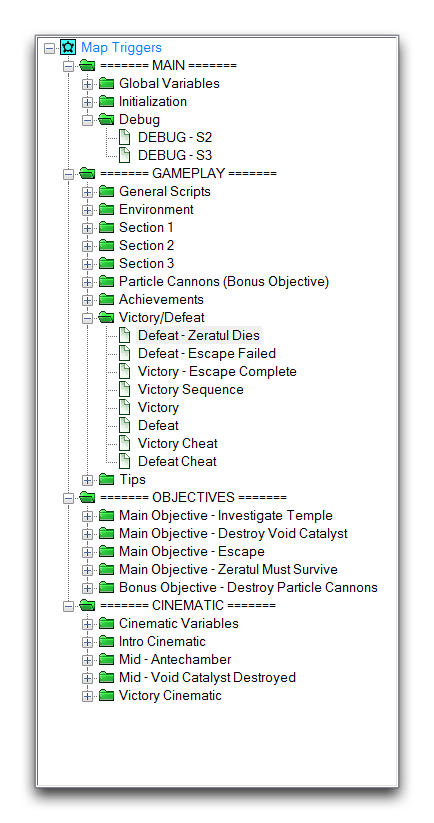
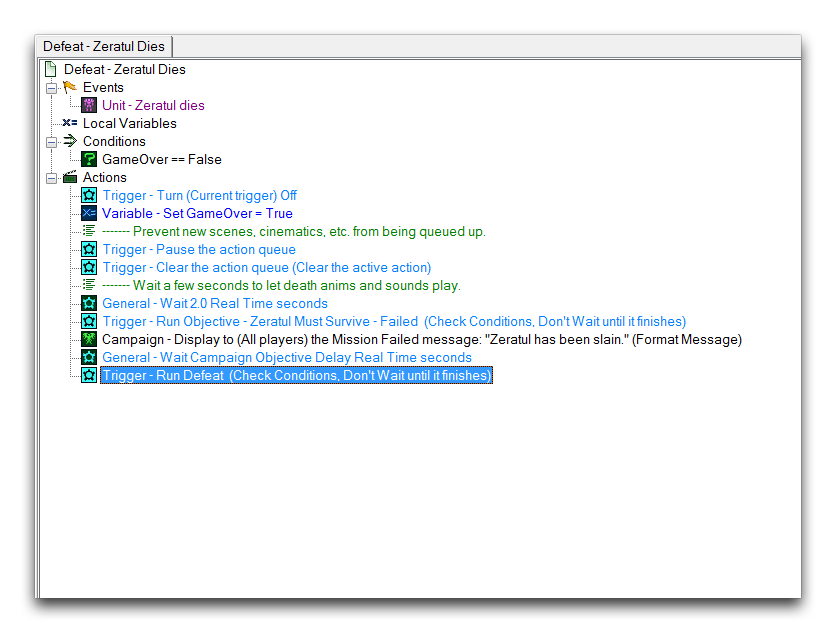

TRIGGER EDITOR INTERFACE
========================

The Trigger Editor is a construction-site for triggers, actions, events,
and all the other elements that make up the logic of the trigger system.
The moment you start working in the Trigger Editor, the logic you build
will be made active in the map immedaitely, enforcing rules, building
mechanics, and creating gameplay.

THE INTERFACE
-------------

Trigger Editor Interface View

The Trigger Editor offers a clean, ordered representation of all the
logic elements active in a project. Any developers with programming
experience will note the resemblance to a standard text editor. The
lynchpin of this interface is the Triggers Panel, shown below.

Triggers Panel

Inside the Triggers Panel you'll find a list of all the active trigger
elements in a project. As well as providing an overview, this will be
your primary means of navigating your project. Selecting an element in
this panel will display its information in the middle of your screen,
inside the Trigger Content Panel.

Trigger Content Panel

Depending on the type of element you've selected, this panel can take on
a number of different layouts.

Variable Content -- Definition Content -- Trigger Content

When the Use Subviews option is enabled, this view will also introduce a
Trigger Content Panel Subview, which shows the fields of an element
alongside any available tooltips.

Trigger Content Panel Subview

As your project grows, you'll find another manageability option
available in the form of the Trigger Explorer. Enabling this will append
a viewer to the Triggers Panel showing a breakdown of the components
inside the currently selected element. You can use this to scan through
a larger project's components as quickly as possible.

Trigger Explorer

Projects can grow to include libraries, which are collections of trigger
elements shared between multiple maps. All of the standard, pre-made
elements are also included in a map via libraries. You can find a list
of all the libraries currently in a map in the Libraries Panel.

Libraries Panel

The segment of the Main Toolbar available from this module is the
Trigger Bar.

Trigger Bar

All of the Trigger Editor's viewing and creation options are made
available here for your convenience. Below you'll find a table that
breaks down the options available from the Trigger Bar.

  ---------------------------------------------------------------------------
  Action         Effect
  -------------- ------------------------------------------------------------
  Back           Reverts commands backward through the Trigger Editor
                 history.

  Forward        Reverts commands forwards through the Trigger Editor
                 history.

  View Raw Data  Changes the view from plain-language to raw script
                 identifiers and Galaxy function calls.

  Show Libraries Toggles the Libraries Panel on or off.

  Use Subviews   Toggles the Trigger Content Panel Subview on or off.

  New Element    Creates a new element of the type that is currently
                 selected.

  New Folder     Creates a folder in the Triggers Panel.

  New Comment    Creates a comment at the current cursor location.

  New Trigger    Creates a trigger in the Triggers Panel.

  New Event      Creates an event in the Trigger Content Panel.

  New Condition  Creates a condition in the Trigger Content Panel.

  New Action     Creates an action in the Trigger Content Panel.

  New Condition  Creates a condition definition in the Triggers Panel.
  Definition     

  New Action     Creates an action definition in the Triggers Panel.
  Definition     

  New Function   Creates a function in the Triggers Panel.

  New Parameter  Creates a parameter in an active definition within the
                 Trigger Content Panel.

  New Preset     Creates a preset in the Triggers Panel.
  Type           

  New Preset     Creates a value in an active preset within the Trigger
  Value          Content Panel.

  New Record     Creates a record in the Triggers Panel.

  New            Creates a sub-function in a currently active function within
  Sub-function   the Trigger Content Panel. For this, you must have the
  type           Sub-functions flag checked in 'Function Options.'

  New Variable   Creates a Global variable in the Triggers Panel or a Local
                 Variable in the Trigger Content Panel depending on cursor
                 position.
  ---------------------------------------------------------------------------

VIEWING OPTIONS
---------------

Using the View Raw Data option will translate the plain-language
statements of the Trigger Editor into the Galaxy function calls, as
shown in the image below.

View Raw Data

This can be useful if you'd like to move into script editing. Moreover,
you can use the View Script option to look at the actual game scripts.
Selecting this option will launch the Script Test window shown below.

Script Test Window via View Script
