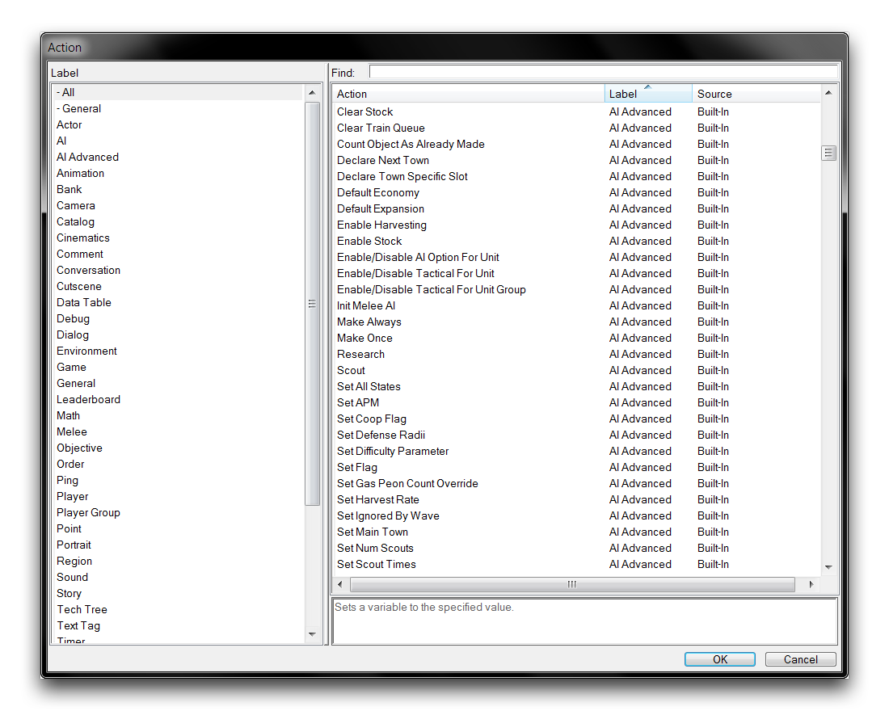
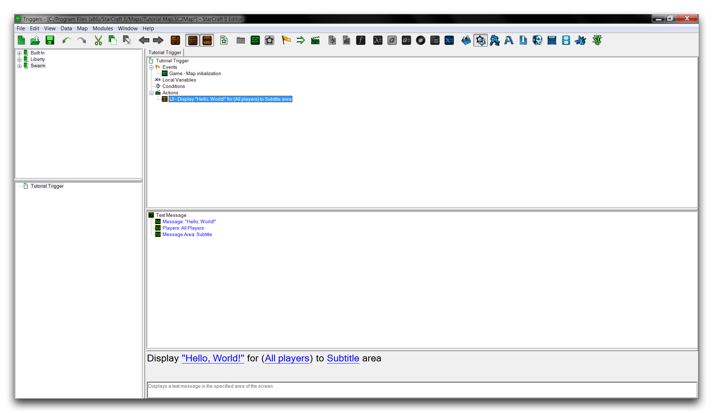

# Actions

Actions are the individual commands within a trigger that make a change within the game. An activated trigger resolves by running each of its actions in a directed sequence. Each action provides a distinct function, which can be combined with any number of other actions to create larger effects. Essentially, actions are the building block statements that you'll use to direct the game.

## Creating An Action

First, create a new trigger by right-clicking the Trigger Panel and navigating to New -\> New Trigger. Inside your new trigger, launch the 'Actions' window either by double clicking the 'Actions' heading or by right-clicking inside the Main Tab and navigating to New -\> New Action.

*Actions Window*

The 'Actions' window shows a list of available actions in its rightmost view. You'll also see a few searching options here, allowing you to search by category, by browsing the sidebar on the left, or from the top search bar.

Type "Text Message" into the search bar and select the action called 'Text Message.' This should present you with the following view.

*Text Message Action*

## Setting Action Terms

The anatomy of the action is shown in the Main Tab's subview here. You'll notice the term 'Message' is colored red. Red text denotes a required value for an action to be valid. By contrast, the blue text for the other two terms of the action presents their default values. In the tab view, you'll see that the action is marked with a distinct red X, showing that it is invalid. A map with invalid elements won't run correctly, so it's important that you take note of them.

To enable this action, a message is required. Click on the term 'Message' and add the text 'Hello, World\!' to the popup. Click 'OK' and return to the main screen to validate your action. To test this action, its trigger must be called in some manner. In this case, you'll add a 'Map Initialization' event by navigating to Events -\> Map Initialization. This should bring you to the following view.

*Configured Action*

Running the 'Test Document' action should result in this trigger firing after the map begins. The message will print to the default 'Subtitle' area just above the game's UI. Your test run should return a result like the one shown below.

*Action Screen Output*

## Action Effects & Varieties

The criteria for the event (Map Initialization) has occurred, resulting in the action firing, which displayed your message to the screen. This is the basic process from which gameplay emerges. You can vary the types of things you are able to do by studying the actions available in the basic library. Highlighting an action in the 'Actions' window will display basic tips below the list. These same tips are also available in the bottommost subview of the Main Tab. Here's a brief intro to some commonly used actions.

| Action                     | Effect                                                                                                                                                     |
| -------------------------- | ---------------------------------------------------------------------------------------------------------------------------------------------------------- |
| Set Variable               | Determines the value of any variable available to the map.                                                                                                 |
| Create Dialog              | Builds a dialog container for 'Dialog Items,' allowing for custom UI constructions.                                                                        |
| Create Unit (Facing Angle) | Spawns a unit with a specific rotational heading in the plane of the map.                                                                                  |
| Play Sound                 | Runs a sound file from the StarCraft Asset library.                                                                                                        |
| Show/Hide \_               | A group of actions that change visibilities of objects on a player basis. For example, Show/Hide Dialog Item can create distinct UI items for each player. |
| Set \_                     | A group of value changing actions. For example, Set Alliance defines if players or player groups are hostile to one another.                               |
| Remove \_                  | A group of removal actions. These will eliminate many types of entities from the game, as in Remove Unit, Remove Behavior or Remove Inventory Item.        |
