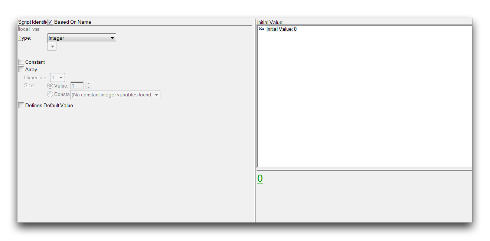

VARIABLES
=========

A Variable is a symbolic representation of a value, able to stand in for
a number, a point, a model, or any possible type of data found in the
StarCraft engine. By abstracting a data type into a symbol, variables
can act as a container, storing or delivering any value of their chosen
type.

Variables can also be fit into larger constructs, like actions or
conditions, where they'll transfer their ability to take and deliver
data. Imbued with the ability to operate using constantly changing
values, once-static statements will come to life, becoming the dynamic,
central building blocks of game development.

VARIABLE SCOPE
--------------

There are two different classifications of variables, Local and Global.
Both possess the same properties mentioned above, but are available at
different locations within the Trigger Editor. You can create global
variables from the Triggers Panel, by navigating to New -\> New
Variable. Local variables are created from several locations, notably
within triggers. Create a local variable within a trigger by
right-clicking on the 'Local Variables' heading, then navigating to New
-\> New Variable. Creating one variable of each type in a new, blank
project, will give you the following.

Local and Global Variables

Global variables are found in the Triggers Panel, while local variables
are visible only in their parent trigger. This separation isn't just
aesthetic, it signifies the characteristic difference between these two
variable types, scope. Scope is a description of the level of
availability of any component. Something available at Global scope, like
global variables, can be accessed anywhere within a single project's
triggers. There is only a single Global scope per project. By contrast,
Local scopes are numerous, each trigger has its own. A local variable is
a variable local to a particular trigger. It can't be accessed outside
that trigger without a special operation.

Global variables offer greater ease of use due to their universal
accessibility, however they are constantly maintained in memory, which
you can confirm using the Trigger Debugger. As you might expect, global
variables have higher performance cost than their local equivalents. You
should also note that local variables are recreated every time a trigger
is run, and are instantiated to their initial value set within the
trigger. Contrast this with the steady value of a global variable. Each
classification offers different options for organization as well.

VARIABLE OPTIONS
----------------

Variables have several configurable options, which you can set by
launching the variable subview and clicking on any variable. You can see
that view in the image below, followed by a breakdown of its options.

Variable Options

  -------------------------------------------------------------------------------
  Option       Description
  ------------ ------------------------------------------------------------------
  Script       The variable's name within Galaxy Code. Selecting Based on Name
  Identifier   will generate the identifier based on the name in the GUI,
               deselecting this option will allow you to enter an identifier.

  Type         The data type of the variable. Highlighting some types will enable
               additional options for setting things like Records, Link Types,
               and File Types.

  Constant     Determines if the initial value of the variable can be changed.
               Constants are a useful safety feature for pieces of data that do
               not need to be changed under any circumstances.

  Array        Selecting this will make the variable into an array of variables
               of the selected Type. Size controls the number of elements in each
               Dimension. While Dimension controls how many layers of elements
               there are. An array with a Size value of 5 and a Dimension of 3
               will have 5\*5\*5, or 125 elements. The Constant option allows you
               to define the Size of an Array using a predefined constant
               variable.

  Defines      Selecting this will define the Initial Value of this variable as
  Default      the default Initial Value for all other variables of the selected
  Value        Type.

  Initial      Sets the initial value of the variable in its selected data type.
  Value        
  -------------------------------------------------------------------------------
