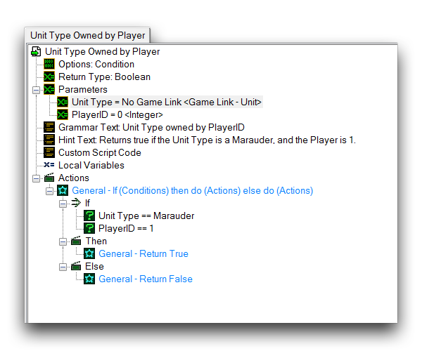
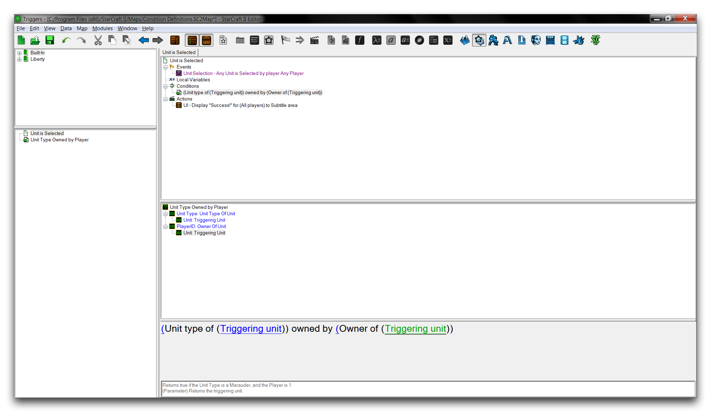

# Condition Definitions

Condition Definitions are used to create custom-defined conditions. Conditions already offer some customization in the selection of their terms and the application of their operators. Definitions allow you to further extend these abilities by defining custom operations that can use any existing statement in the Editor. With these you can develop new inquiries into the state of the game. They can also be a useful method of organizing and combining common conditions.

*Condition Definition View*

| Field              | Details                                                                                                                                                    |
| ------------------ | ---------------------------------------------------------------------------------------------------------------------------------------------------------- |
| Options            | This selects the type of definition, the Condition Definition is of particular interest here.                                                              |
| Return Type        | This determines the response value of the condition. Boolean offers the standard 'true or false.' Integer allows for additional responses beyond a binary. |
| Parameters         | Values passed to the condition.                                                                                                                            |
| Grammar Text       | Sets the GUI text that phrases the condition into natural English.                                                                                         |
| Hint Text          | Sets the illustrative text to be displayed in the Hint Subview when this condition is selected.                                                            |
| Custom Script Code | Allows for the condition to be coded in Galaxy Script rather than GUI statements.                                                                          |
| Local Variables    | Variables available in the scope of this condition.                                                                                                        |
| Actions            | The action statements composing the condition's operation.                                                                                                 |

## Demoing Condition Definitions

Open the demo map provided with this article and look at the Terrain Editor. There you'll find a grouping of SCVs and a pair of marauders. The units are evenly split between the red player one and the white player two. For this exercise, you'll build a custom definition to use in a test of the unit selection event. This definition poses the question, 'Is the unit a marauder belonging to player one?'

Begin by moving to the Trigger Editor, then right-click on the Triggers Panel and select New -\> New Condition Definition. Name your new definition 'Unit Type Owned by Player.' That name might seem a little odd for now, but you'll understand it in a moment. The condition definition will require two pieces of information to make its assessment, the type of the unit, and a player number. To receive this information the definition will use parameters. Navigate inside the definition and right-click the 'Parameters' heading, then navigate to New -\> New Parameter. Repeat this procedure once. Name the first parameter 'Unit Type' and set its type to --Game Link and its 'Link type' to Unit. Name the second parameter 'PlayerID' and set its type to Integer.

Finally, create the action 'If Then Else.' Create two conditions under the 'If' heading and set them to Unit Type == Marauder and PlayerID == 1 respectively. Make sure that the Unit Type and PlayerID are set to the parameters you created.

## Return Statement

For a condition to operate, it must deliver some sort of response statement. You've seen this before in the standard conditions. Typically, they respond with Boolean values of either True or False. Creating this sort of response here will require you to use a special type of control statement called Return. When encountered, the Return statement immediately exits the current layer of control, in this case the condition definition. It then carries the response value to the original call location of the condition. By using another control statement, like 'If Then Else,' a condition controls its different possible response values using multiple possible Return statements.

Under the 'Then' heading, add a 'Return' action and set its value to True. Add a 'Return' action under the 'Else' heading and set its value to False. The definition is now complete. It receives two parameters and checks if they are equal to the desired values, Marauder and 1. If this is true, the condition returns true. Otherwise it returns false.

## Grammar & Hint Texts

The condition definition system offers a few options for making custom definitions more useable. Grammar text allows for the setting of custom plain language type phrasing, similar to most of the GUI triggers. Note that the current description of the definition is Unit Type Owned by PlayerID (Unit Type, PlayerID). Including this in a trigger can be a bit overwhelming. You can change it by navigating to 'Grammar Text' and deselecting 'Use Default Grammar Text.' The parameters must be maintained in the new arrangement, so you can delete the text around them and alter the field to 'Unit Type owned by Player.' This format mimics the existing Editor conditions and explains the earlier naming.

Another option available for your convenience is 'Hint Text.' This provides custom information that will be displayed in the Hint Subview whenever the definition is selected. You can set it here by selecting the 'Hint Text' heading and inputting Returns true if the Unit is a Marauder, and the Player is 1. Completing these steps should result in the definition appearing as follows.

*Completed Condition Definition*

## Using A Condition Definition

Create a new trigger and name it 'Unit Selected.' Navigate into the trigger and create a 'Unit is Selected' event. Now create a condition with the custom definition by navigating to 'Conditions,' right-clicking and following New -\> New Condition. This will launch the 'Configure Condition' window, which should contain the newly defined condition as shown below.

*Selecting the Custom Condition Definition*

Highlight the condition and set its terms. The Unit Type should be set to Unit Type of (Triggering Unit), while the PlayerID should be set to Owner of (Triggering Unit). Click 'Ok' to return to the project. Finally, create an action of the type 'Text Message' and set its 'Message' to Success, which should give the following view.

*Completed Trigger*

If you test it, the game should present the collection of units seen in the Terrain Editor. When selecting any unit other than the red marauder there will be no response. If you select player one's red marauder, the custom condition test will respond with a True value, allowing the trigger to run its body statements and display the message. Launching the game and running the test should give you the following view.

*Successful Output*

## Attachments

 * [039_Condition_Definitions_Start.SC2Map](./maps/039_Condition_Definitions_Start.SC2Map)
 * [039_Condition_Definitions_Completed.SC2Map](./maps/039_Condition_Definitions_Completed.SC2Map)
