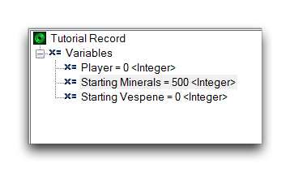
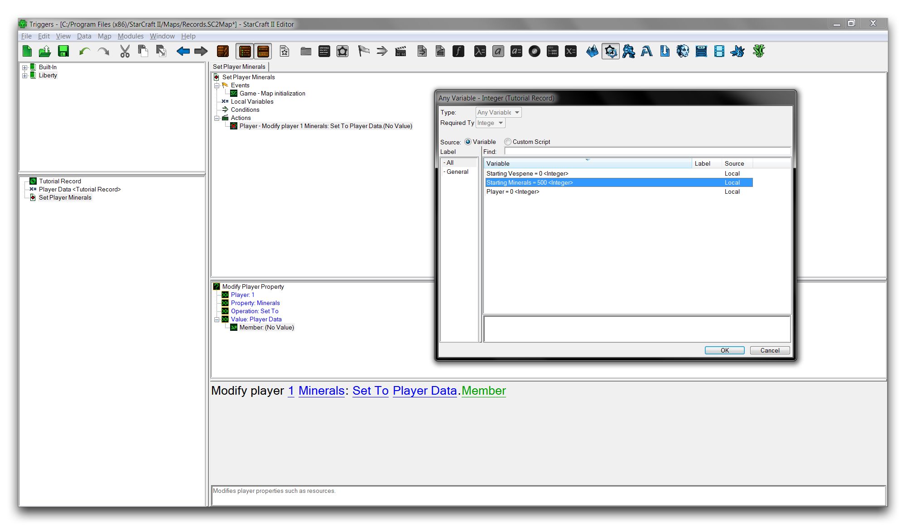
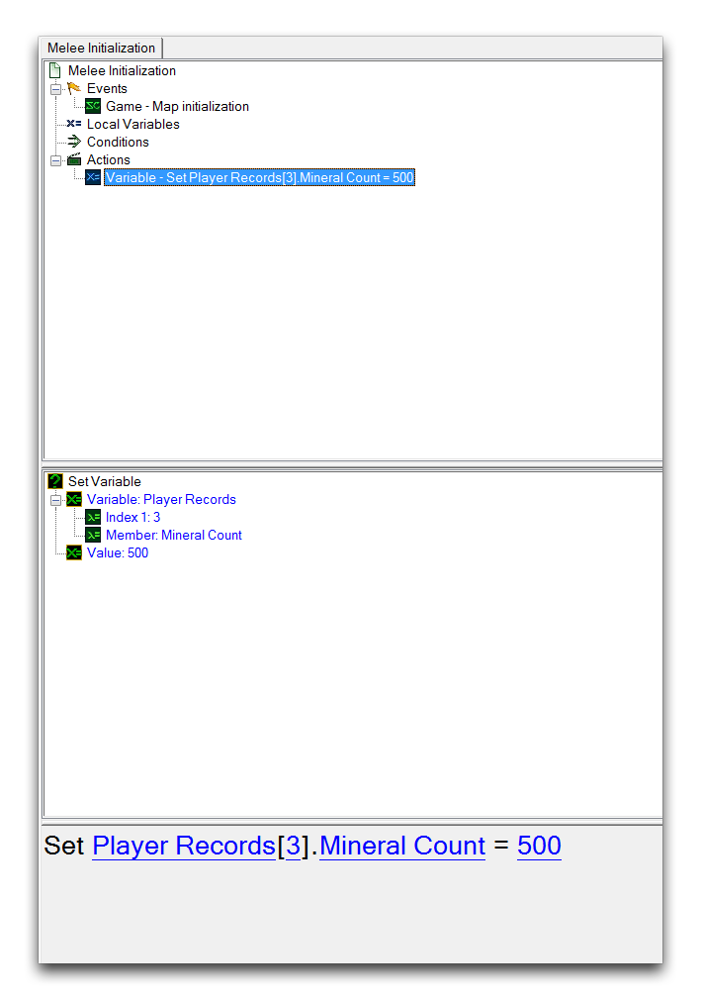

# Records

Records are templates of variables. Building a record is like assembling a sort of planned layout of variables, where you decide type, name, and quantity. Once assembled, the record defines a new composite data type that can be created indefinitely. Each record creates a set of variables according to its design, then maintains them as a persistent container. A typical record design is shown below.

*Record Anatomy*

The record design belies its main usage, the top heading 'Tutorial Record' is the name of the record. Since the record itself is never used to store variables, this name will become a makeshift type for the record. When instances of the record are made, they will show the record type, in this case Tutorial Record, as shown below.

*Record Instances*

Under the 'Variables' heading are the variables contained with the record, referred to as 'members.' Each member has its own type and initial value. When you create an instance of Tutorial Record, it will create each of its members, meaning that the instance will have five members of the type, Name, Player, Color, Race, and Starting Location, each with their respective data type.

## Creating Records

Records are created in the Triggers Panel, as they must exist at a global scope. Right-click on the panel and navigate to New ▶︎ New Record. Selecting the record will display its contents in the main view tab. Record variables can be created by right-clicking on the 'Variables' heading in the record and navigating to New ▶︎ New Variable. To create a new instance of a record, create a variable and set its type to -- Record. This will make a listing of any possible record types available under the heading 'Record.' Once you have selected the desired type, each variable within the record will automatically be created, though not directly visible in the Editor.

*Record Instances*

Note that records, as in the data type, show up in the Triggers Panel, suggesting a global scope. However, since they are not actual instances, they have no specific scope yet. Individual instances of a record can exist at either a global or local scope.

## Referencing A Record Variable

The variables created within a record instance are not directly accessible. They cannot be altered or inspected with the same methods that traditional variables can be. In terms of use, record variables must be accessed through a technique known as referencing. This allows you to call on the individual variable by referencing it in terms of the record instance. Consider the following record.

*Record with Integer Members*

An instance of this record type has been created called Player Data. In this instance there is a Starting Minerals variable like its source record. As an exercise, try setting a player's minerals to this Starting Minerals count of 500 at the start of a game. This will require you to reference the record instance's property. Fortunately, the Editor GUI does much of the work here. Imagine you were going to use a 'Modify Player Property' action, as in the following trigger.

*Trigger Requiring Referenced Variable*

The 'Value' field is where the Starting Minerals variable is needed, but it is unclear how to deliver it there. Double click the field to launch an 'Integer' window and navigate to the Variable tab as seen below.

*Integer Field Window*

The record instance is shown in the field viewer. Since there is an integer type variable inside this record, it is made available as an input to the field. Select it and click 'Ok.' You'll see that some changes have been made to the 'Value' field for the action, as shown below.

*New Action Field*

The record is inputted into the field, but you have also revealed an additional field titled 'Member.' As mentioned a little earlier, a variable member refers to its component variables. The '.' separating the record and the member field is a special operator type known as the Referencing Operator. By the referencing operator, the internal members of the record instance have been made available. Clicking the 'Member' field now will present you with the following view.

*Referencing Record Member*

Here, the Starting Minerals member can be selected, do so and click 'Ok.' The result will look as follows.

*Referenced Record Variable*

Setting the member variable here has finished the referencing procedure. Now, the Starting Minerals value will be set to the 'Value' field, via the reference to its record instance Player Data. When this action runs, it will be passed to the record instance, then follow this reference to the internal structure where the variable is. It will then carry the variable value out and use it.

## Record Arrays

Record instances also have support for arrays. On highlighting a record in the subview, select 'Array.' This will allow you to set 'Dimension' and 'Size' elements like any typical array. Each member of the array will have the standard record design, with all its members set to the standard initial values. This is useful for handling large swathes of data in a very organized package. A typical record array is shown below.

*Record Array*

Referencing variables from within a record array is generally the same as referencing a standard record variable. The difference is that an index is required to select the specific instance you want. A typical view is shown below.

*Record Array Referencing*
