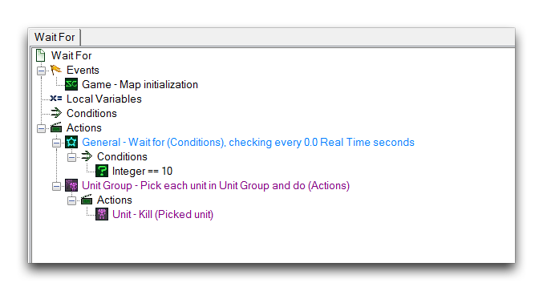

# Control Statements

Control Statements are actions that control when other actions are executed. Since the standard order of execution in the Trigger Editor is linear, these statements offer the unique ability to disrupt that linear flow and create dynamic systems. You can find control statements during action creation under the 'General' label, as shown in the image below.

*Control Statement Actions*

## Loops

Loops create a repeating cycle of statements that continues until broken. The types of loops are distinguished by how they're broken and in what manner they proceed with their containing statements. The loop types are described in the table below.

| Loop Type                        | Details                                                                                                                                                                                                    |
| -------------------------------- | ---------------------------------------------------------------------------------------------------------------------------------------------------------------------------------------------------------- |
| Repeat                           | Containing actions are repeated until a Count variable is reached. The count is incremented after all the contents are executed.                                                                           |
| Repeat Forever                   | Runs indefinitely until broken with another control statement.                                                                                                                                             |
| Pick Each Integer                | Runs until its Start value reaches its End value. This value is incremented after each run through the loop. The Picked Integer function identifier is used to access the value for the current iteration. |
| Pick Each Player in Player Group | Runs the loop once for every Player found in the Player Group. The Picked Player function identifier is used to access the Player for the current iteration.                                               |
| Pick Each Unit in Unit Group     | Runs the loop once for every Unit found in the Unit Group. The Picked Unit function identifier is used to access the Unit for the current iteration.                                                       |
| For Each Real                    | Runs the loop until its Start value reaches its End value. After each iteration of the loop the Start value is altered by an Increment that is a Real.                                                     |
| For Each Integer                 | Runs the loop until its Start value reaches its End value. After each iteration of the loop the Start value is altered by an Increment that is an Integer.                                                 |
| For Each Player in Player Group  | Runs the loop once for each Player in the Player Group.                                                                                                                                                    |
| For Each UI Frame                | Runs the loop once for every frame in a specified UI Variable.                                                                                                                                             |
| For Each Unit in Unit Group      | Runs the loop once for each Unit in the Unit Group.                                                                                                                                                        |
| While                            | Runs the loop until the supplied Condition is not True.                                                                                                                                                    |

There are two supplementary control statements used to manipulate how a loop will behave. The first, Break, will terminate its containing loop when it is encountered. The second, Continue, will skip every action below it and return to the start of the loop when it is encountered. These statements are usually used alongside a check like If Then Else to control the loop under specific conditions. This is the strategy used in Repeat Forever infinite loops, to eventually exit the loop.

## Waits

Waits grant the ability to pause control. This pause may be indefinite, until an event occurs, or until a certain condition is met. The wait types are broken down in the following table.

| Wait Type                                | Details                                                                                                                                                                                              |
| ---------------------------------------- | ---------------------------------------------------------------------------------------------------------------------------------------------------------------------------------------------------- |
| Wait                                     | Pauses control until an amount of Time has elapsed. Also accepts a certain Time Type when setting the wait duration.                                                                                 |
| Wait For Timer                           | Pauses until a certain Timer hits an amount of Time either Elapsed or Remaining.                                                                                                                     |
| Wait For Condition                       | Pauses until a certain Condition is met. The Condition is checked for on an interval of Time.                                                                                                        |
| Wait For Condition With Maximum Duration | Pauses until a certain Condition is met. The Condition is checked for on an interval of Time. There is additionally a failsafe Max Duration that is allowed to elapse before the control is resumed. |

## Using Control Statements

By providing a means of breaking the standard linear flow through a project's logic, control statements become the key action for opening up a wider variety of projects that you can make with the Editor. Take a look at the following trigger.

*Trigger Making Use of Control Statements*

There are several control statements in use in this trigger. A While loop containing a Pick Each Unit in Unit Group loop is used to populate a Unit Group from the unit contents of the entire map. The demo map contains a set of six marines, and stocking the Unit Group allows the interior Pick Each loop to exit out of the While loop by breaking its Condition. Once this loop concludes, a For Each Integer loop engages. Inside this loop is a Wait of 1.0 seconds and a text output of the loop's counting value. These actions will in turn result in the trigger creating a count from 1 to 10 on the player's screen, happening at an interval of 1 second. Now turn your attention to the other trigger.

*Count Resultant Trigger*

This trigger shows a secondary use of the Integer count from the last trigger's counting loop. When the first trigger's count concludes, this trigger will destroy every marine on the map. The result is shown below.

*Text Tag Styled and Attached to Unit*

This demo shows off some simple dynamic structuring enabled by control statements communicating between triggers on a timed basis rather than a standard linear basis.
