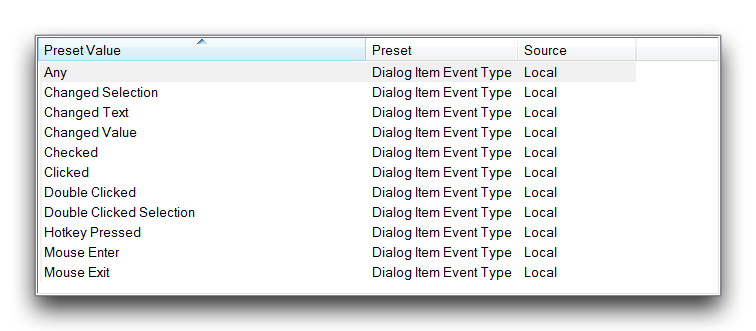
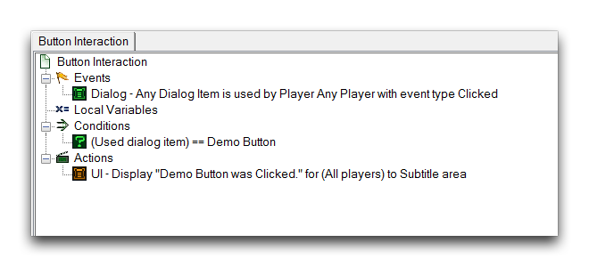
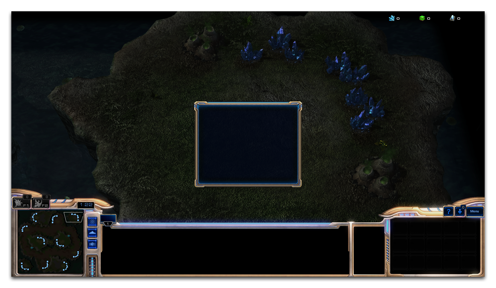

DIALOGS

Dialogs is a catch-all term in the StarCraft II engine referring to a
large collection of elements that can occur in the screen space,
including text, images, animation, and interfaces. The dialog itself is
a sort of container that displays any combination of the aforementioned
elements on a player's screen. Each of these elements are referred to as
a Dialog Item, and are created inside a selected dialog. Using the
dialog system enables you to produce many types of content, including
briefings, portrait dialog sequences, buttons, sliders, and more.

CREATING DIALOGS
================

Dialogs are usually created through a two-step process where the dialog
is first instantiated and then is displayed to the screen for a player
group. This process will appear as follows.

Dialog Creation

The bulk of dialog creation takes place under the Create Dialog and
Show/Hide Dialog options, these allow for the dialog to be sized then
oriented on the screen, and then displayed. The Show Dialog action is
needed because dialogs are created in the Hidden state by default.
Usually after this step, a dialog will captured to a variable with a Set
Variable action. This gives the dialog a constant handle for things like
referencing it, moving it, further altering its visibility, or building
items within it. For setting a dialog to a variable, the function
identifier Last Created Dialog is a standard.

DIALOG ACTIONS
==============

The Editor features a large collection of dialog actions that facilitate
the creation and maintenance of dialogs and their items. A view of these
actions is shown below.

Dialog Actions

The following table breaks down the general types of dialog actions and
describes them. This list is usually appropriate for both dialogs and
dialog items, which are discussed a little later.

  -----------------------------------------------------------------------
  Function    Description
  ----------- -----------------------------------------------------------
  Attach      Moves an element to a specific anchor.
  Dialog      

  Create      Creates a new element, allowing you to set its size,
  Dialog      anchor, offset, and text.

  Destroy     Destroys an element and any contained items.
  Dialog      

  Display     Creates an element directly in screen space that requires
  Screen Item no containing dialog.

  Move Dialog Moves an element relative to a specific anchor.

  Set Dialog  Sets the property of a specific element. Properties include
              size, lighting, text, color, animation, font style, and
              more.

  Show/Hide   Reveals or removes an element from a target player or
  Dialog      group's screen.
  -----------------------------------------------------------------------

DIALOG ITEMS
============

Dialogs are populated by dialog items. Without any items, a dialog is
just a rectangular container with a themed backdrop depending on the
player's race. Dialog items are varied and have options relevant to each
individual type, but in general they abide by the same set of principles
as dialogs. Much like dialogs themselves, you can create dialog items
with a Create Dialog Item action, then display them with a Show Dialog
Item action. After this, you'll usually save a handle within a variable
with a Set Variable action. Again, a useful identifier for doing this is
the function Last Created Dialog Item.

As an exercise, you'll create a dialog item using the general procedure
described above. The assembly trigger is shown below.

Dialog and Dialog Item Assembly

Create Dialog Item (Button) allows you to create a button dialog item,
which is a special item that accepts player input. Mousing over the
button will change its visual state, indicating that it can be clicked.
During the item's creation several fields were set.

The Width and Height define the button's area, which both displays the
item's texture and determines the area of screen space that will accept
player inputs. Its Anchor sets which side of the parent dialog the item
will be attached to, while Offset X and Offset Y set the distances from
the Anchor at which the button will be created. For Button Text, the
input 'Demo Text' was set. This text will be created in the center of
the button. If this text were too long to fit in the button's area, it
would be truncated to '...' until corrected. Testing this dialog will
appear as shown below.

Button Dialog item in Game View

DIALOG EVENT -- DIALOG ITEM IS USED
===================================

As it stands, clicking the button made in the last demo will have no
effect. For dialog items designed to accept user input, there is a
specific dialog event, Dialog Item is Used, required to receive and
respond to player inputs. You can find this event by sorting by the
label 'Dialog' during event creation, as is shown below.

Dialog Item is Used Event

This event responds to a host of possible interactions with dialogs,
which are shown in the following image.

Dialog Item Interaction Types

In this instance, the event type Clicked is appropriate. To recognize a
specific dialog item, a condition can be used with a comparison operator
between the identifier Used Dialog Item and the dialog item's variable
handle. Creating an interaction trigger for the previous demo might look
like the image below.

Dialog Item Interaction Types

Testing the demo will now give the following output.

Dialog Item Interaction Types

Giving the button a trial click here has shown a response to the dialog
event by delivering a text message output.

DIALOG FORMATTING
=================

Dialogs are constant constructs, meaning that they will look the same
regardless of the output size of a particular player's screen. This is a
similar system to that used in the basic melee game interface. This
system ensures a level of reliability, but when creating custom content
it is something you should be aware of. Take the following example. A
centered dialog created at a 16:9 resolution will look like the
following.

Custom Dialog at 16:9 Resolution

Creating this same dialog at a 4:3 resolution will look as follows.

Custom Dialog at 4:3 Resolution

Despite the difference in resolutions, the dialogs themselves have the
same dimensions. This system works through an internal resolution that
is provided by the StarCraft II client. The internal resolution has the
following values for each screen ratio.

> 4:3 Ratio - 1600x1200
>
> 16:9 Ratio - 2133x1200
>
> 16:10 Ratio - 1920x1200

Height will always be calculated at a constant 1200, then width will be
measured based on the screen ratio. While this system will ensure that
your dialogs maintain the same level of visibility across a variety of
machines, it is worth noting that large dialogs and dialog items might
be cut off or cropped if you aren't careful. If you're developing your
project without the means to test on a variety of systems, then it's
important to keep in mind a range of usability when designing dialogs or
other screen space elements. Consider another example, a standard set of
dialogs could appear as shown below on a widescreen formatted computer.

Widescreen Oriented Dialogs

Testing this project on a different, non-widescreen display will look
like the following.

Overlapping Dialogs on a Non-Widescreen Display

The constrained width of a standard display has caused the two dialogs
to overlap, potentially obscuring important information. One method of
avoiding this could be a provisional option for different types of
displays. This would make use of Show/Hide Dialog actions and have two
parallel dialog constructions. Alternately, designing dialog systems to
be no more than 1600 px wide can prevent this sort mishap in most cases.
