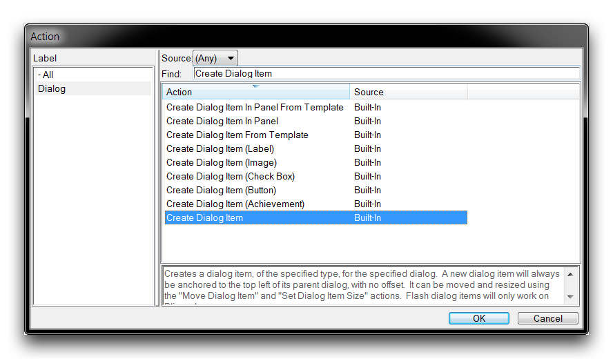
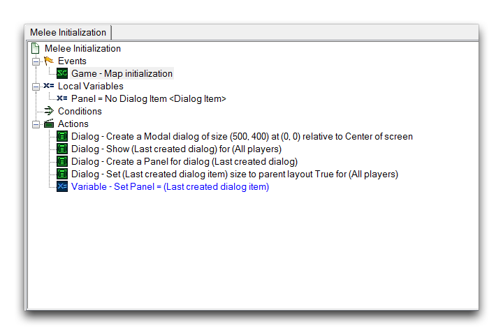
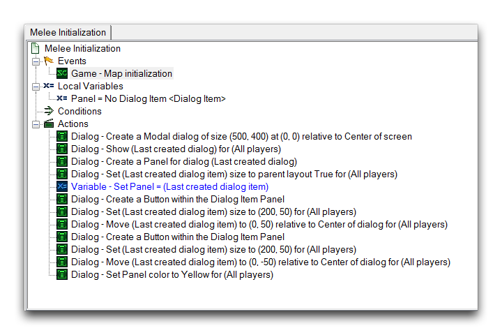

# Dialog Panels

Dialog Panels are a grouping option for dialog items. By creating a panel and hosting dialog items on it, individual items can be controlled together by applying alterations to the panel. Any changes you make will then be propagated to every item belonging to the panel. As such panels provide a level of hierarchy in between a dialog and other types of dialog items. This ends up operating much like a unit group or a player group. It is functionally equivalent to a dialog group.

## Creating A Dialog Panel

As an example, you'll host a panel within a dialog, like any other dialog item.

*Creating a Host Dialog*

From here, create a panel by selecting the Create Dialog Item action, as shown below.

*Creating Panel Dialog Item*

Select 'Panel' for the Type field of the Create Dialog Item.

*Selecting Panel Type for Creation*

You can set the panel's properties to the Width, Height, and Position of its parent dialog through the Set Dialog Item Size to Parent action.

*Setting the Panel's Size*

This panel should now be saved to a variable to provide a consistent handle for any future operations. Together, these actions have resulted in what is essentially a finished panel. It should look as shown in the image below.

*Panel Created*

## Creating Items Within A Dialog Panel

With the dialog panel set up, you can test its functionality by creating some dialog items inside it. In the following update to the trigger, a pair of buttons has been created, sized, and oriented within the panel.

*Dialog Items Created Inside Panel*

The important distinction here is that, rather than being created within the dialog, these items have been created inside the panel. This is how dialog items are 'grouped' inside the panel and accept any alterations that are made to it. You should also note that the panel's variable handle is important here, as it ensures that the panel may be repeatedly referenced for each dialog item being created inside the panel. Sometimes dialog items are created without a handle, as they can be completely controlled by their hosting dialog or panel, but panels themselves will usually require a handle.

## Altering A Dialog Panel And Its Contained Items

Now that you have everything set up, you're ready for a quick demonstration of the utility of a dialog panel. In the trigger update shown below, the Set Dialog Item Color is used to target the panel.

*Altering Panel Property*

Altering the panel like this will end up with each dialog item, the two buttons in this case, being individually sent a Set Dialog Item Color action. Investigating the map with the 'Test Document' function, will show that each button has been set to Yellow. You can see the result in the image below.

*Panel Changes Propagated to its Contained Items*

This should give you an impression of how much effort you can save yourself by using dialog panels. They can be used to quickly group and manage large numbers of dialog items.

## Attachments

 * [044_Dialog_Panels.SC2Map](./maps/044_Dialog_Panels.SC2Map)
