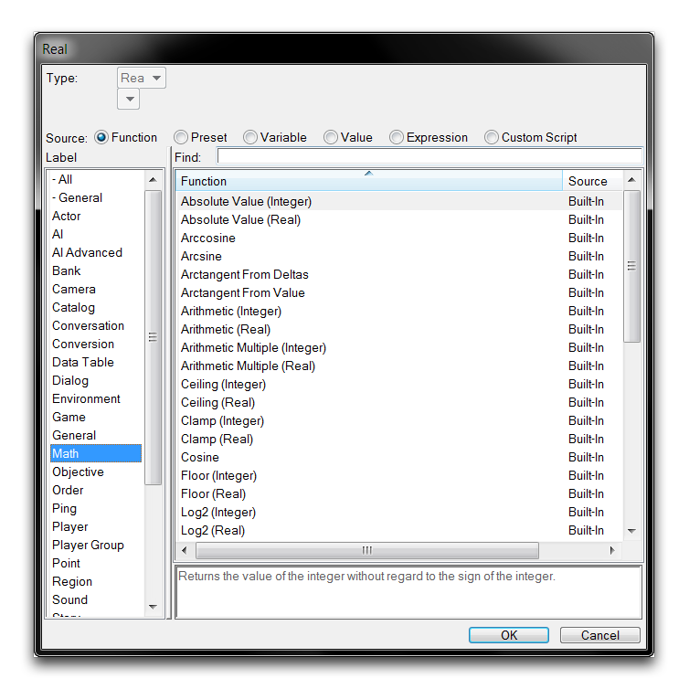
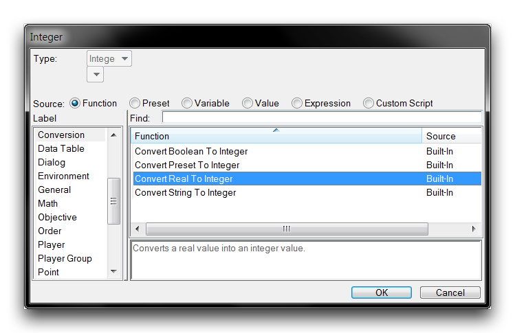
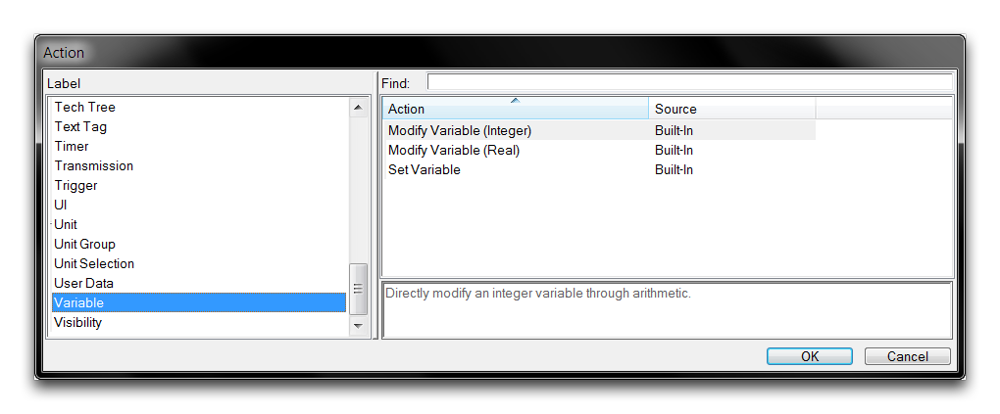
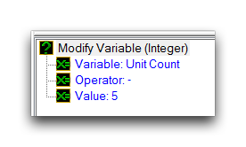
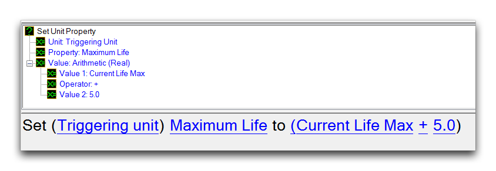
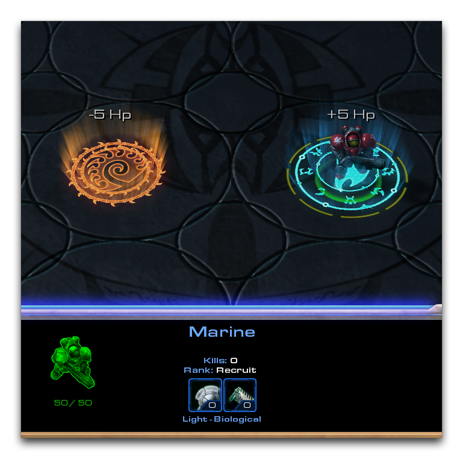
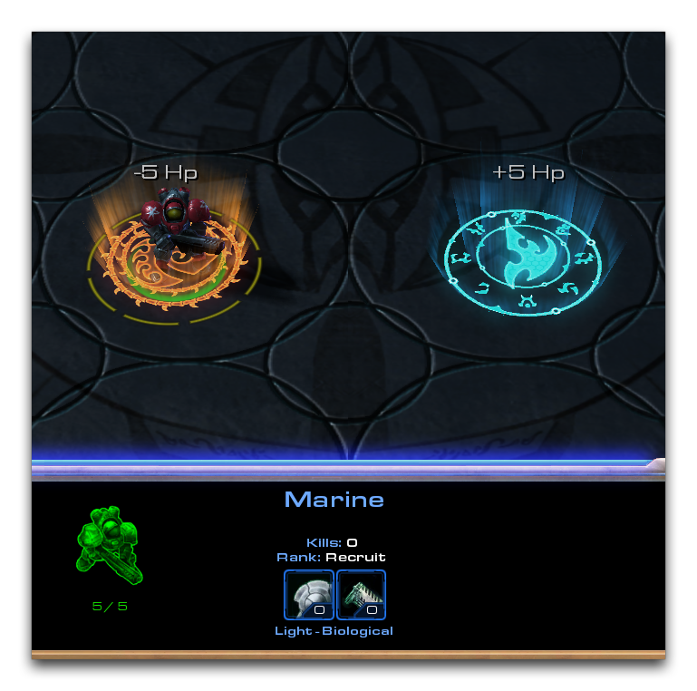

MATH FUNCTIONS
==============

The Editor comes with a standard complement of Math Functions for use in
any work within the Trigger Editor. You can access these whenever you
are filling in a numeric field by navigating to the 'Function' source
and sorting by the 'Math' heading, as shown below.

Math Function Selection

TYPE CONVERSIONS
----------------

As you can see from the image above, most math functions are made
available with both a Real and an Integer version. This version
references the type of the eventual output, and the input types to these
functions may vary. A detailed look at one such example is provided
below.

Function Versions

In this example, the Arithmetic math function is listed with a version
that outputs integers, Arithmetic(Integer), and a version that outputs
reals, Arithmetic(Real). Note that a Real field is being set, yet both
Integer and Real functions are listed. This is because all Integer
functions contain an implicit type conversion to Real, allowing them to
be selected in such a case. The type conversion simply appends the
Integer resulting from the function with a fractional part equal to
zero. So an example Arithmetic (Integer) function of 1 + 1 would result
in the Integer 2, which converts implicitly to a Real of 2.0.

The two versions of the Arithmetic function, Integer and Real, each
takes inputs of the same type as their outputs. However some versioned
math functions only accept Real inputs, but output in their namesake
Integer or Real type. The Log2 function is one such example, it only
accepts Real numbers in order to have a high enough accuracy to make its
calculation. The Log2 Real and Log2 Integer versions, each still output
their corresponding type.

For cases like these where an Integer input is required, there is an
explicit type conversion available. You can find this while filling a
Real field by navigating to the 'Function' source, then selecting the
'Conversion' label, as shown below.

Integer to Real Conversion Function

Explicit integer conversion works the same way as implicit conversion,
by appending a zeroed fractional part to the number. This function also
has some use in inputting integer values into the math functions that
only have a Real version, which are explored a little later in this
article. For any conversions in the opposite direction required, there
is an explicit Real to Integer conversion function available during
Integer field filling.

Real to Integer Conversion Function

'Convert Real to Integer' results in the Real being rounded to its
nearest whole number Integer. All Real numbers ending in .5 are rounded
downwards.

SHARED MATH FUNCTIONS
---------------------

Of the math functions available, 16 are shared operations with versions
available that output both Real and Integer types, these are listed in
the table below. Although this article does not provide a full treatment
of the math involved, some of the operations are furnished with
examples. Each function will take its corresponding Real or Integer
input unless otherwise noted.

  -----------------------------------------------------------------------
  Func   Description
  tion   
  ------ ----------------------------------------------------------------
  Abso   Returns the absolute value of a number. This value is equal to a
  lute   signless magnitude of the number.
  Valu e 

         Absolute Value (-2.0) = 2.0

         Absolute Value (4) = 4

  Arit   Creates a two term equation that uses one of four elementary
  hmet   operators: addition, subtraction, division, or multiplication.
  ic     The result of this equation is set to the field. This is a very
         commonly used function, which can be expanded to more terms by
         either selecting another Arithmetic function for one of the
         terms or by using the Arithmetic Multiple function.

  Arit   Conducts a single elementary operation on any number of terms.
  hmet   As in Arithmetic, the available operations are addition,
  ic     subtraction, division, and multiplication. The use of the
  Mult   Arithmetic functions is covered in more detail below this table.
  iple   

  Ceil   Rounds a number up to the next whole number. This only accepts
  ing    Real inputs.

         Ceiling Real (2.1) = 3.0 Real

         Ceiling Real (-3.2) = -3.0 Real

         Ceiling Integer (5.1) = 6 Integer

  Clam p Adjusts a value to fit between a defined upper and lower bound.
         Values exceeding the upper bound will be set to it, and likewise
         those below the lower bound will be set to the lower.

         Clamp 40.0 between 1.0 and 10.0 = 10.0

         Clamp -5 between 1 and 10 = 1

  Floo r Rounds a number down to its preceding whole number. This only
         accepts Real inputs.

         Floor Real (2.1) = 2.0 Real

         Floor Real (-3.2) = -4.0 Real

         Floor Integer (5.1) = 5 Integer

  Log2   Returns the binary logarithm of the number. Essentially the
         value that 2 would have to be set to the power of to receive the
         number. This only accepts Real inputs.

         Log2 Real (40.0) = 5.3 Real

         Log2 Integer (40.0) = 5 Integer

  Maxi   Returns the larger of two numbers.
  mum    

  Mini   Returns the smaller of two numbers.
  mum    

  Modu   Accepts a Dividend and a Divisor. Returns the modulo, or
  lo     remainder of dividing the Dividend by the Divisor.

         10.0 mod 4.0 = 2.0

         9.0 mod 4.0 = 1.0

         25 mod 5 = 0

  Pow2   Returns the result of 2 set to the power of the number. This
         only accepts Real inputs.

         Real 2 \^ 4.3 = 19.7 Real

         Integer 2 \^ 4.3 = 20 Integer

  Powe r Returns the Value raised to the Power. This only accepts Real
         inputs.

         Real 4.0 \^ 3.1 = 73.5 Real

         Integer 4.0 \^ 3.1 = 73 Integer

  Rand   Returns a random number of the selected type within a specified
  om     range.
  Real   

  Rand   Random real between 0 and 100.0 = 42.5
  om     
  Inte   
  ger    

         Random integer between 25 and 50 = 26

  Roun d Rounds a number to its nearest whole number. All numbers ending
         in .5 are rounded down. Takes only Real inputs.

         Round Real (3.2) = 3.0 Real

         Round Integer (2.5) = 2 Integer

  Squa   Returns the square root of the value. This only accepts Real
  re     inputs.
  Root   

         Square Root Real (43.0) = 6.6 Real

         Square Root Integer(43.0) = 7 Integer

  Trun c Removes the fractional portion of a number. This only accepts
         Real inputs.

         Trunc Real (3.5) = 3.0 Real

         Trunc Real (2.6) = 2.0 Real

         Trunc Integer(2.6) = 2 Integer
  -----------------------------------------------------------------------

REAL MATH FUNCTIONS
-------------------

There are also nine math functions available that output to the Real
type only. These functions are largely trigonometry focused, so the use
of a less precise Integer version would be minimal. Still, an Integer
output can be generated by making use of the 'Convert Real to Integer'
function. Note that some of these functions treat their inputs as other
numeric types such as angles or percentages. This is primarily a
modeling device, and the actual types of their inputs and outputs are
still always Real. The real math functions are broken down in the table
below.

  -----------------------------------------------------------------------
  Function        Description
  --------------- -------------------------------------------------------
  Arccosine       Returns the inverse of the number's cosine function.

  Arcsine         Returns the inverse of the number's sine function.

  Arctangent From Accepts an X and Y delta. Returns the inverse of the
  Deltas          tangent function of these numbers' ratio.

  Arctangent From Returns the inverse of the tangent function of the
  Value           supplied Value.

  Cosine          Returns the cosine of the supplied number treated as an
                  angle.

  Sine            Returns the sine of the supplied number treated as an
                  angle.

  Tangent         Returns the tangent of the supplied number treated as
                  an angle.

  Random Angle    Returns a random Real within the range of 0 to 360.0.

  Random Percent  Returns a random Real within the range of 0 to 100.0.
  -----------------------------------------------------------------------

VARIABLE ACTIONS
----------------

You can use math functions during any action, event, or condition that
makes use of a numeric field. That said, they see considerable use in
supporting the very useful variable actions. These three actions are
responsible for the alteration and initialization of variables. You can
access them during action creation by navigating to the 'Variable'
label, as shown below.

Variable Actions

The powerhouse here is the Set Variable action, which creates an
equation that may set any type of variable to a value, as in the image
below.

Set Variable Action

The value that the variable is set to may be directly specified, set
from another variable, set from a preset, or set from a function. The
last case supports math functions, and together these elements can be
used to alter game variables in a powerful way. The following example
uses a Set Variable action to set a numeric Real field using a sequence
of math functions.

Set Variable with Math Functions

The Modify Variable (Integer) and Modify Variable (Real) actions are
siblings of the Set Variable action, but with a more finely targeted
purpose. They allow modification of a numeric variable using what is
essentially a built-in Arithmetic function. There is one version for
each numeric type. By having this form, these actions are less robust
then their Set Variable cousin, but can be applied quickly for either in
mock-ups or simple variable alterations. An example of these actions is
shown below.

Modify Variable Action

Much like any shared math functions, the Modify Variable (Integer)
action will make use of implicit Real to Integer conversions when
necessary.

DEMOING MATH FUNCTIONS
----------------------

At this point, turn your attention to the demo map provided with this
article for a demonstration of math functions in action. Opening it will
show you the following course.

Demo Map Course

The marine here has a few interesting choices before him. Each beacon is
wired to a trigger action that will apply a math function to a game
variable, that variable being this marine's health. Take a look at the
Regions Layer to see that each beacon has been hooked to an
appropriately sized circular region within their bounds. Move into the
Trigger Editor to investigate further.

Trigger Editor View

In terms of logic, this map has been set up with an Initialization
trigger that sets some camera and text tag features of the map, then
hooks the marine into a Unit variable for use elsewhere. From then on, a
pair of individual triggers respond to 'Unit Enters Region' events. In
the trigger shown above, the HP Addition region entrance will run an
action that makes use of a math function. You can take a closer look
below.

Set Unit Property Action with Math Function

On entering the region, the marine's maximum life will be incremented by
5 using an Arithmetic math function. Testing the map will produce a
result as shown below.

Marine HP Increased by 5

The math function has enacted a change directly on a game variable.
Continue moving the marine into the beacon to repeat the effect if so
desired. If you proceed to the Unit Subtracts Life Region trigger,
you'll see the below.

Unit Subtracts Life Trigger

This trigger also applies an Arithmetic function, but in this instance
it applies a subtraction operation to reduce the marine's HP. To account
for this, an additional math function, Maximum (Real), has been
sequenced to ensure that the marine's HP isn't reduced to zero. The
effects of these functions can be seen from a quick test shown below.

Marine HP Reduced to 5

Repeated entry to the region has caused the trigger to eventually trip
the Maximum function, which clamps its internal Arithmetic operation's
output to 5.
