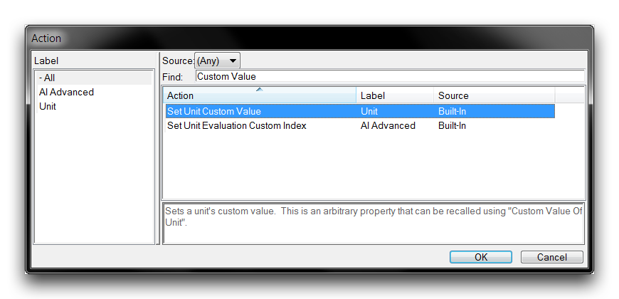

# Custom Values

Custom Values refer to a unit-centric storage array. Once a number is set to a unit's custom values, the array becomes active and any value can be set again, read, modified, and used in any fashion. These numbers are of the Real type, and are limited to an array of 64 values for each unit. Essentially, the custom values are an equivalent to a Real\[63\] that is stored at a special Unit scope.

Custom values represent a type of organized data that is different from arrays or records. By providing it pre-organized within a unit, you are saved from having to declare or manage an array. Combined with the proximity of this data to its source, this makes for a straightforward approach that supports quick calculations and data-tracking for complex entities like hero units.

## Set Custom Value

Custom values are set using the action Set Unit Custom Value. You can find this during action creation under the 'Unit' Label, as shown below.

*Custom Value Actions*

## Get Custom Value

Custom values are extracted using the function Custom Value of Unit. You can find this during Real field filling under the 'Function' source.

*Custom Value Functions*

## Demoing Custom Values

Open the demo map provided with this article. Inside you'll find a view of the Zerg hero Dehaka lining up some foes in a forest clearing.

*Demo Map Course*

Inside the Trigger Editor, you'll find a set of triggers that will monitor and update a custom value belonging to Dehaka with a reading of the unit damage he's dealt out. The triggers will then update this custom value to a text tag.

If you check the global variable scope, you'll find an important tip for custom value use. Creating an index Integer constant for any custom values is a useful habit for creating a consistent handle for the specific custom value. Then, on every occasion that that value is dealt with, the index can be inserted to avoid dealing with the hard-coded custom value array indices. Below you can see the trigger handling the custom value text tag.

*Text Tag Construction Trigger*

Here, a text tag has been neatly constructed and appended to Dehaka as a readout of his custom value. However, the key part of this exercise is found in the 'Custom Value Readout Updater' trigger, which you can see below.

*Custom Value Readout Trigger*

This trigger runs an update after each instance of damage, then updates the custom value with the Set Custom Value action. Take note of the Integer index here of c\_TotalDamageDealt; it operates as a quick handle. After each update to the custom value, the text tag readout is also reset. Together, these actions amount to a visualization of the internal custom value through a text tag. Understanding custom values as unit-centric data like this is helpful when drafting ways to use them. If you test the map out for yourself, you should get a result like the one shown below.

*Custom Value Damage Tracking*

As a final note, custom values do not count as variables within the Trigger Debugger. That means that, when you're debugging systems like this demo or any other custom value centric designs, it will usually be worthwhile to develop a custom debug UI.

## Attachments

 * [050_Custom_Values.SC2Map](./maps/050_Custom_Values.SC2Map)
