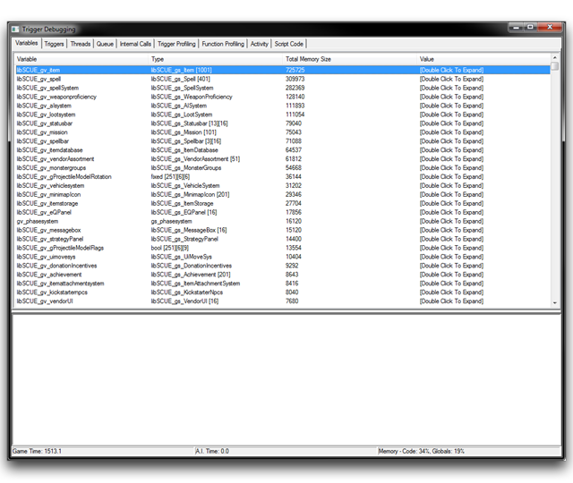
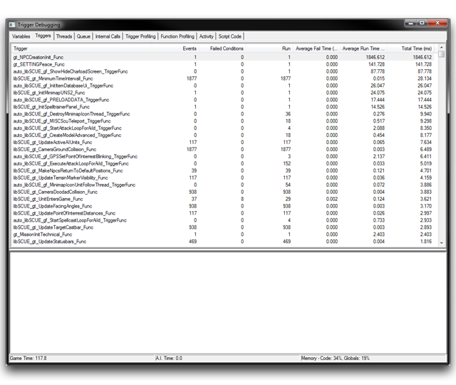
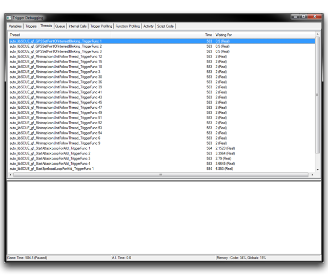
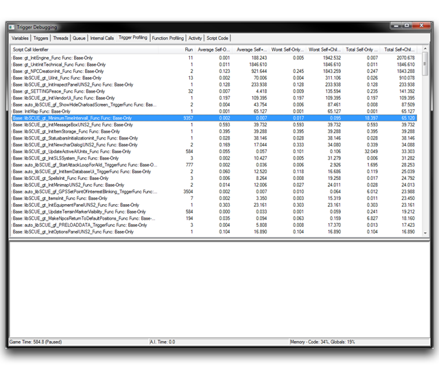
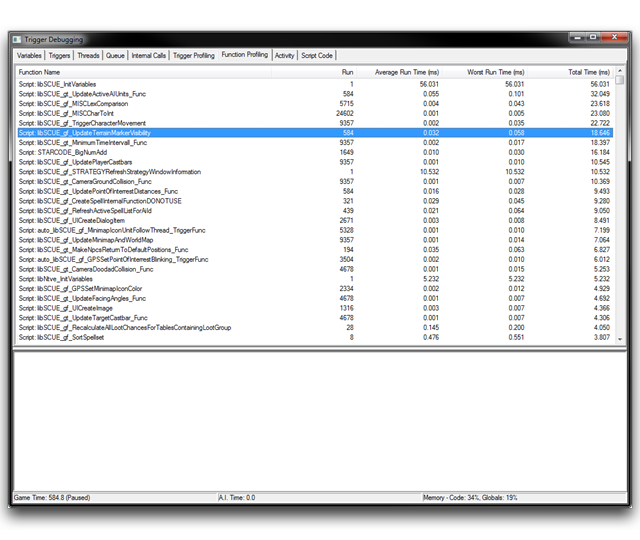
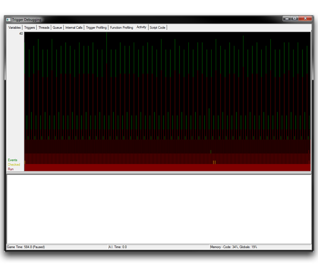
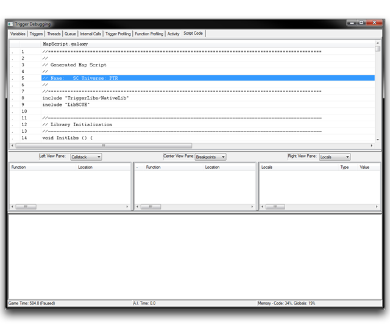
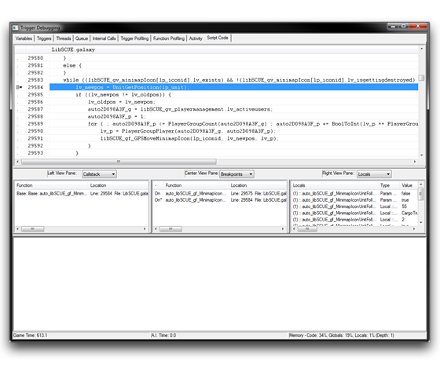

# Trigger Debugger

For advanced users, the Editor offers a Trigger Debugger. This allows you to take a granular approach to performance analysis.

## Launching The Debugger

At runtime, you can launch the debugger to monitor map scripts as they are called during a map test. It serves as a useful companion tool, able to categorize all manner of inefficiencies and errors. There are three main ways to access the debugger.

  - Activate the Editor setting 'Show Trigger Debugging Window' via File -\> Preferences -\> Test Document.
  - Use the cheat command 'trigdebug' in the chat box while testing a map.
  - In the Trigger Editor, use the native action 'Debug -- Open or Close the Debugging Window'.

The last technique is the most robust, as its inclusion in triggers allows for dynamic use, stops, and reuse in a single session. Crucially, this is the only method that supports testing in online multiplayer.

To make use of the debugger in any capacity, your game client must be set to 'Windowed' mode. If you're using the first method on the list above, you'll have to set the option Test Document -\> Game Display Mode to 'Windowed' before the Editor will show the debug window. This setting is highlighted in the image below.

­­

Activating the Debugger via Settings

## Configuring The Debugger

When starting a new project, you'll want to alter the default debugger settings to best prepare it for use. Launch the debugger and right-click on the bottommost subview. You'll be presented with several configuration options. Uncheck all of the options prefixed by Show, except for Show Errors and Show User Output. Next, navigate to the 'Variables' tab, right-click inside the topmost view and uncheck Show Constants. Under its default settings, the debugger can output a tremendous amount of diagnostic data. Ironically, this can create a noted decrease in performance. The options described here will minimize the performance impact of the debugger.

## Components Of The Debugger

The 'Trigger Debugging' window presents nine separate tab-sorted views of the project under examination. The information may be more or less useful at different times, resulting in a breakdown of the general application of each section as follows.

| Debugging Sections | Profiling Sections |
| ------------------ | ------------------ |
| Variables          | Variables          |
| Threads            | Threads            |
| Script Code        | Trigger Profiling  |
| Triggers           | Function Profiling |
|                    | Triggers           |
|                    | Activity           |

Functionally, each tab contains a table of data sorted into column-separated fields. If you click on the table headings, the data will be sorted by that field. You can click the heading again to alternate between sorting in ascending or descending order. You should also note the Status Bar at the bottom of the debugging window in each tab. Here you'll find some high-level project properties; the 'Game Time,' the elapsed time since your test began, the 'A.I. Time,' the elapsed time that AI code has run in your test, and the 'Memory -- Code, Globals,' a percentage value of the maximum, hard-coded memory available for your Editor project.

## Variables Tab

*Variables Tab*

The Variables Tab displays a list of every global variable currently in use. Globals are notorious for their large memory allocation, so sorting this list by 'Total Memory Size' can be very useful in finding which portions of your project demand most memory. You'll also find custom types within this tab, including records and arrays. Having a bird's eye view of variable values at any point during the game is a useful first measure for debugging. Below you'll find a description of each field available in this tab.

| Field             | Details                                                                                                                                                                                                                                      |
| ----------------- | -------------------------------------------------------------------------------------------------------------------------------------------------------------------------------------------------------------------------------------------- |
| Variable          | Galaxy script name for variable.                                                                                                                                                                                                             |
| Type              | Galaxy type of the variable standard types include int, bool, string, struct, and array.                                                                                                                                                     |
| Total Memory Size | Element memory size in bytes. Complex data types display their entire memory allocation; array memory size is the number of elements multiplied by the base element's size, while struct memory size is the sum of each base element's size. |
| Value             | The current value of the variable. Complex data types give the option 'Double Click to Expand.' Clicking will display a list of each variable contained within.                                                                              |

## Triggers Tab

The Triggers Tab shows a list of every trigger that has occurred in the game, alongside a breakdown of their use. This breakdown can give you insight into the number of times triggers are being activated and how often they have passed their conditions, while also providing metrics for their running times. There is some unique and useful functionality available from this view. By right-clicking an element, you can select 'Run Trigger' to execute a debug run of the trigger. This will not succeed in cases where an outside event parameter is required within the body of the trigger, but you can plan for this with a default value.

*Triggers Tab*

| Field             | Details                                                                                                                                                                 |
| ----------------- | ----------------------------------------------------------------------------------------------------------------------------------------------------------------------- |
| Trigger           | Galaxy script name of the trigger function.                                                                                                                             |
| Events            | A count of how many times the trigger has fired.                                                                                                                        |
| Failed Conditions | A count of how often the trigger condition fails, subsequently not running the trigger's body statements.                                                               |
| Run               | A count of how many times the trigger has run its body statements. Usually equal to (Events -- Failed Conditions), but using the 'Run Trigger' option may distort this. |
| Average Fail Time | Average time (ms) taken for the trigger condition to fail.                                                                                                              |
| Average Run Time  | Average time (ms) taken for the trigger execution.                                                                                                                      |
| Total Time        | Total time (ms) occupied by the trigger. This value can be roughly estimated by (Average Fail Time \* Failed Conditions) + (Average Run Time \* Run).                   |

## Threads Tab

Under the Threads Tab you'll find a list of every active trigger thread. This amounts to anything using a wait control statement, such as a trigger or any action definitions within a multithreading paradigm. Since these are often complex and performance intensive procedures, this tab can be vital in properly building out these systems. From here, right-clicking a row and selecting 'View Script' will bring you to the Script Code Tab, automatically scrolling to the first line of the selected function.

*Threads Tab*

| Field       | Details                                                                                                                                                                                                                                                                                                    |
| ----------- | ---------------------------------------------------------------------------------------------------------------------------------------------------------------------------------------------------------------------------------------------------------------------------------------------------------- |
| Thread      | For triggers, this will display the script name of the trigger function. When using action definition multithreading, this will receive the function name of the implicitly generated trigger function. These are readily noticeable by their prefix, auto, and a numeric suffix displaying the Thread ID. |
| Time        | Total time (ms) that the thread has been active.                                                                                                                                                                                                                                                           |
| Waiting For | Displays the type and amount (in seconds) of 'Wait' time the thread is currently executing. There are two types, Real and Game, representing real and game time respectively. This distinction can be important in discovering which 'Wait' statement within a trigger is currently in control.            |

## Queue Tab

*Queue Tab*

The Queue Tab lists every trigger currently making use of the action queue. Actions making use of the queue include the special Galaxy script functions TriggerQueueEnter() and TriggerQueueExit(). Triggers are only displayed here if they are waiting for their queue actions to be processed. Because this tab is so specific, it tends to be see light use, which explains its lack of additional fields.

## Trigger Profiling Tab

*Trigger Profiling Tab*

In the Trigger Profiling Tab, you'll find a more targeted version of the Triggers Tab, focused on profiling and performance monitoring. The list here contains only triggers and action definitions being used for multithreading. Rather than displaying runtimes, this the tab differs by profiling with Self Only Time and Self Only + Children Time. These terms offer a minute degree of specificity in profiling code and are defined below.

| Term               | Definition                                                                                                                                                                                                                                                                                                                                                              |
| ------------------ | ----------------------------------------------------------------------------------------------------------------------------------------------------------------------------------------------------------------------------------------------------------------------------------------------------------------------------------------------------------------------- |
| Self-Only Time     | The execution time of native Galaxy language features. This measures the time required for running primitive operations, such as modifying variables, running control structures, or copying parameters. It does not include the call times of sub-functions, even those of native Galaxy functions. However it does include the overhead of function calls themselves. |
| Self+Children Time | The total execution time for the trigger including all sub-functions and calls. Note that the Children Time, refers to the sub-function calls within each associated Self Time. This term is provided by their addition to the previous, Self-Only Time.                                                                                                                |

As in the Trigger Tab, you can right-click a row and select 'View Script' to deliver the selected trigger to the Script Code Tab, where it will scroll to the first code line of the function. You'll also find a couple of useful options here. By right-clicking on the main window, you can select Show Natives, which will allow the view to create a sub-entry for every native function called from your base functions. You can also select to Show SubCalls, which will display whole call stacks within the profiler view.

Below is a description of each field in the Trigger Profiling Tab. You should keep in mind that several of these fields are cited in terms of a different system of time, as described earlier.

| Field                       | Details                                                                                                                                   |
| --------------------------- | ----------------------------------------------------------------------------------------------------------------------------------------- |
| Script Call Identifier      | The galaxy script name of the base function. If 'Show Natives' is enabled, this will also display the name of a specific native function. |
| Run                         | A count of how many times the trigger has run its body statements. Identical to the field found in the Triggers Tab.                      |
| Average Self-Only Time      | Average execution times (ms) for the trigger.                                                                                             |
| &                           |                                                                                                                                           |
| Average Self+Childre n Time |                                                                                                                                           |
| Worst Self-Only Time        | The single longest execution time (ms) for the trigger. Notable for finding likely causes of latency spikes.                              |
| &                           |                                                                                                                                           |
| Worst Self+Childre n Time   |                                                                                                                                           |
| Total Self-Only Time        | Total execution times (ms) for the trigger.                                                                                               |
| &                           |                                                                                                                                           |
| Total Self+Childre n Time   |                                                                                                                                           |

## Function Profiling Tab

*Function Profiling Tab*

The Function Profiling Tab is the functional counterpoint to the Trigger Profiling Tab. It offers additional insight into the performance of functions within the current testing session. The times in the section 'Run Times' are on a function scale and are equal to 'Self-Only' times described in previous sections. This distinction can be somewhat confusing, but is useful in weighing the overall performance of elements against each other in demanding profiling work.

| Field               | Details                                                                                                                                                                                                                            |
| ------------------- | ---------------------------------------------------------------------------------------------------------------------------------------------------------------------------------------------------------------------------------- |
| Functi on Name      | Galaxy script name of the function.                                                                                                                                                                                                |
| Run                 | A count of how many times the function was called.                                                                                                                                                                                 |
| Averag e Run Time   | The average execution time (ms), single longest execution time (ms), and total execution time (ms) of the function respectively. Note that figures are Run Times on a function scale and are equal to the form of Self-Only times. |
| &                   |                                                                                                                                                                                                                                    |
| Worst Run Time      |                                                                                                                                                                                                                                    |
| &                   |                                                                                                                                                                                                                                    |
| Total Time Run Time |                                                                                                                                                                                                                                    |

## Activity Tab

*Activity Tab*

In the Activity Tab, you'll find a data visualization representing game activity during the current session. 'Activity' is a term describing a combination of three properties, listed below.

| Described Property | Marking Color |
| ------------------ | ------------- |
| Fired Events       | Green         |
| Checked Conditions | Yellow        |
| Executed Triggers  | Red           |

The graph charts each property on a plot of executions vs time (ms), with executions on the y-axis, and time on the x-axis. You should note that, since executed triggers require checked conditions, the red line will be a subset of the yellow line, always fitting within its area. Overall, this tab itself is light on performance. You can actually see latency spikes here by keeping an eye out for sudden, large movements of the green line. You can also loosely gauge the total activity or engine load at any given time to gain a more immediate sense of which parts of your code might require further investigation.

## Script Code Tab

In essence, the Script Code Tab displays the script code of the loaded project. However, its primary advantage is its ability to serve as a full-fledged script debugger with the ability to set breakpoints, inspect local variables, and step through code line by line. As such, this section boasts the most useful core of debug functionality within the Trigger Debugger. Here you can find errors where and when they happen, rather than using outputs and intuition to try to track down problems. Both methods have their advantages, but the most careful work of fixing errors should occur here.

*Script Code Tab*

## Setting Breakpoints

To debug a script at run time, you must first set a breakpoint. A breakpoint acts as the entry point for the debugger to start analyzing your code. Once the flow of code execution hits the breakpoint, the game will be paused and the debugger will start to display data. You can add a breakpoint to the script code by right-clicking the window and selecting Add/Remove Breakpoint. You can remove a breakpoint by selecting a code portion already marked with a breakpoint and repeating the same procedure.

## Further Debugging Considerations

It is important to note how this technique scales with the size of project's code. Once your project reaches a certain size, it will become tedious to find the specific line of code being searched for. You can combat this by switching to either the Triggers Tab or Trigger Profiling Tab, sorting the entries by name, and finding the desired function to debug. Then, right-click the row and use View Script. As mentioned earlier, this will bring you back to the Script Code Tab, scrolled to the first line of code of the selected function.

Alternatively, you can also set a breakpoint from within the Galaxy Map Script, using the keyword Breakpoint at the desired location. When the execution flow encounters this keyword, the Trigger Debugger will open and jump to the position of the breakpoint. There is no current support for the GUI, so you'll have to use either a macro or custom script element.

You should also note that the Script Code Tab can only display the contents of a single library at a time. This means that, when you're working with a project using multiple libraries, you'll need to switch the display between libraries as necessary. You can do this by using a View Script command on a trigger from the library you want to switch to.

## Analyzing Data

After a breakpoint has been set and encountered in the game's flow of execution, the game will pause and bring the debugger into focus. At this point, it will display additional information in the main view Script Code Tab, as shown in the image below.

*Breakpoint Reached within Script Code Tab*

You can use the dropdown menus at the top of each subview to alter the displayed data so that you can parse the current system state. You'll find a breakdown of the available options in the table below.

| Option      | Details                                                                                          |
| ----------- | ------------------------------------------------------------------------------------------------ |
| None        | Hides the selected view pane.                                                                    |
| Globals     | A list of all global variables, similar to the Variables Tab.                                    |
| Locals      | Information about each local variable, including event parameters.                               |
| Watch       | Contains a constructed list of variables that have been marked with the useful Add Watch option. |
| Callstack   | The current callstack, or function call hierarchy, displayed from bottom to top.                 |
| Breakpoints | A list of all currently set breakpoints.                                                         |

In practical use, the Locals option far outweighs the others in terms of usefulness. It allows you to unwrap each value within the currently executing function for easy viewing. By studying these locals and parameters you can track the control of a specific function and confirm that its values are within the expected ranges.
