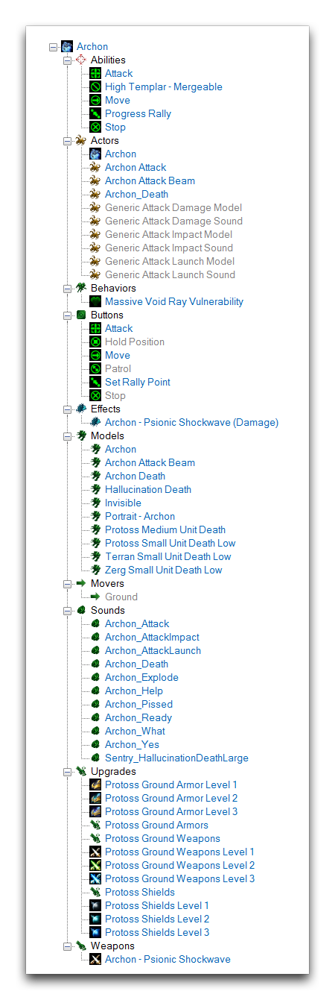
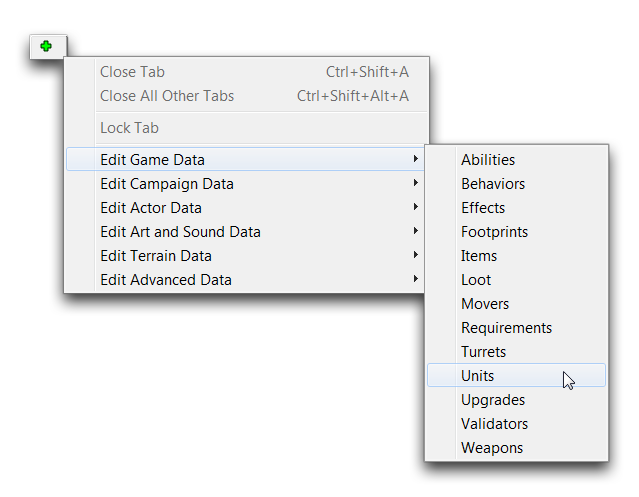
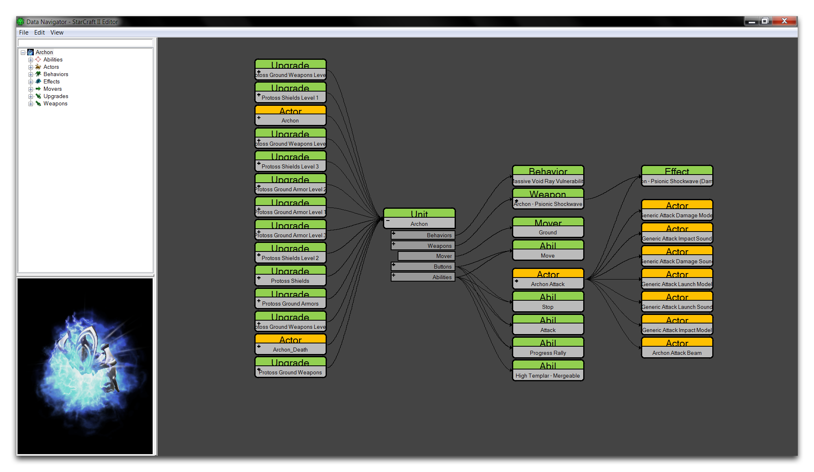
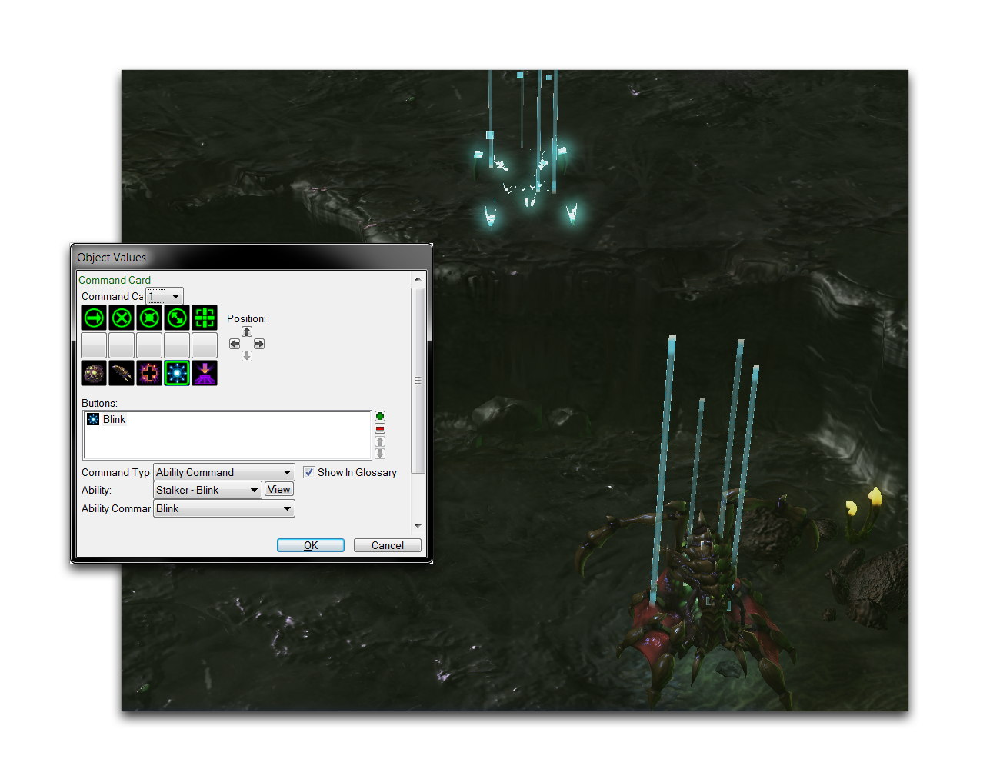
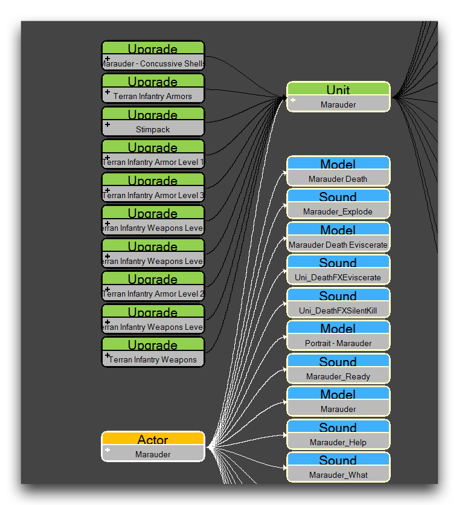
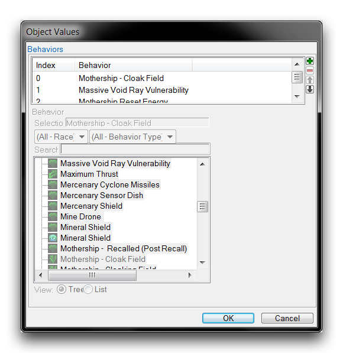

UNITS
=====

A Unit is an interactive game object. Despite the term being thrown
around in a lot of contexts, in the Data Editor the term 'unit' refers
very specifically to a data type placed directly into the game to be
manipulated by players. Selecting a unit in the Data Editor will give
you a breakdown like the one shown below.

Unit Data Object

The unit shown above is the Archon, as displayed on the top of its
fairly extensive data hierarchy. The length of the list shown here
should give you an impression of the unit data type's main purpose, to
serve as a container for various other types of Game Data, Art and Sound
Data, and Actors. You can investigate units in the Data Editor by
navigating to them via + -\> Edit Game Data -\> Units, as shown below.

Navigating to Units in Data

The unit data type is distinguished from other data types by the fact
that it can be placed into the game and receive inputs, things like
player commands, interactions with other units, and orders from an AI.
Communicating these interactions to its connected data types makes the
unit one of the primary ways in which data is turned into gameplay. The
data composition of a unit is shown in the image below.

Unit Composition

As you can see, much of the data in the Editor ends up leading to a
unit. The direct contributors are Abilities, Actors, Behavior, Movers,
and Weapons. The relationship between these categories and the Units
type is described below.

ABILITIES
---------

A unit has space for up to 32 abilities. These abilities determine much
of its functionality. Common abilities present in a unit include attack,
move, stop, hold position, and patrol. These abilities are primarily
added to a unit through the 'Abilities' field shown below.

Unit Composition

Once added, the abilities are tied into gameplay using the 'Command
Card' field. Adding a button to the command card portion of the unit's
UI allows player inputs to trigger abilities. You can see this procedure
being used in the image below.

Custom Command and Effect

ACTORS
------

Actors mainly add art and sound assets into a unit. More specifically,
each unit is home to an Actor that shares its name. These hook in the
unit's 3D model, portrait, death animation, and operational sounds. Many
units also have an attack actor that handles the visual and audio
components of their weapons. These actors are linked to the unit in
their actor messages. In the image below you'll one of these actors
hooking art and sound into a unit.

Actor to Unit Data Connection

BEHAVIORS
---------

Behaviors can exist in the scope of a unit, giving it passive abilities
such as auras or timed life. Behaviors are added to a unit using the
'Behaviors' field, as shown below.

Mothership Behavior View

MOVERS
------

A unit will have a mover that that dictates its basic movement. Any unit
without a mover cannot use move commands. Common movers for units
include Ground, Fly, Burrowed, and Cliff Jumper. Projectiles also
contain movers, typically more complex ones that simulate dynamic
movement. You can customize a unit's movement further within the unit's
movement fields, allowing you to set things like Speed, Turning Rate,
and Acceleration. Movers are set up within a unit's 'Movers' field.

Missile Mover

WEAPONS AND TURRETS
-------------------

Weapons grant a unit the ability to attack. Without a weapon, attack
commands are unavailable. They operate in a relatively straightforward
manner. It begins with a unit being targeted, either by a player or the
AI. The weapon will then create an effect at the target. If the target
unit is in range and the weapon's cooldown period has expired, the
weapon will fire, playing an animation, applying its effects, and
launching a missile if appropriate. Weapons can also be stacked, giving
a unit multiple attacks that each have their own effects, range,
cooldowns, and so forth.

Each weapon can also be configured with a turret. Turrets are a special
data type responsible for aiming at their attack targets. This aiming
creates a timed rotation of the turret before firing, which provides
both a visual and gameplay element. Weapons and turrets are added to a
unit using their respective fields, 'Weapons' and 'Turrets.'
