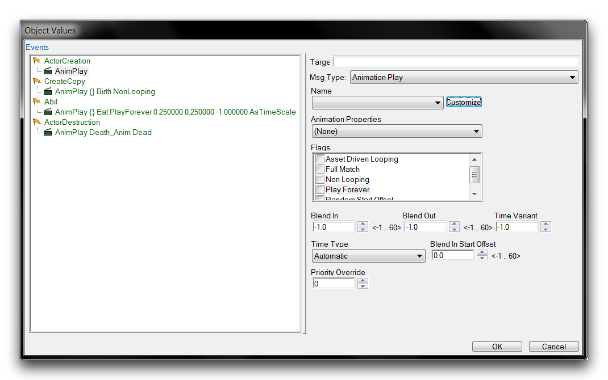
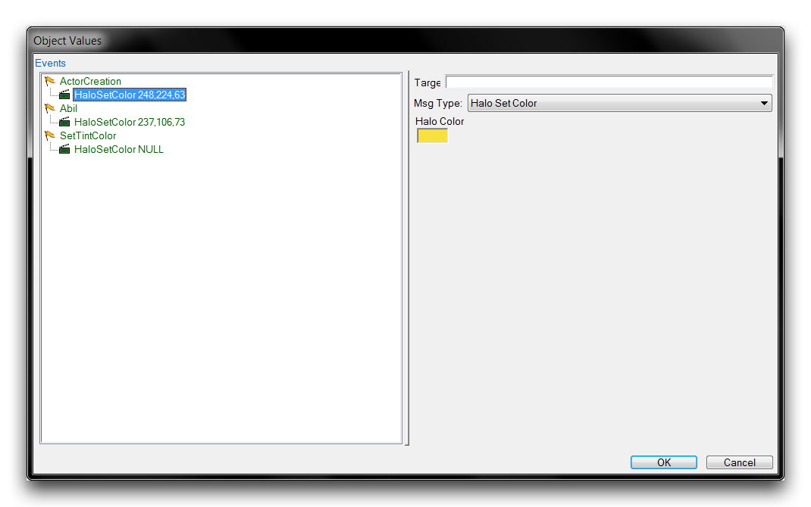
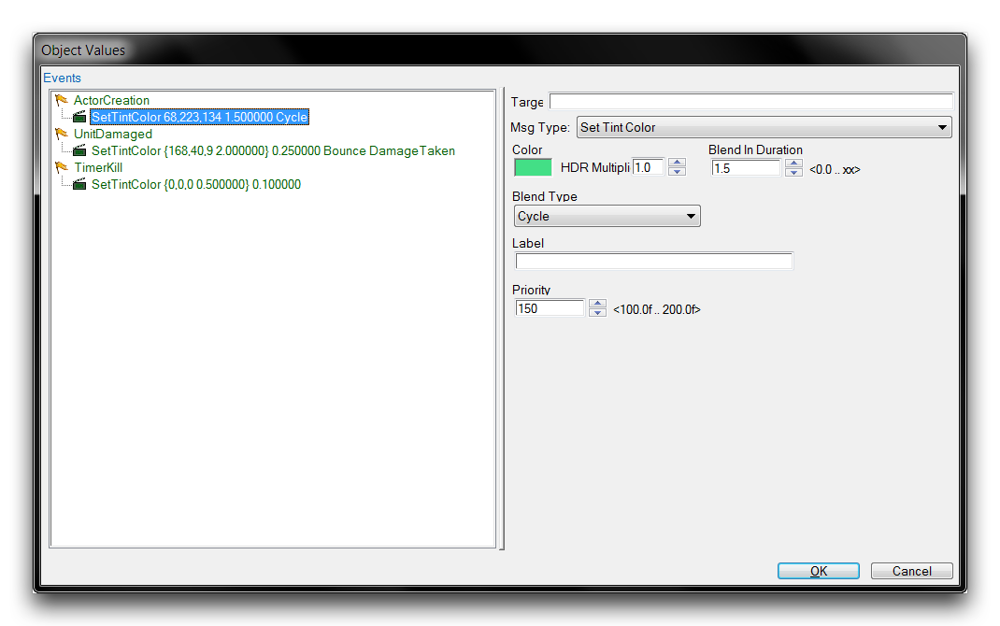

ACTOR MESSAGES RUNDOWN
======================

For nearly every data type, there is some associated actor message to
provide its logical backend. This guarantees that the stable of actor
messages is both diverse and numerous. In this article you'll find a
breakdown of many of the types of messages, as well as some suggestions
for their use.

Before we start, you should note that you can see an actor's messages
both directly, through the expandable 'Events' field, and structured
inside the actor event's subeditor. Each entry in this article will also
include a view of the message type within the subeditor, but the basic
fields view can be sometimes be noteworthy as well. You can see an
example of this view in the image below.

Actor Events Field

From here you can see the direct ID of actor messages, such as UnitBirth
or ActorCreation, rather than their structure form in the subeditor
selection panel of 'Unit Birth' or 'Actor Creation.' These IDs may be
important when using actor messages in the Trigger Editor or scripting.
As such, they have been supplied at the start of each of the following
entries.

While this article may serve as a reference, you should be aware that
best way to investigate the full library of actor messages is
individually, by creating and examining messages in the subeditor view
itself. You can create an actor event or message by moving to an actor's
'Events' field, double clicking it to launch the subeditor, then
right-clicking inside the white box and selecting 'Add Event.' This will
create an event and message pair.

Actor Event Creation

Below you'll find a rundown of the many types of actor messages.

ANIMATION PLAY
--------------

Animation Play Message

AnimPlay

Plays the specified animation. This is the essential message for
animation control, its options mainly control the physical properties of
the animation.

  --------------------------------------------------------------------------
  Field        Details
  ------------ -------------------------------------------------------------
  Name         Sets a reference label for the message.

  Animation    Selects the animation type from a dropdown. All animations
  Properties   are tied to a preset list of states. You can find and
               investigate them in the Cutscene Editor.

  Flags        

  Asset Driven Similar to Play Forever, but loops with more defined behavior
  Looping      set within the animation.

  Full Match   Will match the animation's consecutive plays to one another
               without any stuttering.

  Non Looping  Plays through the current animation once.

  Play Forever Continually loops the animation.

  Random Start Starts the animation at a random frame.
  Offset       
  --------------------------------------------------------------------------

Blend In Blending dynamically interpolates between two different sets of
animations. This sets the amount of time spent blending into this
animation from the current one. Blend Out Sets the time spent blending
out of this animation into a new one. Time Variant Sets the type of time
scale used to set the Time Variant. Time Type Sets the type of time
scale used to set the Time Variant. Blend In Start Offset Sets an offset
time for the blending process to start. Priority Override Sets the
priority for blending in comparison to the other animation's priority.

ANIMATION BRACKET START
-----------------------

Animation Bracket Start Message

AnimBracketStart

Animation brackets act as containers for three-stage animation
sequences. The stages are Opening, Content, and Closing.

  -----------------------------------------------------------------------
  Field             Details
  ----------------- -----------------------------------------------------
  Name              Sets a reference label for the message.

  Opening           Sets the first stage animation.

  Content           Sets the second stage animation which plays following
                    the Opening.

  Closing           Sets the final animation stage which plays after the
                    Content.

  Flags             

  Closing Full      Confirms that the Closing animation completes under
                    any circumstances.

  Instant           Will skip the Opening animation and begin at the
                    Content.

  Non Looping       Sets the Content animation to only play once.

  Play Forever      Replays the Opening animation until receiving a
                    manual stop.

  Random Start      Applies a random offset to the animation start times.
  Offset            
  -----------------------------------------------------------------------

Time Variant Sets the type of time scale used to set the Time Variant.
Time Type Sets the type of time scale used to set the Time Variant.

DESTROY
-------

Destroy Message Options

Destroy

Destroys the actor, eliminating it from any further updates and removing
any visual components. There are two available types, Immediate and
Normal. Immediate will instantly destroy the actor and any of its
substituents. In the case of units, their death animations are not
played. Normal removes the actor and its substituents, but allows death
animations to play and particles to naturally fade out.

GLOW START
----------

Glow Start Message

GlowStart

Applies a pulse-like glow effect to the actor's model. This can be
stopped with the 'Glow Stop' message. There are no suboptions for this
message.

HALO SET COLOR
--------------

Halo Set Color Message

HaloSetColor

Halos add a glowing outline around a model. They are typically used to
provide contrast to a unit or highlight it for specific reference. This
message sets the color of the halo, while 'Halo Start' and 'Halo Stop'
control its addition and removal respectively.

MODEL SWAP
----------

Model Swap Message

ModelSwap

Sets the actor's model to the value selected for Model. This will
replace any currently selected model. This also supports picking of the
model's specific Variation.

SET OPACITY
-----------

Set Opacity Message

SetOpacity

Alters the opacity of the actor, propagating that change to any
connected visual asset, such as a model.

  -----------------------------------------------------------------------
  Field       Details
  ----------- -----------------------------------------------------------
  Opacity     Sets the level of opacity applied, with 0.0 being the
              default status and 1.0 being completely transparent.

  Blend in    Sets the time period over which the opacity will be
  Duration    applied. By default, application is instant.

  Label       Sets a reference label for the message.
  -----------------------------------------------------------------------

SET TINT COLOR
--------------

Set Tint Color Message

SetTintColor

Applies a tint to the actor, propagating the color change to any
connected visual assets, such as a model.

  -----------------------------------------------------------------------------
  Field        Details
  ------------ ----------------------------------------------------------------
  Color        Sets the color applied as a tint. Clicking the color box will
               launch a color picker window.

  HDR          Sets the brightness amplification through HDR lighting.
  Multiplier   

  Blend In     Sets the time period over which the color will be applied. By
  Duration     default, application is instant.

  Blend Type   Selects from different blending methods. One Shot will apply the
               blend into the color once, Bounce will blend into the color then
               back out again, and Cycle will repeatedly blend in and out of
               the color.

  Label        Sets a reference label for the message.

  Priority     Sets the priority of this tinting over similar messages.
  -----------------------------------------------------------------------------
