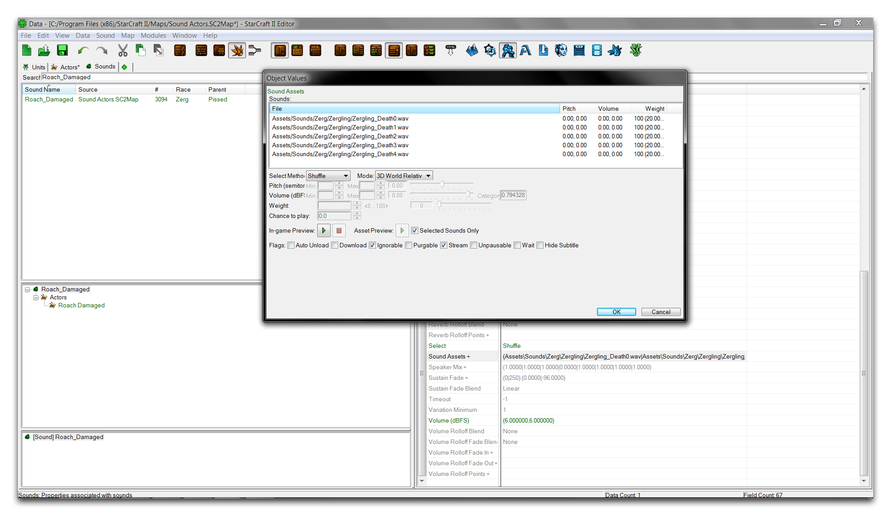
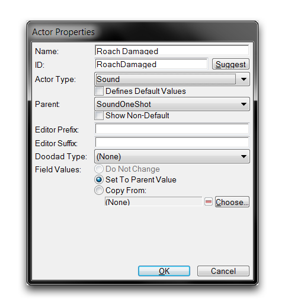

# Sound Actors

Sound Actors are used to deliver most of the game's unit sounds. This includes things like order affirmations, weapons fire, death cries, spell effects, and construction noises. There are other sounds in the games, such as music and cutscene dialog, but sounds actors handle the systemic sounds that respond to gameplay. As a type of actor, sound actors can be located in the actors tab, shown below.

*Sound Actors Listing*

Sound actors don't actually contain their sound asset, it is stored separately in a Sound data type. As such, you can think of sound actors as a kind of sound coordinator. They act in response to the game's inputs via their connection to a unit, then start and stop sounds as directed by their 'Events' field. They have a limited ability to configure their sound. Any alterations to a sound's properties, like pitch, volume, or 3D settings, typically occur in the Sound data.

There are two base types of sound actor that are used for sound actor parentage, SoundOneShot and SoundContinuous. The former is used for sounds that only play once, while the latter is for sounds that play indefinitely. For example, the the Zerg burrow noise is a one shot sound, while the medivac healing loop is a continuous sound.

## Sound Actor Fields

A sound actor's fields create a link between the sound actor itself, a unit, and a sound asset. These fields are broken down in the table below.

| Field                | Details                                                                                                                                                                                                                                                                                                                                                                                                                                                                |
| -------------------- | ---------------------------------------------------------------------------------------------------------------------------------------------------------------------------------------------------------------------------------------------------------------------------------------------------------------------------------------------------------------------------------------------------------------------------------------------------------------------- |
| Events               | Sets the actor events. Sound actors use events to create themselves and their link to a unit. The control of Sound objects is also handled through events.                                                                                                                                                                                                                                                                                                             |
| Sound                | Sets the Sound played on actor creation. Any base behavior present in the sound is maintained here, including looping, variations, and volume controls.                                                                                                                                                                                                                                                                                                                |
| Sound Flags          | Contains a single Update Visibility flag. This flag makes use of actors' ability to be asynchronous. When activated, sounds will respond to their visibility status for a player. For example, if a sound is playing as a unit vanishes from a player's view into fog of war, the sound's volume will fade out. This flag is often disabled for unit death sounds so that players can hear the full death sound of a unit, even if it disappears under the fog of war. |
| Host                 | Determines which properties are inherited from the host. Properties like positon and height are important to any sounds configured to be 3D.                                                                                                                                                                                                                                                                                                                           |
| Host Site Operations | Site operations can be used to alter the sound's position in 3D space.                                                                                                                                                                                                                                                                                                                                                                                                 |

## Sound Actor Events

Events and messages pertinent to a sound actor's operation are broken down in the table below.

| Message                   | Description                                                                                                                                              |
| ------------------------- | -------------------------------------------------------------------------------------------------------------------------------------------------------- |
| Create                    | Creates the actor, playing the sound with its specified properties.                                                                                      |
| Destroy                   | Destroys the actor, ending sound output.                                                                                                                 |
| Timer Set                 | Sometimes used to play a sound after the actor's creation,                                                                                               |
| Sound Done                | Operates as an event, where it is triggered once a sound has finished playing. Usually used to Destroy the actor. A looping sound will not trigger this. |
| Sound Add Digital Effects | Modifies a sound with digital signal processing. There are a number of preconfigured DSP effects such as ReverbUnderwater and ReverbStoneRoom.           |
| Sound Set Muted           | Mutes or unmutes a sound. A muted sound continues to play, but at effectively zero volume.                                                               |
| Sound Set Offset          | Creates an offset, or pause before the sound begins playing.                                                                                             |
| Sound Set Paused          | Pauses or unpauses a sound. A paused sound's output stops until begun again.                                                                             |
| Sound Set Pitch           | Alters the pitch of a sound over time, making it higher or lower.                                                                                        |
| Sound Set Volume          | Sets the volume of a sound over time.                                                                                                                    |

## Demoing Sound Actors

Open the demo map provided with this article. The course inside shows a roach that's been cornered by some marines. It should appear as shown in the image below.

*Sound Actors Listing*

By default, roaches don't make any sort of noise while being attacked. Testing the map now will demonstrate this. However, you can build a new sound actor to alter this behavior using some prebuilt assets. Navigate to the Data Editor and open the Sounds tab. Find the existing sound 'Roach\_Damaged,' and open its 'Sounds Assets' field. This should present you with the following view.

*Sound Actors Listing*

Here a custom Sound has been set up to replicate a selection of zergling death noises. The list is set so that a random variation will pick and play as a stand in for a roach damaged noise. To set that functionality, move to the actors tab and right-click in the main view, then select 'Add Actor.'

*Creating an Actor*

Name the new actor 'Roach Damaged,' then click 'Suggest' to generate an ID. Use the 'Actor Type' dropdown to select the creation of a sound actor, as shown below.

*Selecting Sound Actor Creation*

Select the 'Parent' to be SoundOneShot, since the behavior you want is for the sound to play once on being attacked, then stop. The final actor creation window will look something like this.

*Sound Actor Creation Window*

Now highlight the actor you just created and find its 'Event's field. Select this field and double click it to open the actor events subeditor. You'll see that there is a pre-existing 'SoundDone' event with a 'Destroy' message. This is parented in from the SoundOneShot base and will cause the sound to stop, or be destroyed, after playing once. Right-click below this element and select 'Add Event', as shown below.

*Adding an Event*

Once created, highlight the new 'ActionDamage' event and use the dropdown to set the Event's Msg Type to 'Unit Damage.'

*Selecting Event Type*

Set the 'Unit Damage' event's Source Name to 'Roach.' Then set the message to 'Create.' This will establish the link with the roach, causing the actor to be created and play every time the roach is damaged. The completed actor events should look like those in the image below.

*Completed Actor Events*

Click 'Ok' to save the actor events, then move back to the main Data Editor view. The sound actor still requires a connection to a sound asset, so create the link by navigating to the 'Sound' field and double clicking to open it.

This will launch an 'Object Values' window where you can set the sound. At this point you should be looking at the following.

*Setting Sound Asset*

Select the 'Roach Damaged' Sound that was supplied with the map and click 'Ok.' Now move to the 'Terms' field and double click to open it. This field offers some additional terms, the same as found in actor events. In this case, these terms must be passed before the actor is created. Click the + button to add a new term, then use the dropdown to select 'Cap,' as shown below.

*Setting Terms*

Once selected, set the Cap value of this term to 2. This will appear as follows.

*Completed Term*

This term sets a cap on the number of actors that can exist in the same scope before another can be created. The scope here is the unit source, the roach. This setup means that the roach can make a maximum of two damaged sounds at any given time. Confirm these settings by clicking 'Ok.'

The map is now complete. The sound actor has allowed you to introduce a new sound into the roach's data. You can see the changes in the unit's data structure below.

*Old Roach Data Structure -- New Roach Data Structure*

The sound actor has linked the Sound 'Roach Damaged' into the Unit data through its events, specifically the 'Unit Create' event, which will be triggered on any damage to the roach. Testing this behavior should play this new sound when any marines are commanded to attack the roach. Remember that the sound is a sampling of the zergling death cry. Use 'Test Document' to see it working in-game.

*Newfound Sympathy for the Roach*

## Attachments

 * [063_Sound_Actors_Completed.SC2Map](./maps/063_Sound_Actors_Completed.SC2Map)
 * [063_Sound_Actors_Start.SC2Map](./maps/063_Sound_Actors_Start.SC2Map)
