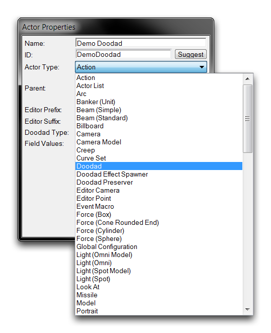
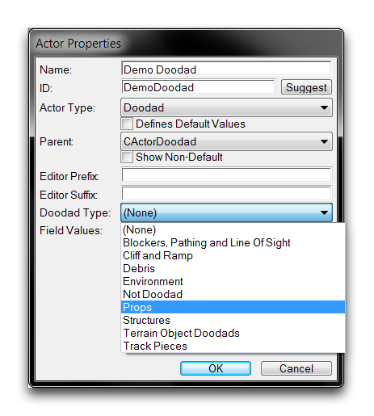
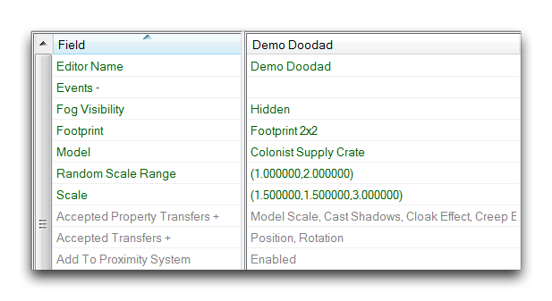

# Doodad Actors

Most users will understand doodads as a collection of elements in the Terrain Editor that can be used in maps for decorative, styling, or world-building purposes. Here, it will help if you have a more formal, data-oriented definition for them. Doodads are simple, visual objects that you can add directly into the game. You can do this using an actor subtype known as the Doodad Actor. You can see some doodads in use in the image below.

*Doodads Shaping a Cliff face*

Doodads are primarily visual elements. As game objects, they're distinguished from Units by their removal from any computation regarding moving, combat, abilities, and so forth. This type exists to offer a lightweight method of sending Model types to the game with only some minor properties. Creating an actor as a doodad subtype means that it will be listed directly in the game, found in the Doodads Palette of the Terrain Editor, ready for placement. You can see this in the image below.

*Doodad Actor Demonstrated in the Terrain Editor*

## Doodad Types

Doodad actors are also given a subtype, listed under their 'Doodad Type' field. This is primarily an organizational tool and can be changed after you have created the actor. Beyond organization, subtypes enable a set of filters on the Doodads Palette. Searching with the 'Actor Type' Doodad and a specific 'Doodad Type' can greatly speed your work with doodads in the Terrain Editor.

Doodad Type Filter in the Terrain Editor -- Tagging Doodad Actors with a Type in the Data Editor

The rightmost view above shows the organization of doodads in the actors tab by their 'Doodad Type.' The leftmost view shows how these types can then be used as a search filter in the Doodads Palette.

## Doodad Actor Details

There is a small number of fields that allow for the alteration of doodad actors. Given the nature of doodads, these are mostly visual modifiers and are described in the below table.

| Field              | Details                                                                                                                                                                                                                                                                                                                                                                                                                                                                      |
| ------------------ | ---------------------------------------------------------------------------------------------------------------------------------------------------------------------------------------------------------------------------------------------------------------------------------------------------------------------------------------------------------------------------------------------------------------------------------------------------------------------------- |
| Art Model          | Sets the model which will be made into a doodad.                                                                                                                                                                                                                                                                                                                                                                                                                             |
| Art Scale          | Allows for scaling of the model type in the X, Y, and Z axes.                                                                                                                                                                                                                                                                                                                                                                                                                |
| Random Scale Range | Applies a random scale factor to placed doodads on an individual basis. The scaling is applied across all three axes, and is selected from within a defined range.                                                                                                                                                                                                                                                                                                           |
| Fog Visibility     | Sets the state the doodad enters when covered in fog of war. This is an important consideration if you are concerned with performance. In order of increasing performance, the possible states are as follows. Visible will keep the doodad fully active under fog of war. Dimmed will slightly darken the doodad and maintain all other animations. Snapshot freezes animations but maintains visibility. Hidden completely removes the doodad when it is under fog of war. |
| Footprint          | Selects the doodad's pathing footprint. A doodad's pathing is its main logical component. This determines the interactions between the doodad's visual component, the Art Model, and the actions of other game objects on the map, such as unit movement or placement.                                                                                                                                                                                                       |
| Events             | Sets the actor events for the doodad. This handles the basic creation and removal of doodads, but also things like sound emitters and animations.                                                                                                                                                                                                                                                                                                                            |

## Creating A Doodad Actor

Assemble a new doodad by moving to the actors tab inside the Data Editor. If the tab isn't already open, you can open it by navigating to + ▶︎ Edit Actor Data ▶︎ Actors. Once inside, create a new actor by right-clicking in the main view and selecting 'Add Actor,' as shown below.

*Creating a New Actor*

This will launch the 'Actor Properties' window. Inside this view, set a name, then hit suggest to generate an ID. Set the 'Actor Type' to Doodad. For this exercise the name Demo Doodad has been used.

*Creating a Doodad Actor*

Use the 'Doodad Type' dropdown to select the organization type for the doodad. For the purposes of the demo, you should select the Prop type. This is a subtype that is usually used to categorize man-made, non-structural objects. You can see what it looks like to select the subtype in the image below.

*Selecting Doodad Type*

Once you're done, you can click 'Ok' to finish creating the doodad actor.

## Setting The Doodad Actor'S Fields

The essential part of the doodad actor is the 'Model,' so you should set that now. Highlight the new actor to view its fields in the Data Editor. Move to the 'Model' field and double click it to launch an editing window, as shown below.

*Doodad Actor Model Selection*

This window displays all of the Model assets in a project's data, along with some searching options. Pick the desired model here, then hit 'Ok' to save the selection. For this exercise, you should choose the Colonist Supply Crate.

Next, move to the 'Events' field to set the actor events. Select this field and double click it to open the actor events subeditor shown below.

*Doodad Actor Events Default*

Doodad actors contain support for sound emitters and animation by default. The 'AnimPlay' message sets the animation to be played on doodad creation, selects a random animation frame to start playing at, and then sets it to loop indefinitely. The sound emitter begins its playing behavior as set out within its respective sound type. If these extended functions are not needed, as is the case with the demo crates, then you can delete them. Do this by selecting each term, right-clicking, and choosing 'Remove Selection.'

Finally, you'll have to set the 'Footprint' field. This field allows you to select from a list of available or custom footprints and apply them to the doodad. The pathing will then be set on top of the doodad in the game, giving it the logic rules defined in the Footprints type. Add a footprint by highlighting the 'Footprint' field and double clicking to launch the editor window shown below.

*Setting Doodad Footprint*

For this exercise, you should choose a footprint of Footprint 2x2. The doodad is now ready and functional, but there are still several properties you should consider setting. These include Art Scale, Random Scale Range, and Fog Visibility. The completed demo doodad's fields are shown below.

*Demo Doodad Fields*

## Placing The Doodad

To place your custom doodad, navigate to the Terrain Editor and then to the Doodads Layer. The completed doodad will have been added to the Doodads Palette and you can find it either manually or using the search filters, like 'Doodad Type.' You can use the palette for this, as shown below.

*Doodads Palette Search Filters Use*

Placing the doodad in the Editor view should reveal its model and footprint on the map. Note that any scaling, and randomization of scale will occur as the model is placed and won't be reflected in the palette's previewer. You can see the exercise's custom doodad in the image below.

*Custom Doodad in Game*
