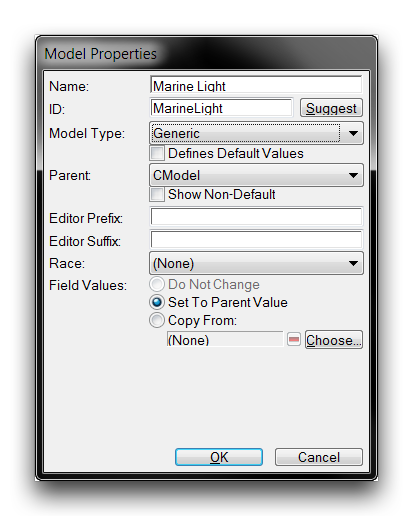
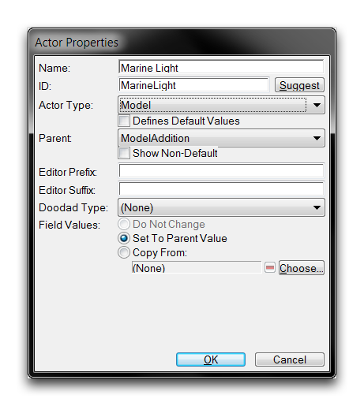
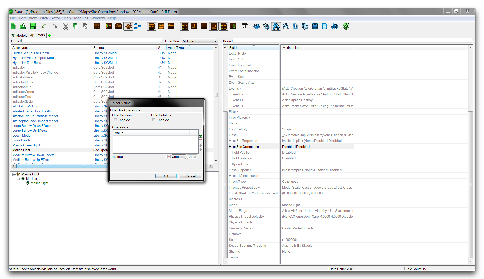
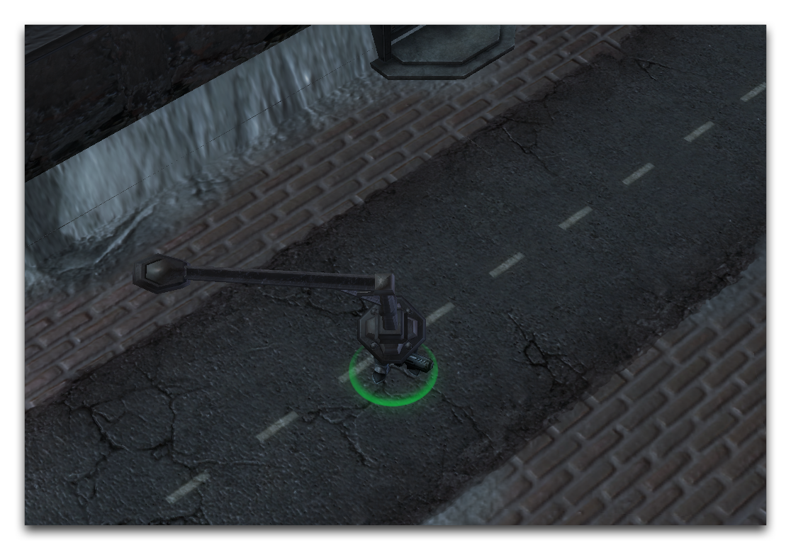
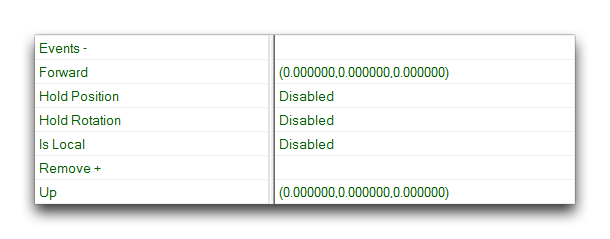
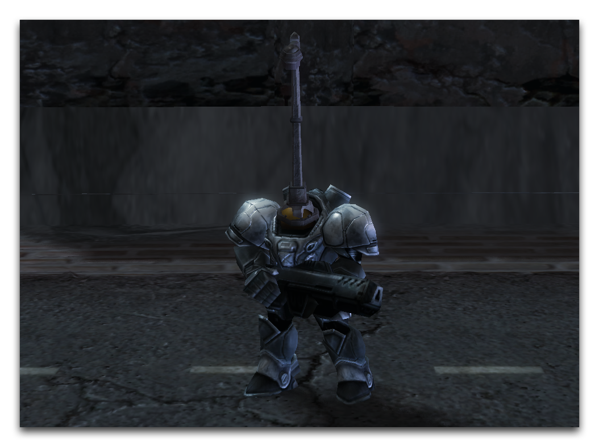
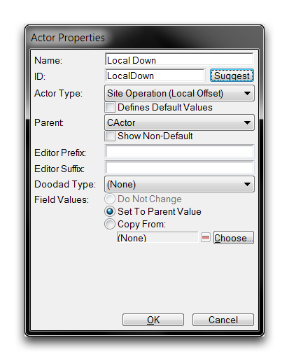
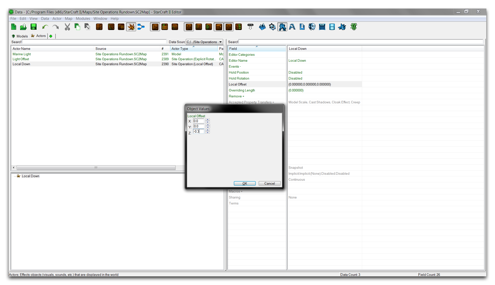
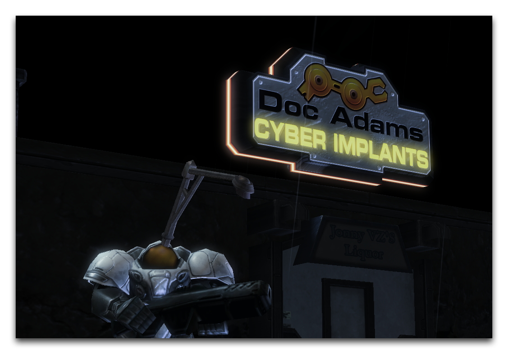

# Site Operations Rundown

Site operations represent a substantial number of the modifications that you can be apply to an actor. It will likely take some time and experience before you have a firm grip on them. This is a brief guide on employing the most commonly used operations to help you along the way.

You'll notice that this guide differs a bit from previous rundowns of Editor elements. This is because site operations differ from other elements of the editor in that the order in which they're applied matters. Rearranging the same set of site operations can produce markedly different results. This can mean that site operations are a bit difficult to define in a vacuum. Rather than providing a breakdown of each operation's fields and details individually, this article defines each operation and shows how to apply them in a tutorial exercise. This will help you to gain insight into how a host actor changes as more site operations are layered onto it.

Open the demo map provided with this article to start the tutorial. Inside you'll find a marine standing on a boardwalk roadway, as in the image below.

*Demo Map Course*

Move to the Data Editor, then to the actors tab for first step of the exercise.

## Site Operation (Attachment)

The Attachment site operation attaches an actor either to a unit or to another actor. This is usually used to give the appearance that the actor's models are linked or grafted together. You can stack this grafting to create strange, chimaera-like units, which is perhaps the most iconic use of site operations. A well-known example built with this method is the Blizzard's April Fools' prank the Terratron.

*Terratron: A Robot Built From Many Combined StarCraft Models*

Before you try to understand the mechanics of this operation, it will help to go over a few terms. The actor being attached, which hosts the site operation, is known as the Host. The actor to which the Host is being attached is known as the Base.

When creating an attachment site operation, the most important field is the Attachment Query. You can use this field to set the type of attachment point used. This is described in more detail in the table below. Applying the attachment site operation to the Host will tell it to send the Attachment Query to any Base it is connected to. This causes the Host to be attached to the Base by its instance of the attachment point type set by the Attachment Query. The operation then sets the Host's position and orientation to that of the Base's attachment point.

It's worth noting that, since there is a limited number of attachment point types, you'll find a useful pre-built set of attachment site operations already in the Data Editor. These typically have names with a prefix of SOpAttach, and a suffix describing the name of an attachment point type. Examples include SOpAttachHead, SOpAttachWeapon, and SOpAttachCenter.

This table shows a breakdown of the attachment site operation's fields.

| Field            | Details                                                                                                                                                                                                                                                                                                                                                                                                        |
| ---------------- | -------------------------------------------------------------------------------------------------------------------------------------------------------------------------------------------------------------------------------------------------------------------------------------------------------------------------------------------------------------------------------------------------------------- |
| Attachment Query | Sets the attachment Methods, which specify the attachment point to which the Host will be attached. This is set by selecting a 'Filter Type.' The options here are Direct, where the reference name of an attachment point is specified from a dropdown, and Method, where the point is specified from the Attach Methods data type. You can also provide a Fallback query in case the specified method fails. |
| Hold Position    | This flag sets the position of the attachment to remain constant at its initially calculated value.                                                                                                                                                                                                                                                                                                            |
| Hold Rotation    | This flag sets the rotation of the attachment to remain constant at its initially calculated value.                                                                                                                                                                                                                                                                                                            |

## Using An Attachment Operation

The map provided with this article can be used to demonstrate attachment operations, you can practice on the lone marine. He won't mind. The first thing you'll need is a Model for the Host actor. You can create a model by moving to the models tab in the Data Editor, right-clicking in the Object List, and selecting 'Add Model.' This will launch the window shown below.

*Model Creation Window*

Set the model's 'Name' to 'Light Model' and hit 'Suggest' to auto generate an ID. Set the 'Model Type' to 'Generic' and click 'Ok.' This will create a Model object. Move to its 'Model' field and double click it to launch an 'Object Values' selection window. Clicking 'Browse' in this window will launch the Archive Browser, as shown below.

*Model Selection with Archive Browser*

Use the browser's search function to find Streetlight\_01.m3, select it and click 'Ok.' Click 'Ok' again in the selection window, to move back to the main Data Editor view. The model asset has now been linked to a Model type and is ready for use within an actor. Prepare the actor by first moving to the actors tab. There, right-click in the object list and select 'Add Actor.'

*Adding an Actor*

Selecting 'Add Actor' will launch an 'Actor Properties' creation window. In this window, set the 'Name' to 'Marine Light' and hit 'Suggest' to auto generate an ID. You should also set the 'Actor Type' to 'Model' and the 'Parent' to 'ModelAddition.' Click 'Ok' to create the actor. This should with the window pictured below.

*Model Actor Creation Window*

Creating the model with the same name as the model actor will fill the 'Model' field for you, automatically creating the link. Now it's time to add the attachment site operation to this actor. You can do so by moving to the 'Host Site Operations' field and double clicking on it to launch the site operations subeditor.

*Host Site Operation Subeditor*

Clicking the 'Choose' button will launch the site operation selection shown below.

*Selecting Attachment Site Operation*

In this case, you can use one of the pre-made attachment operations. The series of site operations prefixed with SOpAttach each contains an Attachment Query that targets a specific class of attachment point in a unit. Select the SOPAttachHead operation, which targets the attachment point in a model's head. Then click 'Ok' to return to the previous view.

*Selected Site Operation*

The site operation has been added to the actor's listing. Click 'Ok' to finalize. The model actor now contains a custom streetlight model that will be grafted to its Base unit's head. All that remains is for you to connect the actor to its host. You can do this using the actor events field. Navigate to 'Events' within the 'Marine Light' model actor, and double click the field to open the actor events subeditor view, shown below.

*Actor Events View*

Right-click inside the white box and select 'Add Event.' Using the dropdown, set the 'Msg Type' of the event to 'Unit Birth.' Then set the 'Msg Type' of the message to 'Create' and its 'Source Name' to 'Marine.' This should leave you with the following.

*Linking Model Actor to Unit*

Creating this actor event causes the 'Marine Light' model actor to link to the 'Marine' unit actor at the time of unit creation. As described earlier, this causes the 'Marine' actor to serve as the Base, the 'Marine Light' as the Host, and the SOpAttachHead as the attachment site operation. The Model of the 'Marine Unit' Actor will now be grafted to the Model of the 'Marine Light' Actor at the point of the SOpAttachHead's Attachment Query. The result of this operation is shown in the image below.

*Models Grafted Together with Attachment Operation*

## Site Operation (Explicit Rotation)

The Explicit Rotation site operation creates a rotation in a Host actor on any combination of its three axes: x, y, and z. This is achieved through the use of two vectors, Forward and Up. Each vector provides a different base axis for rotation in the three cardinal directions. The details of this operation are broken down in the table below.

| Fiel d         | Details                                                                                                                                                                                                                                                             |
| -------------- | ------------------------------------------------------------------------------------------------------------------------------------------------------------------------------------------------------------------------------------------------------------------- |
| Forw ard       | Provides a base rotation axis for rotation operations, which are selected using the X, Y, and Z inputs. You can picture the Forward vector as protruding outwards from the actor, parallel to the ground. Input rotations are controlled by the following scheme.   |
|                | \-X: Right +X: Left                                                                                                                                                                                                                                                 |
|                | \-Y: Forward +Y: Backwards                                                                                                                                                                                                                                          |
|                | \-Z: Down +Z: Up                                                                                                                                                                                                                                                    |
|                | This is a unit vector and all inputs are normalized on a scale of 1/-1. This vector sees much more use than the other option.                                                                                                                                       |
| Up             | Provides a base rotation axis for rotation operations, which are selected using the X, Y, and Z inputs. You can picture the Up vector as protruding upwards from the actor, as if emerging from the ground. Input rotations are controlled by the following scheme. |
|                | \-X: Right +X: Left                                                                                                                                                                                                                                                 |
|                | \-Y: Down +Y: Up                                                                                                                                                                                                                                                    |
|                | \-Z: Forward +Z: Backwards                                                                                                                                                                                                                                          |
|                | This is a unit vector and all inputs are normalized on a scale of 1/-1. Usually this vector only sees use in models that are on their side, and moving through a range of motion. Under these circumstances, something using the Forward vector could invert.       |
| Hold Posi tion | This flag sets the position of the operation to remain constant at its originally calculated value.                                                                                                                                                                 |
| Hold Rota tion | This flag sets the rotation of the operation to remain constant at its originally calculated value.                                                                                                                                                                 |

The two vector options are not typically used together. Mixing both options will create a resulting rotation is equal to the Forward vector rotation subtracted from the Up, which essentially splits the difference in their rotations.

## Using An Explicit Rotation Operation

You will now use an explicit rotation operation to reorient the light model. Move back to the actors tab and create a new actor of the 'Explicit Rotation' type and name it 'Light Offset.' This procedure is shown below.

*Creating an Explicit Rotation Actor*

You can set the exact rotation by selecting a vector type to base the rotation on, then setting its x, y, and z fields. The possible vector fields Forward and Up are shown below.

*Rotation Actor Fields*

Double clicking the Forward field will open the following view.

*Setting Rotation Site Operation*

The rotation required here is to swing the light to the left and backwards a full unit each. You can do this by setting the X, and Y fields to 1. Your operation is now complete and ready to be added to the model actor's site operations listing. You can do so by moving to the 'Host Site Operations field in the 'Marine Light' and double clicking to open it. From here, select 'Choose' again and navigate to the new 'Light Offset' operation in the popup. Select it and click 'Ok.'

*Adding your Custom Explicit Rotation Site Operation*

This will populate it into the site operation list as shown above. From there, click 'Ok' to finish the addition. The operation is now complete and can be investigated, but there's one more change you should make. Move to the 'Scale Maximum' field and open it. Set each of the X, Y, and Z values to 0.25. Repeat this process for the 'Scale Minimum' field.

*Adjusting the Light Posts Scale*

On creation, models are set between the Scale Maximum and Scale Minimum. Making the two fields equal to one another will provide constant, non-random scaling for the model. These figures have set the scale to roughly a fourth of what was seen before. You can check your progress by returning to the Terrain Editor, where you should see something like the image below.

*Scaled and Rotated Model Attachment*

Note that the main axis of the street light is now aligned with the model's head.

## Site Operation (Local Offset)

The Local Offset site operation allows you to change the position of a model in all three cardinal directions: x, y, and z.

| Field          | Details                                                                                                                                                          |
| -------------- | ---------------------------------------------------------------------------------------------------------------------------------------------------------------- |
| Local Offset   | Applies an offset vector that moves the actor in three directions, X, Y, and Z. This vector follows the basic directionality of the Editor, which is as follows. |
|                | \-X: Right +X: Left                                                                                                                                              |
|                | \-Y: Forward +Y: Backwards                                                                                                                                       |
|                | \-Z: Down +Z: Up                                                                                                                                                 |
| Hold Positi on | This flag sets the position of the offset to remain constant at its originally calculated value.                                                                 |
| Hold Rotati on | This flag sets the rotation of the offset to remain constant at its originally calculated value.                                                                 |

## Using A Local Offset Operation

Now you'll use an offset operation to do some tweaking on the light attachment's position. Create a new actor named 'Light Down' with the type 'Site Operation (Local Offset).'

*Creating a Local Offset Actor*

Move to your new actor's Local Offset field. The model will be moved downwards into the unit by offsetting it along the negative Z axis. Double click the field to edit it and set Z value to -0.3.

*Setting the Offset Actor's Fields*

As with the others, this site operation must be added to the Base model's actor events. Go to the 'Host Site Operations field within 'Marine Light' and double click it to open the subeditor view. From there, hit 'Choose' and add the 'Local Down' offset to the operations listing. The listing, now containing three different site operations, should appear as in the image below.

*Offset Operation Added to Listing*

Now is a good time to remember that the order of operations is important, and that altering it will often cause unpredictable results. Confirm that the operation order meets your planned design as in the above image. At this point the project is complete. A foreign model has been grafted onto the marine, reoriented, scaled, and offset. Move back to the Terrain Editor and take a moment to appreciate your design.

*Money Well Spent*
