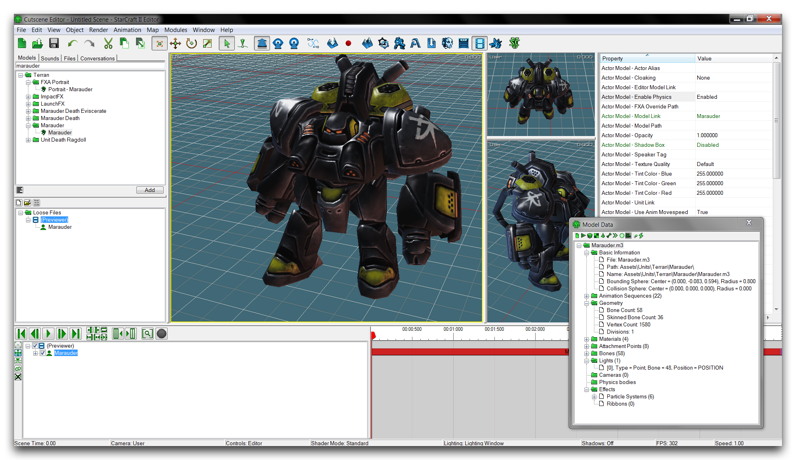
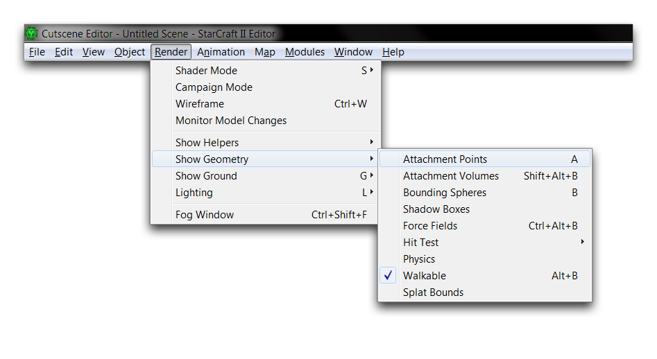

# Model Data Viewer

Some procedures in the Data Editor call for the use of 'Model Data,' the structural properties of model assets set during their construction. You can always retrieve these properties by inspecting the assets where they were created, in the published suite of Blizzard Art Tools. In many cases, this can be overkill. A shortcut is to use the Cutscene Editor as an inspector. There you'll find a special Model Data Viewer for this very purpose. The viewer is shown in the image below.

*Model Data Viewer*

## Launching The Viewer

You can find the Model Data Viewer by opening the Cutscene Editor and navigating to Object ▶︎ Model Data, as shown below.

*Opening the Model Data Viewer*

You can also get to the viewer by right-clicking on a model in the Actor Timeline Tree, or the bottom-left pane where components of the current scene are listed, and selecting 'Show Model Data.'

*Opening the Model Data Viewer from the Actor Timeline Tree*

## Understanding The Viewer

Once launched, the model data viewer will populate itself with the data of the currently selected model type.

*Model Data Viewer in Cutscene Editor*

Inside the viewer, you'll see that the model data is broken up and organized into folders. Each folder holds either a detailed breakdown of one of the structural types of the model or an overview of the whole model's data. These folders follow the layout outlined below.

  - Unit Type
      - Basic Information
      - Animation Sequences
      - Geometry
      - Materials
      - Attachment Points
      - Bones
      - Lights
      - Cameras
      - Physics Bodies
      - Effects
          - Particle Effects
          - Ribbons

The information you'll find in each folder is broken down in the following table.

| Field               | Details                                                                                                                                                                                                                                                   |
| ------------------- | --------------------------------------------------------------------------------------------------------------------------------------------------------------------------------------------------------------------------------------------------------- |
| Basic Information   | Offers an overview of the model's file structure and collision sizes.                                                                                                                                                                                     |
| Animation Sequences | Breaks up each model animation into a folder listed under the animation's reference name, length, and starting frame. Moving into each animation's folder reveals their looping settings, individual bounding sphere sizes, and several other flags.      |
| Geometry            | Contains counts of the bones, vertices, divisions, and skinned bones within the model.                                                                                                                                                                    |
| Material            | Breaks down each material in the model, listing their texture and map compositions alongside lighting information and any display property flags that are set. Also contains folders for each material that show any parallax height or motion blur data. |
| Attachment Points   | Shows a list of all the available attachment points on the model. Each point is listed under its reference name and the bone number to which it is attached.                                                                                              |
| Bones               | Breaks down each bone in the model by identifying number and reference name. Every bone also has a subfolder containing information about billboarding, animation, and inverse kinematics.                                                                |

## Model Data Applications

The applications for information found in the model data viewer can vary from project to project.

If a project is using custom assets, then the viewer can be your first stop to confirm that everything is loading into the engine. Here, the model data is compared to the information found within the Blizzard Art Tools, checking for any discrepancies. Any differences might suggest that certain components are not exporting correctly.

In other cases, the viewer is used for looking up reference names. These names are used frequently within triggers and data as identifiers. The Animation Sequence reference names are used in actor events, as the 'Animation Property,' or in the animation trigger actions, as 'Identifier.' Attachment Point reference names are used for attachment site operations and the 'Attach Actor to ...' trigger actions.

## Locating Attachment Points

The Model Data Viewer has a special use in locating attachment points using the Cutscene Editor. You can do this by enabling the visibility of attachment points by navigating to Render ▶︎ Show Geometry ▶︎ Attachment Points, as shown below.

*Showing Attachment Points*

Once enabled, each attachment point is represented by a triangular solid overlaid on the model. Each triangle represents a position where the attachment point is found and points in the direction the attachment point faces. The image below shows the attach points of a marauder.

*Attachment Points Basic Visualization*

This visualization shows the distribution and direction of attachment points, but offers no help in finding out the reference names of each point so that you can use them elsewhere in the Editor. Some of the attachment points have useful names, but others can be difficult to decode.

If you open the viewer and navigate to the Attachment Points folder, you can find each individual attachment point by selecting the listing of the point that is being searched for. Once highlighted in the Model Data Viewer, an attachment point will glow bright green in the main view of the Cutscene Editor and begin pulsing. This is shown in the image below.

*Attachment Point Highlighted Using Model Data Viewer*

This effect is far more prominent in motion, but the image above still shows that the selected attachment point is brighter and much larger. In this instance, the method has identified Ref\_Hardpoint, which would have been difficult to locate using its reference name alone.
