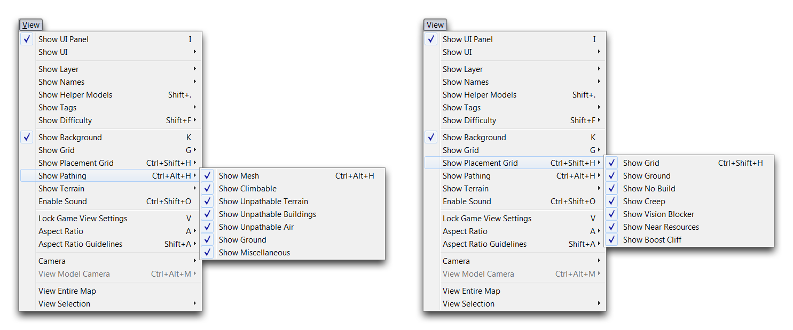
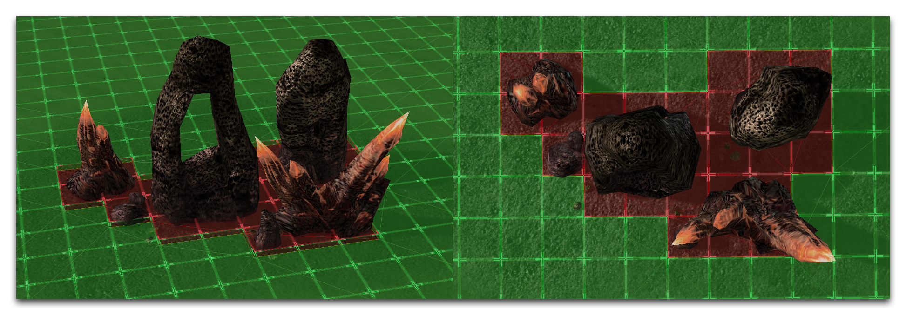
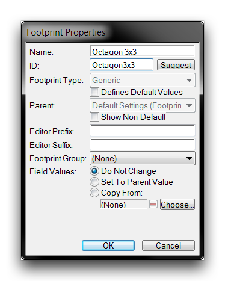
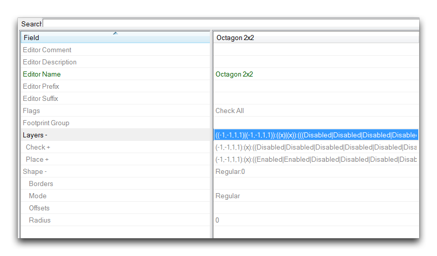
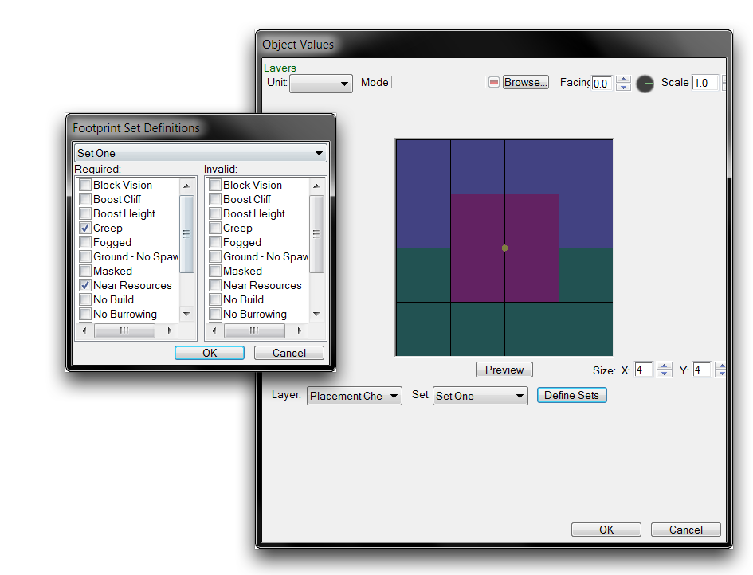
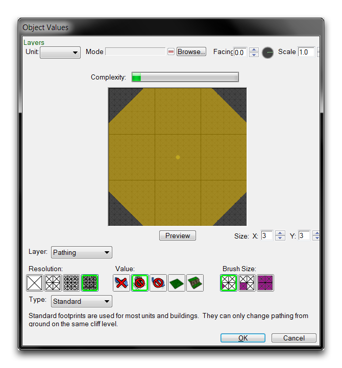
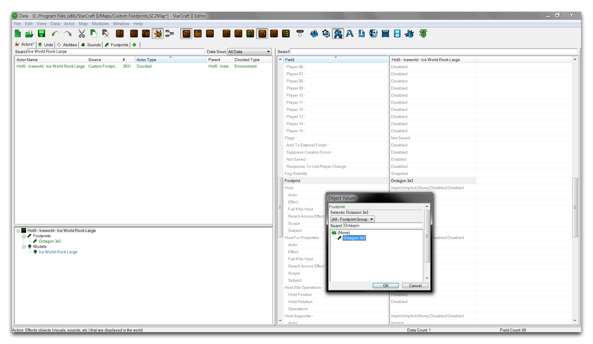

# Custom Footprints

The Editor features a wide range of footprints that are often repurposed in the creation of new objects, actors, and units. That said, it can still be useful to understand how to create a custom footprint. This will allow you to create footprint designs with custom shapes and pathing for very specific applications.

## Pathing Grid

Footprints apply pathing logic to the map in terms of map units. It can be difficult to visualize the units of the StarCraft engine, but fortunately the Editor provides some utilities to help you. First, enable all of the pathing layer visibility options by navigating to View -\> Show Pathing and checking each category, as shown below. Then navigate to View -\> Show Pathing Grid and enable all of the options there too.

*Turning Visibility Options On*

You should now be able to see the full pathing grid in the Editor. Green indicates pathable areas, while red shows the areas which are not pathable. The squares depicted in the grid each represent a 1 by 1 unit area, the same unit scale in which maps are created. This means a 96x96 map equates to a unit grid scale of 96 units squared. Footprints must adhere to the unit grid. This makes it very useful for figuring out placements and understanding the requirements for a specific custom footprint. You can see the grid in the images below.

*Footprint Grid Visibility*

## Creating A Footprint

To create a footprint first move to the Data Editor. If the 'Footprints' tab is not already open, add it by navigating to + -\> Edit Game Data -\> Footprints. Right-click in the main data view and select 'Add Footprint.' This should give you the following view.

*Adding Footprint in Data*

This will launch the 'Footprint Properties' window. For this exercise, you'll create a custom footprint in an octagonal shape. Enter 'Octagon 3x3' as the 'Name' field for the pop up, click suggest to generate an ID, then click 'Ok.'

*Footprint Properties Window*

Once you've returned to the main Data Editor view, navigate to the 'Layers' field of the newly created footprint and double click it to launch the Footprint Editor.

*Launching Footprint Editor*

## Footprint Editor

*Editor View*

The Footprint Editor offers a specific tool for creating footprints and controlling their pathing and placement logic. It's a little off the beaten path, but you can access it from either of the two fields in the 'Footprints' data type, 'Layers' and 'Shapes.' Selecting either of these fields launch will launch the same editor. This is because the Footprint Editor populates itself with the data from both the layer and shape fields for a single footprint object. Note that manually editing the footprint data and avoiding this subeditor is still an option. However, it is often more intuitive do so using the footprint editor due to the visual nature of footprints. The properties of the subeditor are broken down in the table below.

| Property   | Effect                                                                                                                                                                                                                                                                                                                                                           |
| ---------- | ---------------------------------------------------------------------------------------------------------------------------------------------------------------------------------------------------------------------------------------------------------------------------------------------------------------------------------------------------------------- |
| Size       | Sets the unit grid size of the footprint.                                                                                                                                                                                                                                                                                                                        |
| Value      | Selects a pathing type to be applied. Choices include None, No Building, Unpathable Terrain, Ground, and Cliff. The None setting is the default value for all units of the map.                                                                                                                                                                                  |
| Brush Size | Sets the pathing application area in cells. The settings are Triangle: 1 cell, Sub-cell: 4 cells, and Cell: 16 cells.                                                                                                                                                                                                                                            |
| Resolution | Sets the number of cells which can be pathed within a single unit. The settings are Large (4 cells per unit), Medium (16 cells per unit), Small (64 cells per unit), and Tiny (256 cells per unit).                                                                                                                                                              |
| Layer      | Sets the logic layer being altered. Options include Pathing, Placement Apply, and Placement Check. This will be described in more detail later in the article.                                                                                                                                                                                                   |
| Unit       | Selects a preview model to test footprint size. Model will list the unit path, while Facing and Scale allow you to alter the model's properties.                                                                                                                                                                                                                 |
| Complexity | An estimate of the footprint's performance cost. Increasing Resolution, using many pathing types, and creating unusual geometry are the primary concerns here.                                                                                                                                                                                                   |
| Type       | Selects the footprint's main behavior from Standard, Overlay, or Persistent. Standard overlays are by far the most common and alter pathing on the same level of cliff height. Overlay footprints alter non-ground pathing and are seldom used. Persistent footprints cannot be removed during gameplay, only altered. They usually see use with bridge objects. |

Pathing is created in the subeditor in three separate layers, Pathing, Placement Apply, and Placement Check. Pathing allows for the size, shape, and type of pathing to be determined. This is the layer visible in the grid view of the Terrain Editor. It's worth noting that multiple pathing types are supported within a single cell. This isn't immediately obvious, as the subeditor will only show the first painted color. Once you have designed a pathing footprint, you may find that you need to close the Editor and reload the map before it will show any updated footprints in the Terrain Editor.

The placement layers, Placement Apply and Placement Check, affect the application of specific placement flags. Each of these allows you to set four distinct layers of options. Placement Apply will apply these options to the area on the map within its footprint. Placement Check requires the options to exist within the set areas or the object owning the footprint cannot be created. You should be aware that, for the option layers to be painted on the footprint, they must first be set using 'Define Sets.' Clicking this button will launch a 'Footprint Set Definitions' window. Be careful, make sure to use the dropdown at the top of the window to select the proper layer being set. A typical view of this layer is shown below.

*Placement Application Layer and Definition Popup*

Now, head back to the 'Octagon 3x3' footprint and paint an octagonal footprint using the pathings No Building and Unpathable Terrain. As a hint, you should use the Tiny resolution and make the triangular cutouts have a base length of six cells. The result should look as pictured below.

*Hexagon 3x3 Pathing*

## Linking A Footprint To An Object

Now that you've created your custom footprint, you'll place it inside a doodad for testing. Navigate to the actors tab within the Data Editor and select the 'Ice World Rock Large' doodad. Highlight the 'Footprint' field and double click it to launch the 'Object Values' window. Find your 'Octagon 3x3' footprint, select it, and hit 'Ok'. This should leave you with the following.

*Adding Footprint in Data*

Testing the doodad in the Terrain Editor should give an updated footprint, which differs from the doodad's square 3x3 default. Locate the doodad within the Doodads Layer, select it, and place it in the map to investigate. If the footprint has not yet updated or remains blank, you may have to try closing the Editor and relaunching. The footprint in its before and after states should appear as shown below.

*Default and Custom Footprint*
