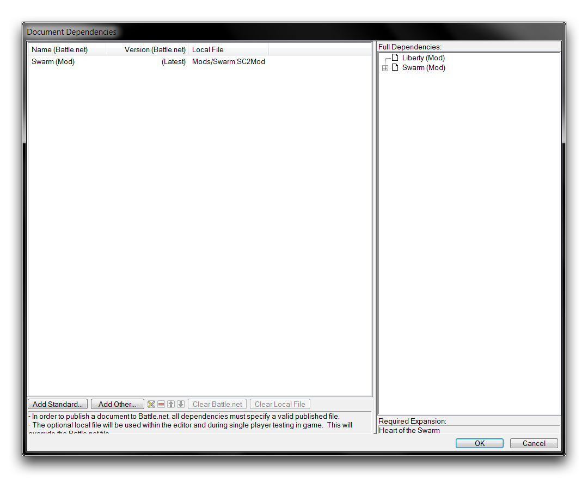
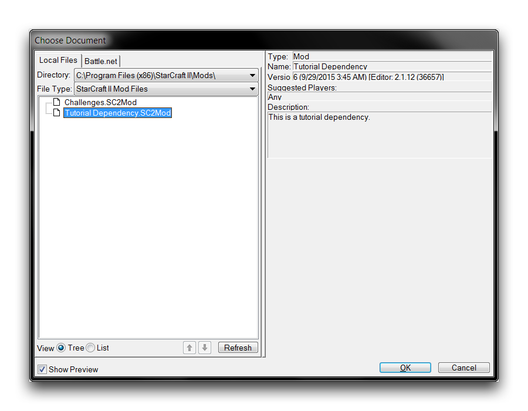

TEST A MOD OFFLINE
==================

Testing is one of the primary components of development. A strong developer wants to make the eventual play session as effortless, focused, and productive for the tester as possible. Preparing your project prior to any shared testing is essential in ensuring you make the best use of your volunteers' time.

For maps, the Editor has an obvious and upfront method for testing, simply navigating to the 'Test Map' function embedded in the Editor's Navigation Bar. However with mods there are some additional steps. This can cause beginning developers to fall into the most visible method, uploading both their mod and a map to Battle.net and testing there.

This approach can cause some significant slowdown due to the publishing system's additional layer of protection, which is intended for release versions. By contrast, there are a couple agile methods of testing a mod with which you should familiarize yourself. The downside to these is that they are offline methods and as a result are only appropriate for testing practices available to a single player.

TESTING A MOD WITH A TARGETED MAP
---------------------------------

You should note that, when attempting to use the Editor's direct 'Test Map' function, you'll be instructed to set a map target for the active mod. This makes sense, as mod files contain no terrain data and have no setting for the assets and data they contain. Setting a targeted 'Default Map' for testing allows a direct, no-frills offline test of a mod system.

You can set up a direct mod test by navigating to File -\> Preferences -\> Test Document. Here you'll note the heading 'Default Map.'

Setting the Testing Target Map

Set the 'Default Map' to the desired target for your mod test by selecting the 'Browse' button, then navigating to a local map file. Click 'OK' to return to the main Editor. From now on, using the 'Test Map' function will result in the currently active mod file being slotted as a temporary dependency to the 'Default Map.' Then the map containing the mod will launch a test. The 'Default Map' setting will persist between projects. If you are using this function within several different mods at once, you'll need to make the change each time.

This system may remind you of a local version of the 'Extension Mod' system, where map and mod are combined at run time, but remain separated after the game.

TESTING WITH A DEPENDENCY
-------------------------

Alternatively, you can test a mod by adding it as a dependency to an active map. With the map you wish to test open, navigate to File -\> Dependencies. This will present the current list of document dependencies. A default view might look like the one shown below.

Setting the Testing Target Map

From here, select 'Add Other.' This will present you with the following view.

Setting the Test Dependency

Select the custom mod you are interested in testing and hit 'OK.' Once you've returned to the dependency view again, click 'OK' to move back into your active map. There you can use the 'Test Document' function to test the map with its new dependency.

This method might be most appropriate if you're working on a map and are curious about some interaction with one or more of your existing mods. Rather than move to Battle.net, you can quickly alter your current map's dependencies by adding or removing mods, then run a trial with each configuration.
