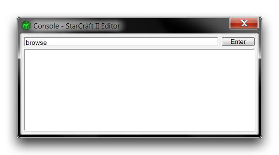
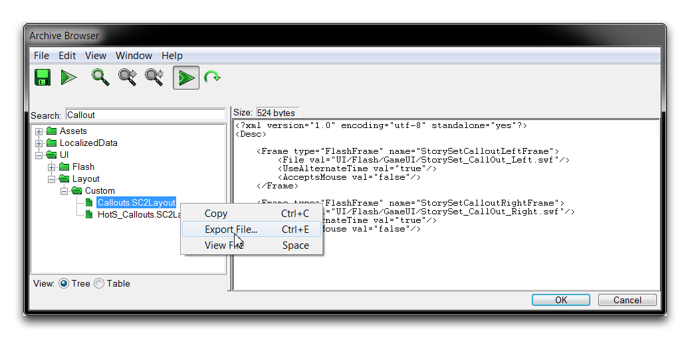
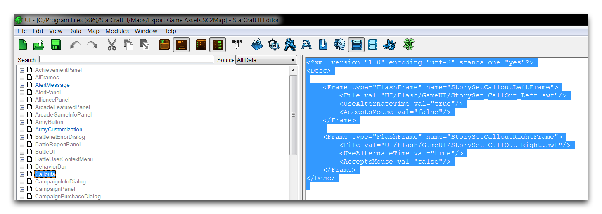
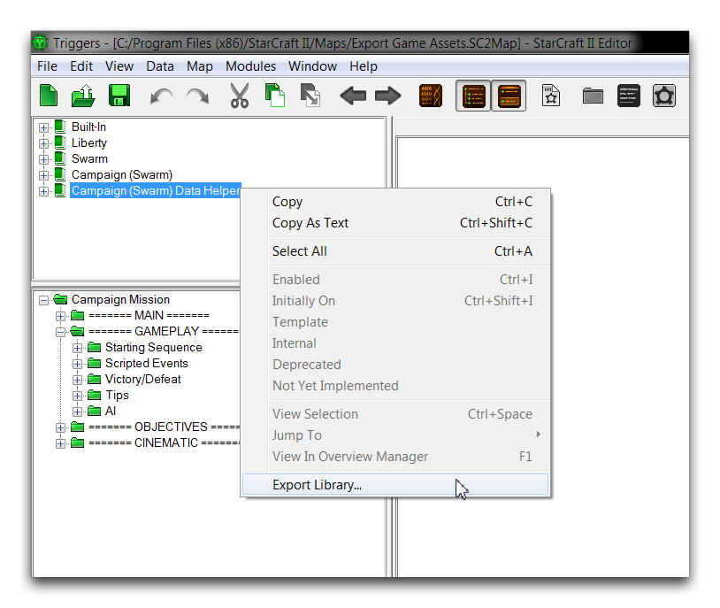
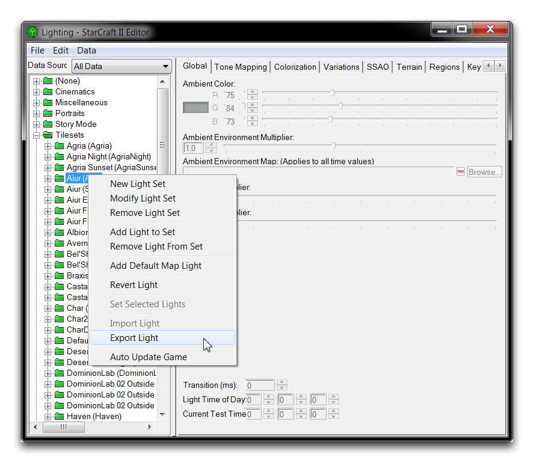

# Export Game Assets

Just as custom assets can be brought into the Editor with the Importer, the standard assets can also be exported out of projects into basic file types. Each type of asset requires you to use a slightly different method to extract it from a project. These methods are described in this article.

Exporting from the Editor is often used to get a closer look at the standard assets. They can be taken out of the Editor, inserted into different programs, altered and recomposed, then imported again for use. Knowing how to export can also be valuable if you ever lose any source parts of a project. You can then export files from the base project as a recovery method. For each asset type, there some common file formats that you should be aware of. A list is provided below.

| Type               | File Format             |
| ------------------ | ----------------------- |
| Texture            | .dds                    |
| Model              | .m3                     |
| Sound              | .wav                    |
| UI Layout          | .SC2Layout, .xml        |
| Trigger Libraries  | .SC2Lib                 |
| Lights             | .SC2Lighting            |
| Components Folders | .SC2Components, Various |

## Opening The Archive Browser

You may already be familiar with the Archive Browser for its use in finding files for various data and trigger operations. It also serves as the main hub for exporting things from a project. To use it for this purpose, you'll need to access to browser directly, rather than as part of an editing prompt. You can do so by navigating to Window ▶︎ Console from anywhere in the Editor, as shown below.

*Opening the Console*

Once you've launched the console, enter the command browse then select the 'Enter' button, as shown below.

*Asset Browser Launch Command*

This will launch the Archive Browser. It will show a structured folder arrangement of all the assets currently in the project.

*Archive Browser View*

## Exporting From The Archive Browser

Assets can be exported from the Archive Browser by right-clicking them and selecting Export File.

*Archive Browser View*

## Exporting Ui Layouts

You can also use the Archive Browser to export UI layouts. Do so by locating them in the UI folder, highlighting them, and selecting Export File.

*Archive Browser View*

Alternatively, you can extract them directly from the UI Editor. Navigate to the .SC2Layout file, then highlight the XML data and hit Ctrl+C to copy. The data can then be pasted into a text editor or plaintext file for later use.

*Highlighting XML for Export*

## Exporting Trigger Libraries

You can export trigger libraries from the Trigger Editor using the Library Panel by highlighting the library, right-clicking, and selecting Export Library.

*Exporting a Trigger Library*

## Exporting Lights

You can export lighting files from the Lighting Window. Select the lighting arrangement to be exported, then right-click and select Export Light.

*Exporting a Light*

## Exporting Components Folders

A map project can be broken into its Components Folders through an export process. This format is a collection of scripts, component lists, image files, and raw data that can be useful for diagnostic and analytic procedures that you can do outside the Editor. To export, open the map to be saved as component folders and navigate to File ▶︎ Save As. Change the 'Save as type' field to .SC2Components and select 'Save.'

*Saving as StarCraft II Component Folders*

This process will result in a folder with the specified filename, appended with the suffix .SC2Map. This folder will contain a set profile of data components and assets that will look similar to those shown below.

*StarCraft II Components Folder*
