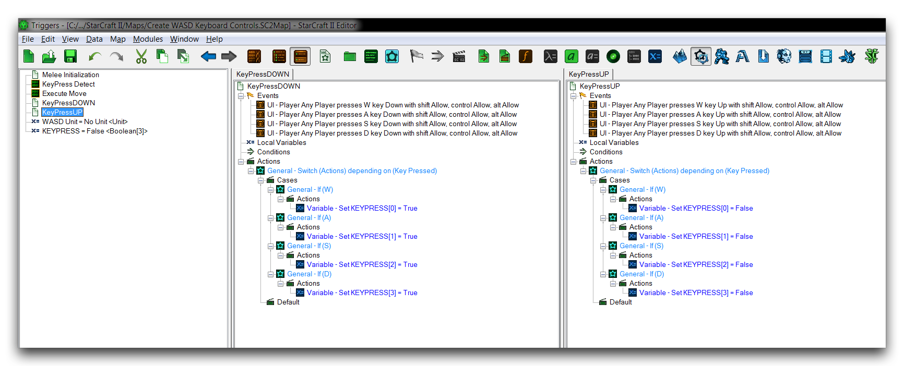
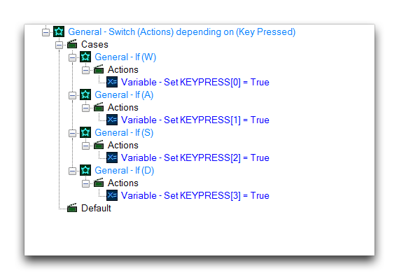
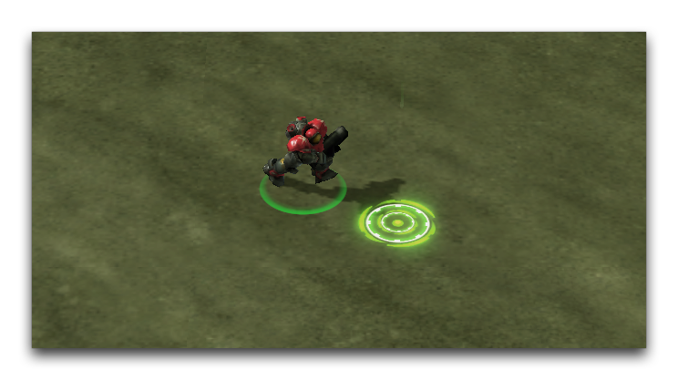

# Create Wasd Keyboard Controls

Using the keyboard to control a game character's movement is a classic control scheme. The best known example of this is the WASD keyboard controls, in which the W, A, S, and D keys are bound to the directions up, left, right, and down. This is often used as an ergonomic, universally available option that can be operated one hand while the other uses the mouse.

Although StarCraft uses a mouse and keyboard control scheme, it does not tie any keyboard controls directly to movement. Still, this is possible for custom projects made using the Editor. Learning to implement the WASD keyboard controls can be very educational and has many practical applications in action, adventure, and simulation games.

## Keypress Ui Events

A keyboard control system requires some way of getting between player inputs and the game. UI events usually suit this requirement and in this case you'll make use of the Key Pressed event. The triggers 'KeyPressDOWN' and 'KeyPressUP' create events that respond to the four keys of the WASD controls. 'KeyPressDOWN' runs when any of these keys is pushed down, while 'KeyPressUP' runs when any of these keys are released. You can see the composition of these triggers in the image below.

*Keypress UI Event Triggers*

By separating the keys out individually, this system supports combinations of keys being pressed and released in any way the hardware supports. As a result, combinations like pressing the W and A keys together will give the proper response of moving the character both up and left at the same time.

## Key Storage Array

In order to track all concurrent key presses, this design requires an array for storage. The 'KEYPRESS' array is of the Boolean type and sized to a value of 3. Considering that arrays begin at a zero index, the total storage available here is 4 keys, enough for the entire WASD control system. Using a Boolean array allows each array value to represent whether or not a certain key is currently pressed. The keys will use the following mapping.

W == Index 0

A == Index 1

S == Index 2

D == Index 3

A True value represents pressed, while a False value represents not being pressed. All the spots in the array are set to False by default. The array itself is shown below.

*Key Storage Array*

## Switch Actions

As you've already seen, the two keypress triggers will each respond to any of the four WASD keys. This saves the design from having to rely on eight separate events to monitor keyboard inputs. However, this creates a need for some control statements to properly parse the input. You can use a switch statement to solve this by providing a case for each of the four Key values. The switch statement used for the 'KeyPressUP' trigger is shown in the image below.

*KeyPressUP Switch*

For each trigger, the switch statement contains a 'Set Variable' action that sets the index of the array associated with that case's Key. For the 'KeyPressUP' trigger the values are set to True, indicating that the key is now down. Conversely, for 'KeyPressDOWN" trigger the values are set to False, indicating that the key has been released.

## Keypress Detection Loop

To create a constant a feed of keypress inputs into movement logic, a loop 'KeyPress Detect' is used. The loop itself is quite extensive and has been reproduced below, annotated with comments.

  - General -- While (Conditions) are true, do (Actions) // While loop allows for constant movement

<!-- -->

  - Conditions

<!-- -->

  - (WASD Unit is alive) == True // Checks that the controlled unit is still alive

<!-- -->

  - Actions

<!-- -->

  - General -- If (Conditions) then do multiple (Actions) // Sets off a series of input checks

<!-- -->

  - If Then Else

<!-- -->

  - General -- Else If // These checks look for a specific

<!-- -->

  - Else If // input case

<!-- -->

  - KEYPRESS\[0\] == False
  - KEYPRESS\[1\] == False
  - KEYPRESS\[2\] == False // The case here is all four keys
  - KEYPRESS\[3\] == False // not being pressed

<!-- -->

  - Then

<!-- -->

  - Unit -- Order WASD Unit to (Stop)(Replace Existing Orders) // Cease movement

<!-- -->

  - General -- Else If

<!-- -->

  - Else If

<!-- -->

  - KEYPRESS\[0\] == True
  - KEYPRESS\[1\] == True // W and A keys are pressed

<!-- -->

  - Then

<!-- -->

  - Execute Move(145.0, 1.0) // Moves the unit northeast

<!-- -->

  - General -- Else If

<!-- -->

  - Else If

<!-- -->

  - KEYPRESS\[0\] == True // W and D keys are pressed
  - KEYPRESS\[3\] == True

<!-- -->

  - Then

<!-- -->

  - Execute Move(45.0, 1.0) // Moves the unit northwest

<!-- -->

  - General -- Else If

<!-- -->

  - Else If

<!-- -->

  - KEYPRESS\[2\] == True // S and A keys are pressed
  - KEYPRESS\[1\] == True

<!-- -->

  - Then

<!-- -->

  - Execute Move(45.0, -1.0) // Moves the unit southeast

<!-- -->

  - General -- Else If

<!-- -->

  - Else If

<!-- -->

  - KEYPRESS\[2\] == True // S and D keys are pressed
  - KEYPRESS\[3\] == True

<!-- -->

  - Then

<!-- -->

  - Execute Move(145.0, -1.0) // Moves the unit southwest

<!-- -->

  - General -- Else If

<!-- -->

  - Else If

<!-- -->

  - KEYPRESS\[0\] == True // W key is pressed

<!-- -->

  - Then

<!-- -->

  - Execute Move(90.0, 1.0) // Moves the unit north

<!-- -->

  - General -- Else If

<!-- -->

  - Else If

<!-- -->

  - KEYPRESS\[1\] == True // A key is pressed

<!-- -->

  - Then

<!-- -->

  - Execute Move(180.0, 1.0) // Moves the unit west

<!-- -->

  - General -- Else If

<!-- -->

  - Else If

<!-- -->

  - KEYPRESS\[2\] == True // S key is pressed

<!-- -->

  - Then

<!-- -->

  - Execute Move(90.0, -1.0) // Moves the unit south

<!-- -->

  - General -- Else If

<!-- -->

  - Else If

<!-- -->

  - KEYPRESS\[3\] == True // D key is pressed

<!-- -->

  - Then

<!-- -->

  - Execute Move(0.0, -1.0) // Moves the unit east

<!-- -->

  - General -- Wait 0.0 Real Time Seconds // Creates a pause for test outputs

## Moving The Unit

'KeyPress Detect' pushes a set of instructions to the 'Execute Move' action, which handles moving the controlled unit. These instructions include an Angle and Offset that are sent to an 'Order Targeting Point' command. This command makes use of the 'Move' ability, sending the unit to a 'Point with a Polar Offset.' By sending the unit to its current position altered by the Offset, the command effectively moves the unit in the direction of the Angle by the offset magnitude.

When the Offset is set to a negative value, this actually represents moving the unit in the opposite direction. So an Angle of 145.0 with an Offset of -1.0, which occurs when the S and D keys are pressed, will send the unit in the southwest direction. When the values are an Angle of 145.0 and an Offset of 1.0, as is the case when the W and A keys are pressed, the unit is sent in the northeast direction. The 'Execute Move' action definition can be seen in the image below.

*Execute Move Action Definition*

## Connecting It Together

For this demonstration, the movement system is initiated on map start. This isn't necessary, but it is the most likely scenario. Control schemes seldom change within the body of a game, but shifting the initialization actions elsewhere is still an option. The 'Melee Initialization' trigger is shown below.

*Melee Initialization Trigger*

This trigger sets a pre-placed unit to the 'WASD Unit' variable. This makes it the controlled unit for the movement system. Additionally, the 'KeyPress Detect' loop begins, at which point it immediately starts searching for player inputs. Whenever you're working with a constantly running UI events system, you should monitor the large quantity of loop and event checks closely for performance. When designing a system like this for online use, be sure to do careful testing to ensure latency doesn't become a problem.

## Testing The Controls

Launching the map will allow you to control the marine with the WASD keys.

*WASD Keyboard Controls*
